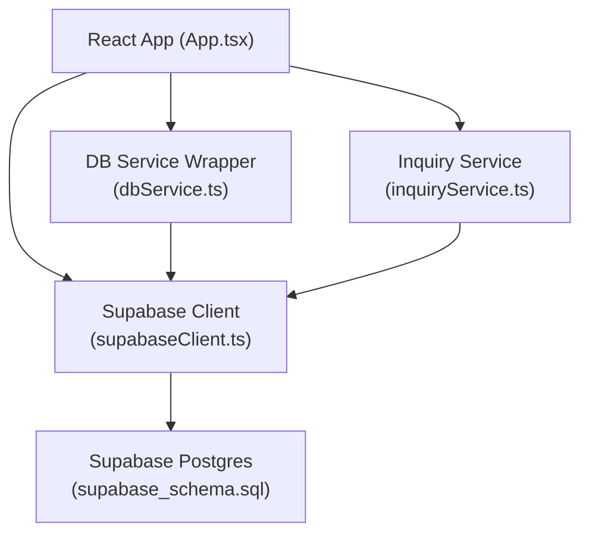
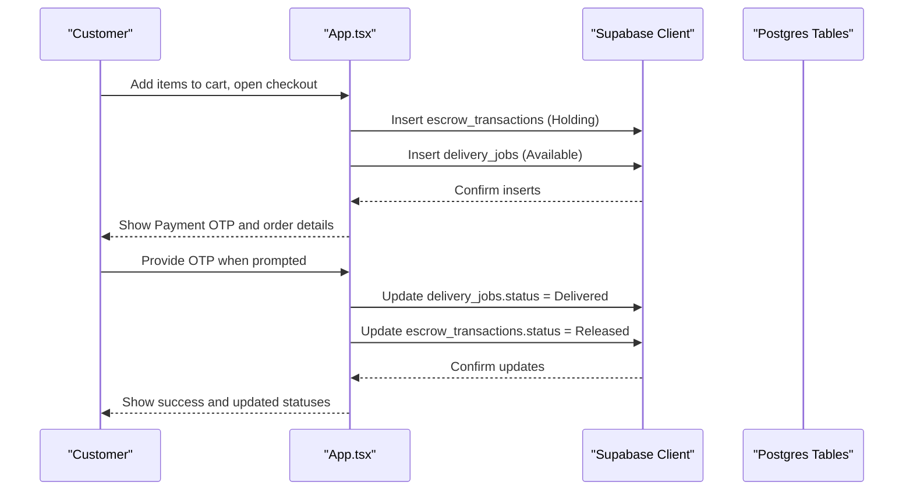
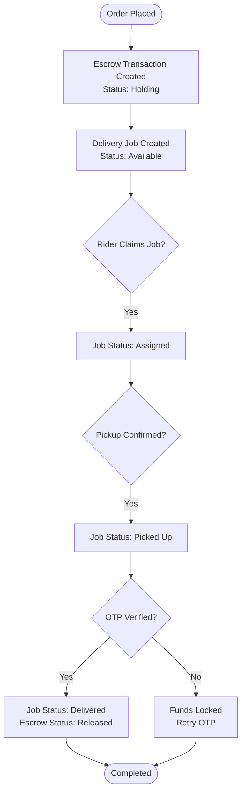
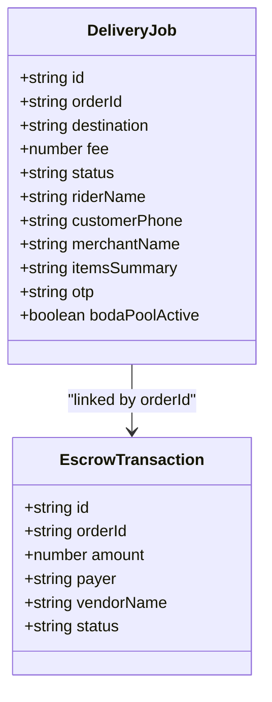
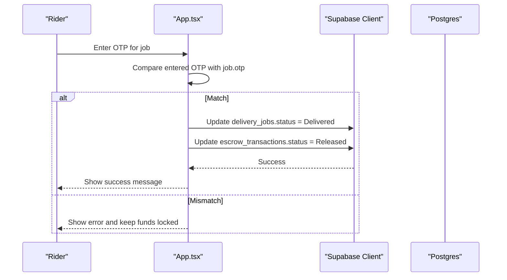
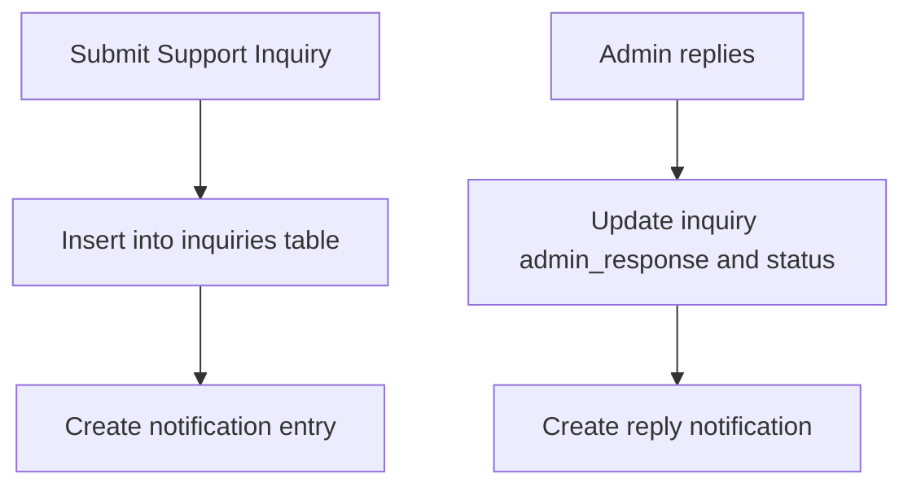
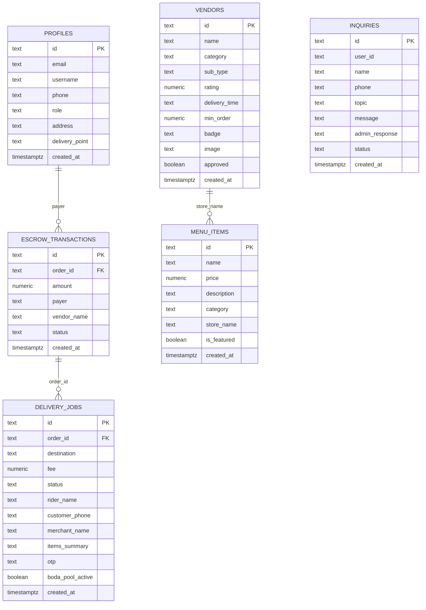
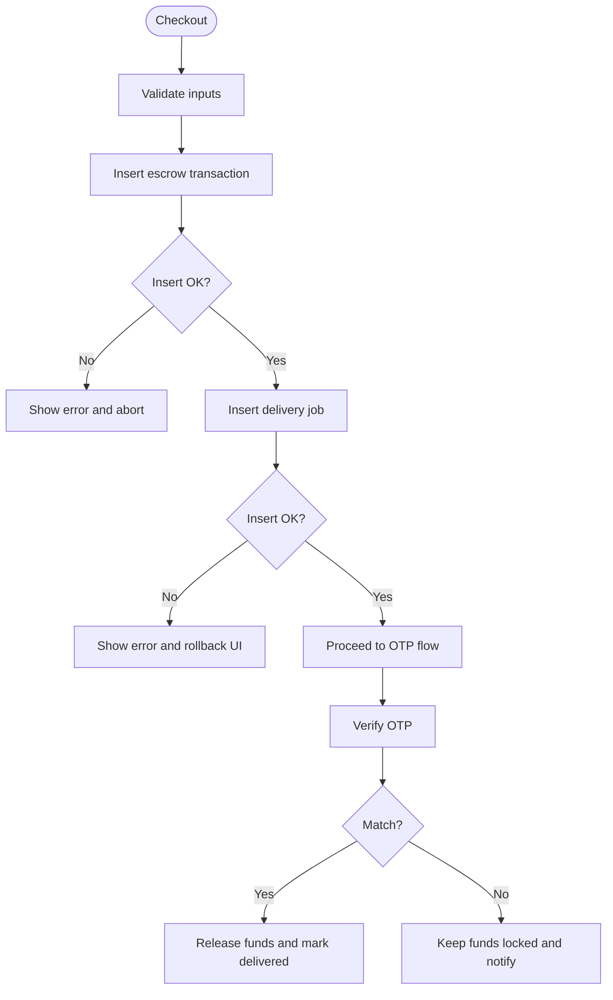
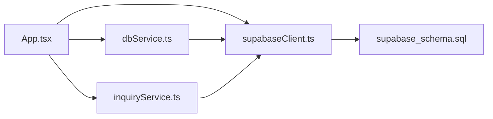

# Order Processing & Delivery

<cite>
**Referenced Files in This Document**
- [App.tsx](file://src/App.tsx)
- [supabaseClient.ts](file://src/supabaseClient.ts)
- [dbService.ts](file://src/supabase/dbService.ts)
- [inquiryService.ts](file://src/supabase/inquiryService.ts)
- [supabase_schema.sql](file://supabase_schema.sql)
- [SUPABASE.md](file://SUPABASE.md)
</cite>

## Table of Contents
1. [Introduction](#introduction)
2. [Project Structure](#project-structure)
3. [Core Components](#core-components)
4. [Architecture Overview](#architecture-overview)
5. [Detailed Component Analysis](#detailed-component-analysis)
6. [Dependency Analysis](#dependency-analysis)
7. [Performance Considerations](#performance-considerations)
8. [Troubleshooting Guide](#troubleshooting-guide)
9. [Conclusion](#conclusion)
10. [Appendices](#appendices)

## Introduction
This document explains the order processing and delivery management system implemented in the application. It covers the end-to-end lifecycle from order placement through fulfillment, including status transitions, notifications, audit trails, rider assignment flows, OTP-based delivery confirmation, and database schema relationships. The implementation is a client-side React application that interacts with Supabase for persistence and authentication. Real-time updates are not implemented via WebSockets; instead, the UI refreshes state by re-querying or updating local state after server responses.

## Project Structure
The project is a Vite + React TypeScript application. The core business logic for orders, escrow, and delivery jobs resides in the main application component. Data access is performed through a Supabase client configured at runtime. A small service layer wraps common queries and error handling. Database schema and Row Level Security policies are defined in a SQL script executed against Supabase.

**Diagram sources**
- [App.tsx:1-200](file://src/App.tsx#L1-L200)
- [supabaseClient.ts:1-7](file://src/supabaseClient.ts#L1-L7)
- [dbService.ts:1-24](file://src/supabase/dbService.ts#L1-L24)
- [inquiryService.ts:1-19](file://src/supabase/inquiryService.ts#L1-L19)
- [supabase_schema.sql:1-198](file://supabase_schema.sql#L1-L198)

**Section sources**
- [App.tsx:1-200](file://src/App.tsx#L1-L200)
- [supabaseClient.ts:1-7](file://src/supabaseClient.ts#L1-L7)
- [dbService.ts:1-24](file://src/supabase/dbService.ts#L1-L24)
- [inquiryService.ts:1-19](file://src/supabase/inquiryService.ts#L1-L19)
- [supabase_schema.sql:1-198](file://supabase_schema.sql#L1-L198)

## Core Components
- Order Placement and Escrow Holding
  - Customer selects items, chooses delivery route, and provides M-Pesa phone number.
  - System generates an order ID and a secure OTP used later for delivery confirmation.
  - An escrow transaction record is created with amount and payer details; status starts as Holding.
  - A delivery job is created with destination, fee, merchant info, items summary, and OTP.

- Rider Assignment and Job Distribution
  - Available jobs appear in the rider dashboard.
  - A rider claims a job, transitioning its status to Assigned.
  - When the rider picks up the parcel, status becomes Picked Up.
  - OTP verification completes the delivery and releases funds.

- OTP Verification and Delivery Completion
  - After pickup, the rider enters the OTP provided to the customer during checkout.
  - On successful match, the job status changes to Delivered and the escrow transaction status changes to Released.
  - If OTP does not match, funds remain locked and an error is shown.

- Notifications and Audit Trails
  - Support inquiries create notifications and can be replied to by admins.
  - Escrow ledger records capture payer, vendor, amount, and timestamps for auditability.
  - Delivery job history reflects status transitions for traceability.

**Section sources**
- [App.tsx:1144-1231](file://src/App.tsx#L1144-L1231)
- [App.tsx:1594-1651](file://src/App.tsx#L1594-L1651)
- [App.tsx:1038-1142](file://src/App.tsx#L1038-L1142)
- [supabase_schema.sql:44-69](file://supabase_schema.sql#L44-L69)

## Architecture Overview
The system uses a single-page React application that communicates directly with Supabase. There is no backend server or WebSocket integration; real-time updates are achieved by refreshing local state after mutations.

**Diagram sources**
- [App.tsx:1144-1231](file://src/App.tsx#L1144-L1231)
- [App.tsx:1624-1651](file://src/App.tsx#L1624-L1651)
- [supabase_schema.sql:44-69](file://supabase_schema.sql#L44-L69)

## Detailed Component Analysis

### Order Lifecycle and Status Transitions
- States:
  - Escrow transactions: Holding -> Released (or Refunded if applicable).
  - Delivery jobs: Available -> Assigned -> Picked Up -> Delivered.
- Key operations:
  - Create escrow and delivery job on checkout.
  - Claim job (rider), confirm pickup, verify OTP, release funds.

**Diagram sources**
- [App.tsx:1144-1231](file://src/App.tsx#L1144-L1231)
- [App.tsx:1594-1651](file://src/App.tsx#L1594-L1651)

**Section sources**
- [App.tsx:1144-1231](file://src/App.tsx#L1144-L1231)
- [App.tsx:1594-1651](file://src/App.tsx#L1594-L1651)

### Rider Assignment System and Job Distribution
- Job visibility:
  - Available jobs are listed in the rider dashboard.
- Assignment algorithm:
  - First-come-first-served claim model; a rider claims a job and it transitions to Assigned.
- Availability tracking:
  - Job status indicates availability and progress.
- Location-based matching:
  - Destination field stores the delivery route; no geospatial matching is implemented in this codebase.

**Diagram sources**
- [App.tsx:97-119](file://src/App.tsx#L97-L119)
- [supabase_schema.sql:44-69](file://supabase_schema.sql#L44-L69)

**Section sources**
- [App.tsx:1594-1651](file://src/App.tsx#L1594-L1651)
- [supabase_schema.sql:44-69](file://supabase_schema.sql#L44-L69)

### OTP Verification System
- OTP generation:
  - Secure random 4-digit code generated at checkout time and stored in the delivery job.
- Matching workflow:
  - Rider enters OTP after pickup; system compares with stored value.
  - On match, job status becomes Delivered and escrow status becomes Released.
  - On mismatch, funds remain locked and user is notified.

**Diagram sources**
- [App.tsx:1624-1651](file://src/App.tsx#L1624-L1651)
- [supabase_schema.sql:44-69](file://supabase_schema.sql#L44-L69)

**Section sources**
- [App.tsx:1624-1651](file://src/App.tsx#L1624-L1651)

### Notifications and Audit Trails
- Notifications:
  - Support inquiries generate notifications visible in the customer portal.
  - Admin replies update inquiry status and content.
- Audit trails:
  - Escrow ledger captures payer, vendor, amount, and timestamp.
  - Delivery job status transitions provide a timeline for each order.

**Diagram sources**
- [App.tsx:1038-1142](file://src/App.tsx#L1038-L1142)
- [supabase_schema.sql:98-109](file://supabase_schema.sql#L98-L109)

**Section sources**
- [App.tsx:1038-1142](file://src/App.tsx#L1038-L1142)
- [supabase_schema.sql:98-109](file://supabase_schema.sql#L98-L109)

### Database Schema Relationships
Key tables involved in order processing and delivery:
- profiles: User identity and role information.
- escrow_transactions: Payment holding ledger linked to orders.
- delivery_jobs: Dispatch records linked to orders and OTPs.
- vendors and menu_items: Marketplace catalog data.
- inquiries: Support tickets and admin responses.

**Diagram sources**
- [supabase_schema.sql:8-22](file://supabase_schema.sql#L8-L22)
- [supabase_schema.sql:44-69](file://supabase_schema.sql#L44-L69)
- [supabase_schema.sql:71-96](file://supabase_schema.sql#L71-L96)
- [supabase_schema.sql:98-109](file://supabase_schema.sql#L98-L109)

**Section sources**
- [supabase_schema.sql:8-22](file://supabase_schema.sql#L8-L22)
- [supabase_schema.sql:44-69](file://supabase_schema.sql#L44-L69)
- [supabase_schema.sql:71-96](file://supabase_schema.sql#L71-L96)
- [supabase_schema.sql:98-109](file://supabase_schema.sql#L98-L109)

### Transaction Management and Error Handling
- Transactions:
  - Checkout creates both an escrow transaction and a delivery job in separate calls; errors are handled individually.
  - OTP verification updates both job and escrow statuses; failures trigger error messages and keep funds locked.
- Error handling:
  - UI displays toast messages for success and failure states.
  - Supabase client returns data and error objects; wrapper service normalizes responses.

**Diagram sources**
- [App.tsx:1144-1231](file://src/App.tsx#L1144-L1231)
- [App.tsx:1624-1651](file://src/App.tsx#L1624-L1651)
- [dbService.ts:1-24](file://src/supabase/dbService.ts#L1-L24)

**Section sources**
- [App.tsx:1144-1231](file://src/App.tsx#L1144-L1231)
- [App.tsx:1624-1651](file://src/App.tsx#L1624-L1651)
- [dbService.ts:1-24](file://src/supabase/dbService.ts#L1-L24)

## Dependency Analysis
- Application components depend on Supabase client for authentication and data operations.
- Services encapsulate query patterns and error normalization.
- Schema defines constraints and RLS policies enabling full access for development.

**Diagram sources**
- [App.tsx:1-200](file://src/App.tsx#L1-L200)
- [supabaseClient.ts:1-7](file://src/supabaseClient.ts#L1-L7)
- [dbService.ts:1-24](file://src/supabase/dbService.ts#L1-L24)
- [inquiryService.ts:1-19](file://src/supabase/inquiryService.ts#L1-L19)
- [supabase_schema.sql:1-198](file://supabase_schema.sql#L1-L198)

**Section sources**
- [App.tsx:1-200](file://src/App.tsx#L1-L200)
- [supabaseClient.ts:1-7](file://src/supabaseClient.ts#L1-L7)
- [dbService.ts:1-24](file://src/supabase/dbService.ts#L1-L24)
- [inquiryService.ts:1-19](file://src/supabase/inquiryService.ts#L1-L19)
- [supabase_schema.sql:1-198](file://supabase_schema.sql#L1-L198)

## Performance Considerations
- Direct Supabase calls from the UI avoid server round-trips but may increase client load.
- Batch operations are not used for order creation; consider batching inserts for performance.
- No caching strategy is implemented; frequent re-renders could occur without memoization.
- RLS policies are set to allow full access for development; tighten policies for production to reduce unnecessary checks.

[No sources needed since this section provides general guidance]

## Troubleshooting Guide
- Common issues:
  - Query returns null data: Check RLS policies and ensure rows exist in Supabase Studio.
  - Incorrect Supabase URL: Ensure environment variables point to the correct project URL.
  - Authentication failures: Verify credentials and session handling; fallback login paths exist for legacy phone-based lookup.
- Steps:
  - Inspect toast messages for error context.
  - Use Supabase Studio to verify table contents and policies.
  - Review console logs for Supabase client errors.

**Section sources**
- [SUPABASE.md:1-38](file://SUPABASE.md#L1-L38)
- [App.tsx:688-957](file://src/App.tsx#L688-L957)

## Conclusion
The platform implements a robust order and delivery workflow using Supabase for persistence and authentication. Orders transition through clear statuses, with OTP-based verification ensuring secure handover. Rider assignment follows a simple claim model, and audit trails are maintained via escrow and inquiry records. While WebSockets are not used, the UI remains responsive through direct client-server interactions. Future enhancements could include real-time updates, advanced location-based matching, and stricter RLS policies for production security.

[No sources needed since this section summarizes without analyzing specific files]

## Appendices
- Environment setup and best practices for Supabase usage are documented in the project’s Supabase guide.
- For additional features like live tracking, consider integrating Supabase Realtime or a WebSocket service.

**Section sources**
- [SUPABASE.md:1-38](file://SUPABASE.md#L1-L38)