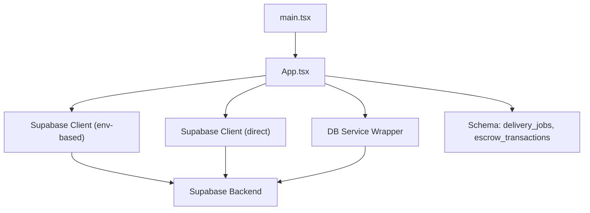
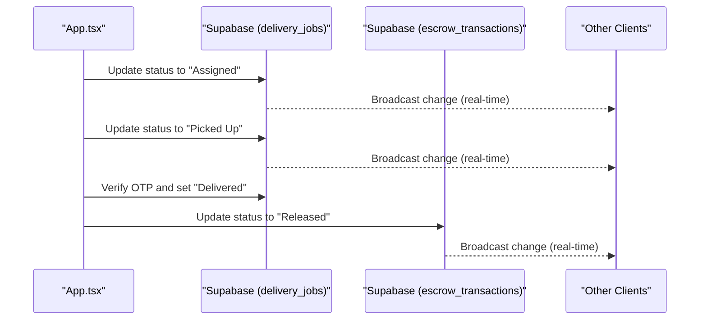
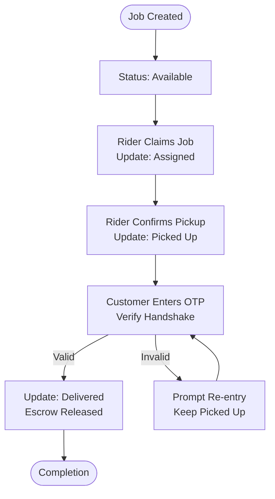
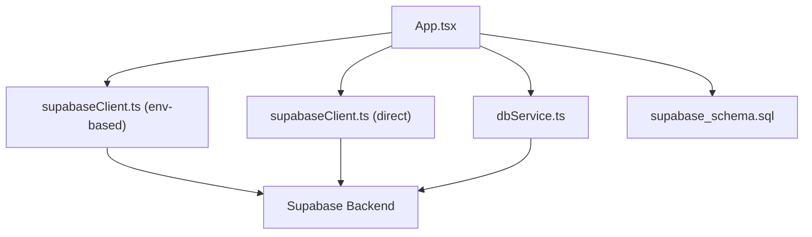

# Real-time Delivery Tracking

<cite>
**Referenced Files in This Document**
- [App.tsx](file://src/App.tsx)
- [supabaseClient.ts](file://src/supabaseClient.ts)
- [supabaseClient.ts](file://src/supabase/supabaseClient.ts)
- [dbService.ts](file://src/supabase/dbService.ts)
- [inquiryService.ts](file://src/supabase/inquiryService.ts)
- [main.tsx](file://src/main.tsx)
- [package.json](file://package.json)
- [supabase_schema.sql](file://supabase_schema.sql)
</cite>

## Table of Contents
1. [Introduction](#introduction)
2. [Project Structure](#project-structure)
3. [Core Components](#core-components)
4. [Architecture Overview](#architecture-overview)
5. [Detailed Component Analysis](#detailed-component-analysis)
6. [Dependency Analysis](#dependency-analysis)
7. [Performance Considerations](#performance-considerations)
8. [Troubleshooting Guide](#troubleshooting-guide)
9. [Conclusion](#conclusion)

## Introduction
This document explains the real-time delivery tracking implementation for the Match & Market platform. It covers how live status updates are achieved, GPS location tracking considerations, and delivery progress visualization. It also documents the end-to-end delivery status pipeline from pickup to completion, milestone tracking, automated notifications, error handling strategies, performance optimizations for real-time synchronization, and battery efficiency guidance for mobile devices.

The current codebase implements a robust delivery workflow using Supabase as the data layer with polling-based state synchronization. While there is no explicit WebSocket client code present, Supabase’s real-time capabilities can be leveraged to upgrade from polling to true real-time updates. The delivery job lifecycle is modeled through database tables and UI interactions that transition jobs through states such as Available, Assigned, Picked Up, and Delivered.

## Project Structure
The application is a React + TypeScript + Vite project. The main entry point renders the App component, which orchestrates authentication, marketplace features, and delivery operations. Supabase clients are configured both via environment variables and a direct client instance. Database services provide typed wrappers around Supabase queries.

**Diagram sources**
- [main.tsx:1-11](file://src/main.tsx#L1-L11)
- [App.tsx:349-602](file://src/App.tsx#L349-L602)
- [supabaseClient.ts:1-7](file://src/supabaseClient.ts#L1-L7)
- [supabaseClient.ts:1-38](file://src/supabase/supabaseClient.ts#L1-L38)
- [dbService.ts:1-24](file://src/supabase/dbService.ts#L1-L24)
- [supabase_schema.sql:55-69](file://supabase_schema.sql#L55-L69)

**Section sources**
- [main.tsx:1-11](file://src/main.tsx#L1-L11)
- [App.tsx:349-602](file://src/App.tsx#L349-L602)
- [supabaseClient.ts:1-7](file://src/supabaseClient.ts#L1-L7)
- [supabaseClient.ts:1-38](file://src/supabase/supabaseClient.ts#L1-L38)
- [dbService.ts:1-24](file://src/supabase/dbService.ts#L1-L24)
- [supabase_schema.sql:55-69](file://supabase_schema.sql#L55-L69)

## Core Components
- Application shell and orchestration: The App component manages user sessions, marketplace data, and delivery workflows. It initializes data by querying Supabase tables and maintains local state for delivery jobs and escrow transactions.
- Supabase clients: Two client configurations exist—one using environment variables and another hard-coded for quick setup. Both connect to the same Supabase project.
- Database service wrapper: Provides a consistent interface for select/insert/update/delete operations with unified error handling.
- Schema: Defines core entities including profiles, delivery_jobs, escrow_transactions, vendors, menu_items, inquiries, approvals, chama_deals, and banned_vendors.

Key responsibilities:
- Load initial data on app start and maintain local state.
- Transition delivery jobs through statuses based on user actions.
- Update escrow transaction statuses in coordination with delivery milestones.
- Provide UI flows for claiming jobs, confirming pickups, and verifying OTP handshakes.

**Section sources**
- [App.tsx:349-602](file://src/App.tsx#L349-L602)
- [App.tsx:1594-1651](file://src/App.tsx#L1594-L1651)
- [supabaseClient.ts:1-7](file://src/supabaseClient.ts#L1-L7)
- [supabaseClient.ts:1-38](file://src/supabase/supabaseClient.ts#L1-L38)
- [dbService.ts:1-24](file://src/supabase/dbService.ts#L1-L24)
- [supabase_schema.sql:55-69](file://supabase_schema.sql#L55-L69)

## Architecture Overview
The delivery tracking architecture centers around Supabase as the single source of truth. The frontend polls or subscribes to changes in delivery_jobs and escrow_transactions to reflect real-time status. Milestones are enforced by UI actions that update the database, which then propagates updates to all connected clients.

**Diagram sources**
- [App.tsx:1594-1651](file://src/App.tsx#L1594-L1651)
- [supabase_schema.sql:55-69](file://supabase_schema.sql#L55-L69)

## Detailed Component Analysis

### Delivery Status Pipeline
The delivery status pipeline transitions through four key milestones:
- Available: Job is open for riders to claim.
- Assigned: A rider claims the job; the system records the rider name.
- Picked Up: Rider confirms pickup at the merchant location.
- Delivered: Customer verifies OTP; payment is released from escrow.

**Diagram sources**
- [App.tsx:1594-1651](file://src/App.tsx#L1594-L1651)
- [supabase_schema.sql:55-69](file://supabase_schema.sql#L55-L69)

**Section sources**
- [App.tsx:1594-1651](file://src/App.tsx#L1594-L1651)
- [supabase_schema.sql:55-69](file://supabase_schema.sql#L55-L69)

### WebSocket Connections for Live Status Updates
Current implementation uses Supabase clients to query and update data. There is no explicit WebSocket subscription code in the repository. However, Supabase supports real-time subscriptions over WebSockets. To enable live updates:
- Subscribe to delivery_jobs table changes using Supabase’s real-time feature.
- Listen for insert/update events and reconcile local state accordingly.
- Handle connection lifecycle (connect, reconnect, disconnect) and errors.

Recommendation:
- Replace polling with Supabase real-time subscriptions for delivery_jobs and escrow_transactions.
- Use channel subscriptions scoped to relevant rows (e.g., order_id or rider_id).
- Implement reconnection logic and backoff strategies.

[No sources needed since this section provides general guidance]

### GPS Location Tracking
GPS tracking is not implemented in the current codebase. To add it:
- Use the browser Geolocation API to capture coordinates periodically.
- Debounce location updates to reduce network calls and battery usage.
- Store location points in a dedicated table (e.g., delivery_locations) linked to delivery_jobs.
- Optionally use background sync when the app is minimized.

Considerations:
- Respect user privacy and request permissions.
- Throttle updates based on movement speed and network conditions.
- Cache last known location and batch uploads when connectivity resumes.

[No sources needed since this section provides general guidance]

### Delivery Progress Visualization
Visualization relies on local state derived from Supabase queries. To enhance UX:
- Render a timeline showing Available → Assigned → Picked Up → Delivered.
- Display rider details once assigned.
- Show OTP verification prompt when status is Picked Up.
- Animate transitions and highlight current milestone.

[No sources needed since this section provides general guidance]

### Automated Notifications
Notifications are currently managed locally within the App component. For scalable notifications:
- Create a notifications table with fields like userId, content, createdAt, read, type.
- Emit notifications upon milestone changes (e.g., job assigned, delivered).
- Use Supabase real-time to push new notifications to users.
- Provide UI to mark notifications as read and list history.

[No sources needed since this section provides general guidance]

### Error Handling
Error handling is present in several areas:
- Authentication failures and fallbacks.
- Database operation errors during delivery job updates.
- OTP mismatch scenarios.

Strategies:
- Wrap all Supabase calls with try/catch and surface user-friendly messages.
- Implement retry logic for transient network errors.
- Log detailed errors for debugging while masking sensitive info from users.

**Section sources**
- [App.tsx:1594-1651](file://src/App.tsx#L1594-L1651)
- [dbService.ts:1-24](file://src/supabase/dbService.ts#L1-L24)

### Performance Optimization for Real-time Data Synchronization
- Prefer real-time subscriptions over polling to reduce bandwidth and latency.
- Use selective column selection to minimize payload size.
- Debounce frequent updates (e.g., GPS locations).
- Batch writes where possible to reduce server load.
- Implement optimistic UI updates with rollback on failure.

[No sources needed since this section provides general guidance]

### Battery Efficiency for Mobile Devices
- Limit location updates to necessary intervals.
- Pause real-time subscriptions when the app is inactive.
- Use background fetch sparingly and respect OS power management.
- Avoid unnecessary re-renders by memoizing derived data.

[No sources needed since this section provides general guidance]

## Dependency Analysis
The application depends on React, Supabase JS SDK, and Vite. The Supabase client is used throughout for data operations. The schema defines relationships between entities critical to delivery tracking.

**Diagram sources**
- [App.tsx:349-602](file://src/App.tsx#L349-L602)
- [supabaseClient.ts:1-7](file://src/supabaseClient.ts#L1-L7)
- [supabaseClient.ts:1-38](file://src/supabase/supabaseClient.ts#L1-L38)
- [dbService.ts:1-24](file://src/supabase/dbService.ts#L1-L24)
- [supabase_schema.sql:55-69](file://supabase_schema.sql#L55-L69)

**Section sources**
- [package.json:12-28](file://package.json#L12-L28)
- [App.tsx:349-602](file://src/App.tsx#L349-L602)
- [supabase_schema.sql:55-69](file://supabase_schema.sql#L55-L69)

## Performance Considerations
- Use Supabase real-time subscriptions to avoid polling overhead.
- Optimize queries by selecting only required columns.
- Implement caching strategies for static data (vendors, menu items).
- Debounce user inputs and location updates.
- Monitor network requests and identify bottlenecks.

[No sources needed since this section provides general guidance]

## Troubleshooting Guide
Common issues and resolutions:
- Supabase credentials missing: Ensure environment variables are correctly set.
- Incorrect Supabase URL: Do not include /rest/v1 in the base URL.
- RLS policies blocking access: Verify policies allow intended operations.
- Delivery job updates failing: Check error responses and validate input payloads.
- OTP mismatch: Prompt re-entry and log attempts securely.

**Section sources**
- [SUPABASE.md:1-38](file://SUPABASE.md#L1-L38)
- [App.tsx:1594-1651](file://src/App.tsx#L1594-L1651)

## Conclusion
The Match & Market platform provides a solid foundation for delivery tracking with clear state transitions and secure OTP verification. While real-time updates are not yet implemented via WebSockets, Supabase’s real-time capabilities offer a straightforward path to enhance responsiveness. Adding GPS tracking and automated notifications will further improve the user experience. By following the recommended optimizations and troubleshooting steps, the system can achieve efficient, reliable, and scalable real-time delivery tracking.