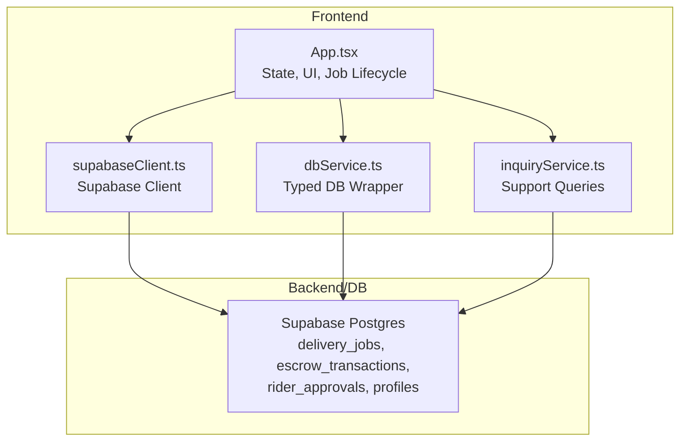
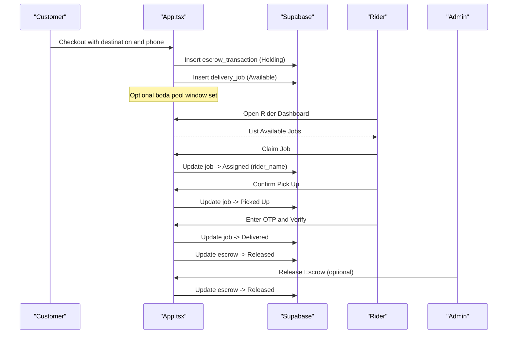
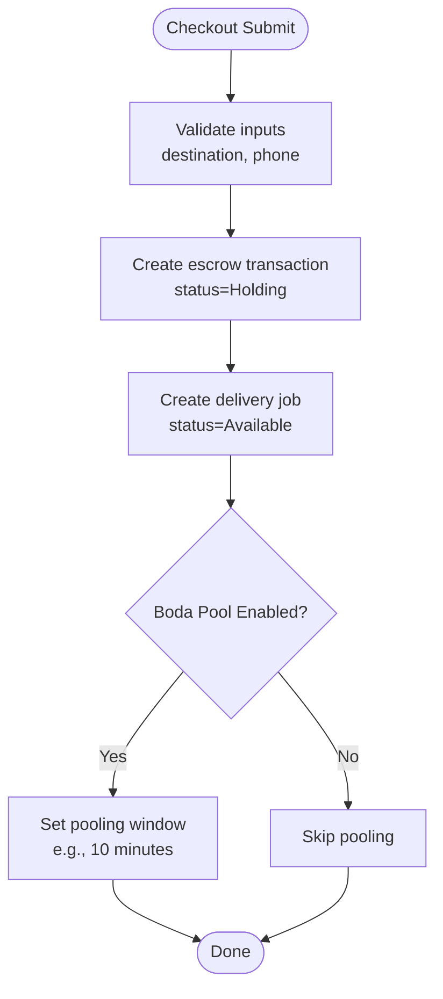
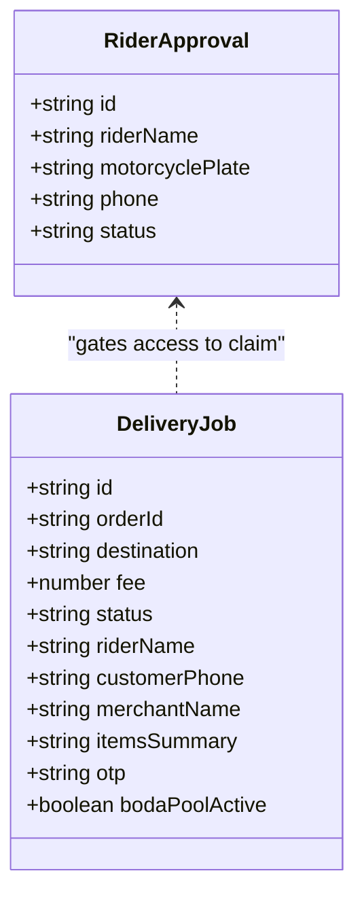
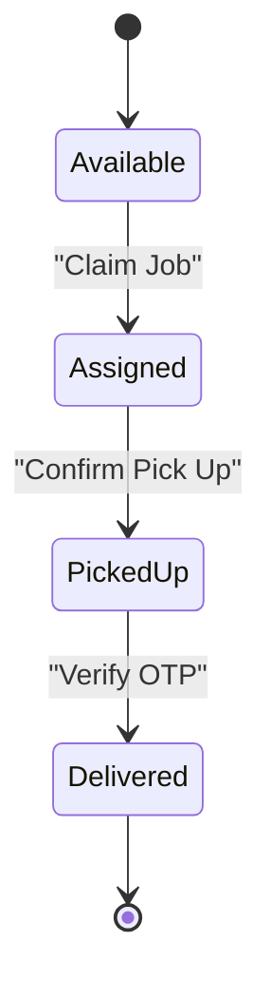
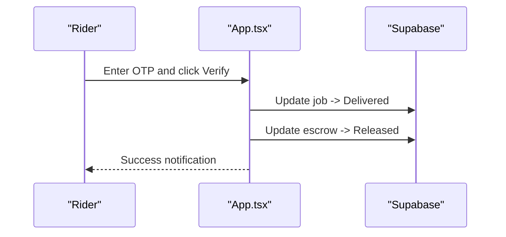
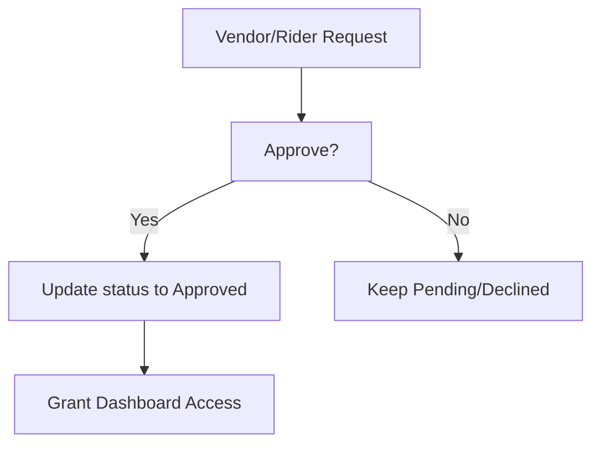
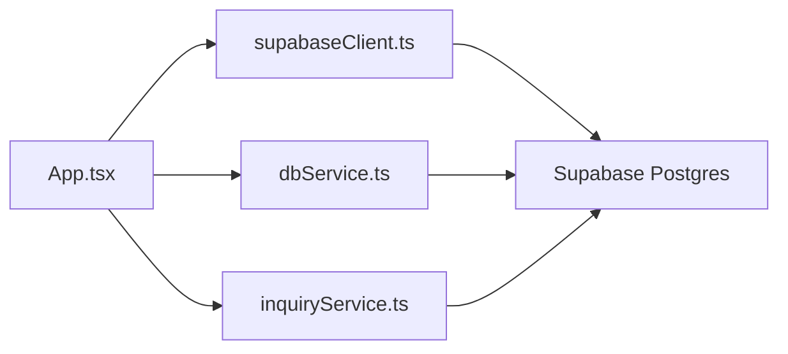

# Rider Assignment & Fleet Management

<cite>
**Referenced Files in This Document**
- [App.tsx](file://src/App.tsx)
- [supabaseClient.ts](file://src/supabaseClient.ts)
- [dbService.ts](file://src/supabase/dbService.ts)
- [inquiryService.ts](file://src/supabase/inquiryService.ts)
- [supabase_schema.sql](file://supabase_schema.sql)
- [package.json](file://package.json)
</cite>

## Table of Contents
1. [Introduction](#introduction)
2. [Project Structure](#project-structure)
3. [Core Components](#core-components)
4. [Architecture Overview](#architecture-overview)
5. [Detailed Component Analysis](#detailed-component-analysis)
6. [Dependency Analysis](#dependency-analysis)
7. [Performance Considerations](#performance-considerations)
8. [Troubleshooting Guide](#troubleshooting-guide)
9. [Conclusion](#conclusion)

## Introduction
This document explains the rider assignment system and fleet management implemented in the application. It covers how delivery jobs are created, how riders claim and progress through job states, the boda pool (shared delivery) mechanism, OTP-based verification at handover, and admin controls for escrow release. The system is built as a React + TypeScript frontend that interacts with Supabase via a shared client instance. Data models and Row Level Security policies are defined in a SQL schema file.

## Project Structure
The rider and fleet features live primarily in the main application component, with data access utilities and a Supabase client. Database schema and RLS policies are defined in a single SQL script.

**Diagram sources**
- [App.tsx:1144-1231](file://src/App.tsx#L1144-L1231)
- [supabaseClient.ts:1-7](file://src/supabaseClient.ts#L1-L7)
- [dbService.ts:1-24](file://src/supabase/dbService.ts#L1-L24)
- [inquiryService.ts:1-19](file://src/supabase/inquiryService.ts#L1-L19)
- [supabase_schema.sql:55-69](file://supabase_schema.sql#L55-L69)

**Section sources**
- [App.tsx:1144-1231](file://src/App.tsx#L1144-L1231)
- [supabaseClient.ts:1-7](file://src/supabaseClient.ts#L1-L7)
- [supabase_schema.sql:55-69](file://supabase_schema.sql#L55-L69)

## Core Components
- Delivery Jobs: Represented by a typed interface and persisted to the database. Each job includes order reference, destination, fee, status lifecycle, customer contact, merchant info, items summary, OTP, and boda pool flag.
- Escrow Transactions: Payment holding ledger linked to orders; status transitions from Holding to Released upon successful delivery verification.
- Rider Approvals: Onboarding queue for riders; approval gates access to the rider dashboard.
- Profiles: User identity and role used to gate access and personalize dashboards.

Key responsibilities:
- Job creation on checkout with optional boda pooling.
- Rider claiming, pickup confirmation, OTP verification, and completion.
- Admin release of escrow funds when needed.

**Section sources**
- [App.tsx:97-109](file://src/App.tsx#L97-L109)
- [App.tsx:1144-1231](file://src/App.tsx#L1144-L1231)
- [App.tsx:1594-1651](file://src/App.tsx#L1594-L1651)
- [supabase_schema.sql:55-69](file://supabase_schema.sql#L55-L69)
- [supabase_schema.sql:44-53](file://supabase_schema.sql#L44-L53)
- [supabase_schema.sql:129-143](file://supabase_schema.sql#L129-L143)

## Architecture Overview
The flow starts at checkout, creates an escrow transaction and a delivery job, then exposes the job to approved riders. Riders claim the job, confirm pickup, verify OTP with the customer, and complete delivery. Admins can release escrow if necessary.

**Diagram sources**
- [App.tsx:1144-1231](file://src/App.tsx#L1144-L1231)
- [App.tsx:1594-1651](file://src/App.tsx#L1594-L1651)

## Detailed Component Analysis

### Delivery Job Creation and Boda Pooling
- Triggered during checkout after payment initiation.
- Creates an escrow transaction and a delivery job with status Available.
- If boda pooling is enabled, sets a time window to allow grouping multiple deliveries along similar routes.
- Updates local state and persists to Supabase.

**Diagram sources**
- [App.tsx:1144-1231](file://src/App.tsx#L1144-L1231)

**Section sources**
- [App.tsx:1144-1231](file://src/App.tsx#L1144-L1231)

### Rider Selection Criteria and Availability Tracking
- Access to the rider dashboard is gated by rider approvals or explicit role.
- Available jobs are listed; riders claim jobs by updating the job’s status to Assigned and setting the rider name.
- No automatic matching algorithm is implemented; selection is first-come-first-served based on manual claiming.

**Diagram sources**
- [App.tsx:97-109](file://src/App.tsx#L97-L109)
- [supabase_schema.sql:129-143](file://supabase_schema.sql#L129-L143)

**Section sources**
- [App.tsx:1594-1607](file://src/App.tsx#L1594-L1607)
- [App.tsx:3030-3187](file://src/App.tsx#L3030-L3187)

### Job Status Lifecycle and Real-Time Updates
- States: Available → Assigned → Picked Up → Delivered.
- Each transition updates the database and refreshes local state for immediate UI feedback.
- OTP handshake ensures secure handover between rider and customer.

**Diagram sources**
- [App.tsx:1594-1651](file://src/App.tsx#L1594-L1651)

**Section sources**
- [App.tsx:1594-1651](file://src/App.tsx#L1594-L1651)

### OTP-Based Handshake and Escrow Release
- A secure OTP is generated and stored with the job.
- Rider enters OTP at delivery; verification updates both job and escrow to completed states.
- Admin can manually release escrow funds if required.

**Diagram sources**
- [App.tsx:1624-1651](file://src/App.tsx#L1624-L1651)

**Section sources**
- [App.tsx:1624-1651](file://src/App.tsx#L1624-L1651)

### Admin Controls and Approval Gates
- Vendor and rider approvals are managed via dedicated tables; approval status determines dashboard access.
- Admin can ban/unban vendors and release escrow funds.

**Diagram sources**
- [supabase_schema.sql:114-143](file://supabase_schema.sql#L114-L143)
- [App.tsx:1452-1512](file://src/App.tsx#L1452-L1512)

**Section sources**
- [App.tsx:1452-1512](file://src/App.tsx#L1452-L1512)

## Dependency Analysis
- App.tsx orchestrates all user flows and directly calls Supabase via the shared client.
- dbService provides a typed wrapper for common operations.
- inquiryService encapsulates support-related queries.
- supabase_schema.sql defines tables and RLS policies enabling full CRUD for client apps.

**Diagram sources**
- [App.tsx:1144-1231](file://src/App.tsx#L1144-L1231)
- [supabaseClient.ts:1-7](file://src/supabaseClient.ts#L1-L7)
- [dbService.ts:1-24](file://src/supabase/dbService.ts#L1-L24)
- [inquiryService.ts:1-19](file://src/supabase/inquiryService.ts#L1-L19)
- [supabase_schema.sql:166-198](file://supabase_schema.sql#L166-L198)

**Section sources**
- [package.json:12-28](file://package.json#L12-L28)
- [supabase_schema.sql:166-198](file://supabase_schema.sql#L166-L198)

## Performance Considerations
- Batch inserts: When initializing baseline data, use batch inserts to reduce round trips.
- Selective queries: Fetch only required fields to minimize payload size.
- Local state caching: Keep recent job lists in memory to avoid frequent re-fetches.
- Debounce search/filter: Apply debouncing on marketplace filters to reduce unnecessary computations.
- Avoid N+1 patterns: Use single queries where possible and precompute derived values locally.

[No sources needed since this section provides general guidance]

## Troubleshooting Guide
- Authentication issues: Ensure Supabase URL and anon key are correct; check RLS policies if queries return null.
- Empty results: Confirm rows exist in Supabase Studio and that field names match schema columns.
- Failed inserts: Inspect error messages from Supabase; verify permissions and constraints.
- OTP mismatch: Re-generate OTP if needed and ensure the entered code matches the stored value.

**Section sources**
- [SUPABASE.md:14-28](file://SUPABASE.md#L14-L28)
- [App.tsx:1144-1231](file://src/App.tsx#L1144-L1231)
- [App.tsx:1624-1651](file://src/App.tsx#L1624-L1651)

## Conclusion
The rider assignment system implements a straightforward, manual dispatch model with clear job states, OTP-based verification, and escrow integration. While location-based matching and advanced route optimization are not present, the boda pool feature supports shared deliveries within a time window. Future enhancements could include proximity-based matching, capacity limits per rider, and real-time tracking integrations.

[No sources needed since this section summarizes without analyzing specific files]