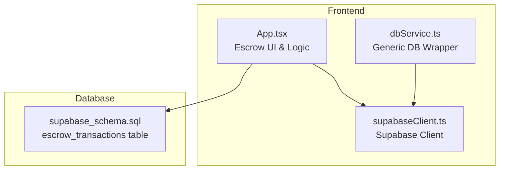
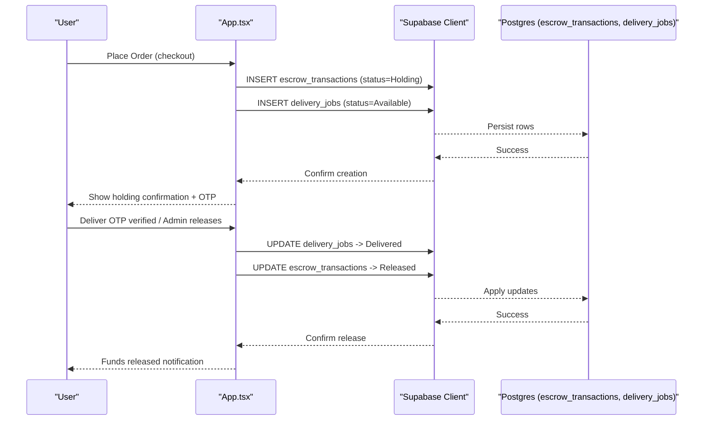
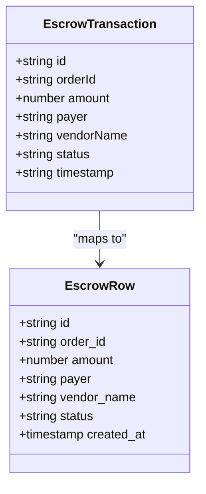
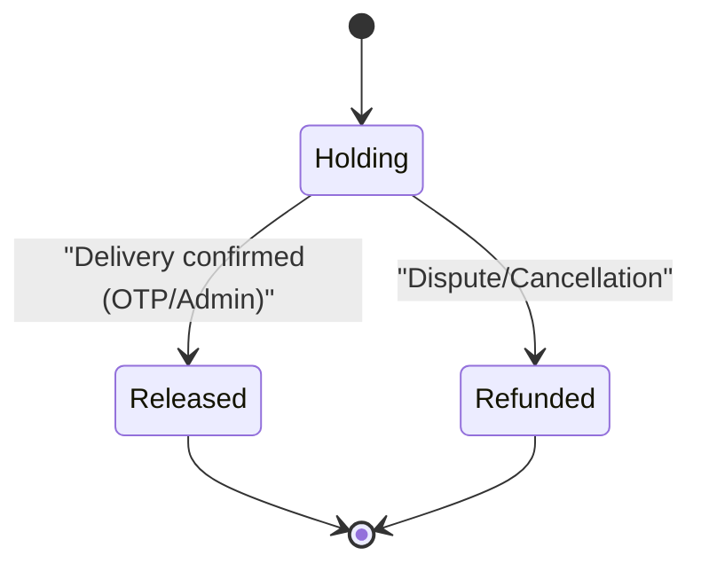
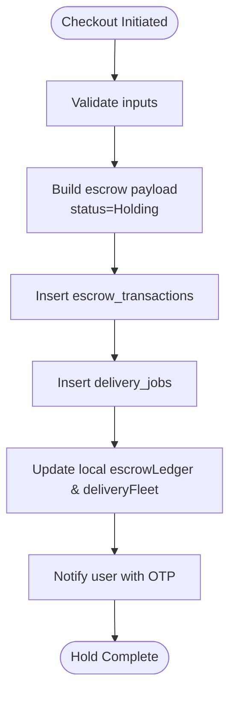
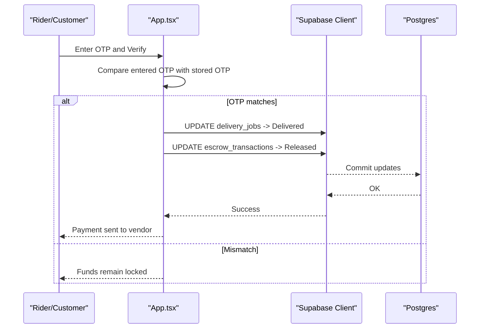
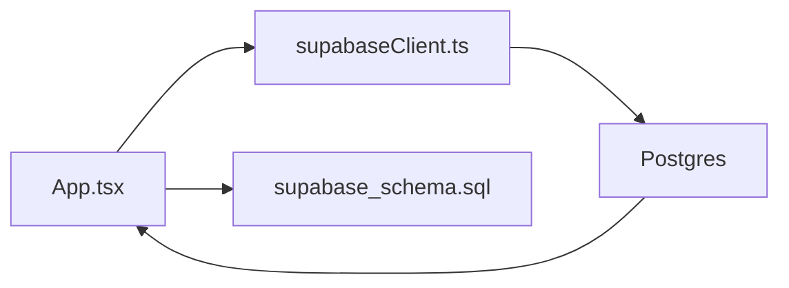

# Escrow Mechanics

<cite>
**Referenced Files in This Document**
- [App.tsx](file://src/App.tsx)
- [supabase_schema.sql](file://supabase_schema.sql)
- [supabaseClient.ts](file://src/supabase/supabaseClient.ts)
- [dbService.ts](file://src/supabase/dbService.ts)
</cite>

## Table of Contents
1. Introduction
2. Project Structure
3. Core Components
4. Architecture Overview
5. Detailed Component Analysis
6. Dependency Analysis
7. Performance Considerations
8. Troubleshooting Guide
9. Conclusion

## Introduction
This document explains the escrow mechanics implemented in the application, focusing on how funds are held during transactions, the transaction lifecycle state machine (Holding → Released/Refunded), and security measures protecting buyers and sellers. It documents the EscrowTransaction interface fields (orderId, amount, payer, vendorName, status, timestamp), details the hold process when orders are placed, release conditions upon delivery confirmation, and refund triggers for disputes or cancellations. It also covers examples of creating escrow transactions, updating statuses, maintaining an audit trail, and addresses concurrent handling and data consistency considerations.

## Project Structure
The escrow feature spans:
- Database schema defining the escrow ledger and related tables
- Application logic that creates, updates, and displays escrow records
- Supabase client configuration used to persist and query data

**Diagram sources**
- [App.tsx](file://src/App.tsx)
- [supabaseClient.ts](file://src/supabase/supabaseClient.ts)
- [dbService.ts](file://src/supabase/dbService.ts)
- [supabase_schema.sql](file://supabase_schema.sql)

**Section sources**
- [supabase_schema.sql](file://supabase_schema.sql)
- [App.tsx](file://src/App.tsx)
- [supabaseClient.ts](file://src/supabase/supabaseClient.ts)
- [dbService.ts](file://src/supabase/dbService.ts)

## Core Components
- EscrowTransaction interface defines the in-memory model with fields orderId, amount, payer, vendorName, status, and timestamp.
- escrow_transactions table persists the ledger with columns id, order_id, amount, payer, vendor_name, status, created_at.
- DeliveryJobs table is linked via order_id and participates in the release flow.
- Supabase client provides authenticated access to insert and update records.

Key responsibilities:
- Create escrow record on checkout with status Holding
- Update delivery job and escrow record to Released upon successful delivery verification
- Provide admin controls to release funds
- Maintain a timestamped audit trail for dispute resolution

**Section sources**
- [App.tsx](file://src/App.tsx)
- [supabase_schema.sql](file://supabase_schema.sql)

## Architecture Overview
The escrow flow integrates the frontend UI, Supabase client, and database schema. On checkout, the app inserts both an escrow transaction and a delivery job. Release occurs after OTP verification or admin action, updating both tables atomically per request.

**Diagram sources**
- [App.tsx](file://src/App.tsx)
- [supabase_schema.sql](file://supabase_schema.sql)

## Detailed Component Analysis

### Data Model and Interface
- In-memory EscrowTransaction includes:
  - orderId: unique order identifier
  - amount: total payable amount
  - payer: buyer identity
  - vendorName: merchant name
  - status: Holding | Released | Refunded
  - timestamp: human-readable time for audit trail
- Database escrow_transactions includes:
  - id, order_id, amount, payer, vendor_name, status, created_at

These two models map directly between runtime state and persistence.

**Diagram sources**
- [App.tsx](file://src/App.tsx)
- [supabase_schema.sql](file://supabase_schema.sql)

**Section sources**
- [App.tsx](file://src/App.tsx)
- [supabase_schema.sql](file://supabase_schema.sql)

### Transaction Lifecycle State Machine
States:
- Holding: funds reserved upon order placement
- Released: funds transferred after delivery confirmation
- Refunded: funds returned due to cancellation/dispute (interface supports this; current flow focuses on Holding → Released)

[No sources needed since this diagram shows conceptual workflow, not actual code structure]

### Hold Process on Checkout
- On checkout, the app constructs an escrow record with status Holding and a corresponding delivery job.
- Both records are inserted into the database.
- The UI updates local state to reflect the new escrow entry and delivery job.
- An OTP is generated and shared with the rider for secure handover.

**Diagram sources**
- [App.tsx](file://src/App.tsx)

**Section sources**
- [App.tsx](file://src/App.tsx)

### Release Conditions and Flow
Release occurs under two primary conditions:
- OTP verification by the rider/customer confirming delivery
- Admin action releasing funds

Both paths update the delivery job to Delivered and set the escrow transaction status to Released.

**Diagram sources**
- [App.tsx](file://src/App.tsx)

**Section sources**
- [App.tsx](file://src/App.tsx)

### Refund Triggers and Cancellations
- The EscrowTransaction interface supports a Refunded status for disputes or cancellations.
- While the current implementation emphasizes Holding → Released, the schema and type allow future refund flows to be added consistently.
- Recommended trigger points:
  - Customer dispute escalation
  - Vendor non-delivery within SLA
  - Administrative override based on policy

[No sources needed since this section discusses general behavior without analyzing specific files]

### Audit Trail Maintenance
- Each escrow record includes a timestamp field for display and a created_at column for persistence.
- The UI renders a live ledger showing all transactions and their statuses, enabling visibility for audits and dispute resolution.

**Section sources**
- [App.tsx](file://src/App.tsx)
- [supabase_schema.sql](file://supabase_schema.sql)

### Examples of Usage
- Creating an escrow transaction:
  - Occurs during checkout; inserts a row with status Holding and links to a delivery job.
- Updating status:
  - Upon OTP verification or admin release, updates both delivery job and escrow transaction to Released.
- Viewing ledger:
  - The dashboard lists all escrow entries with orderId, amount, payer, vendorName, status, and timestamp.

**Section sources**
- [App.tsx](file://src/App.tsx)

## Dependency Analysis
The escrow feature depends on:
- Supabase client for network requests
- Database schema enforcing table structures and RLS policies
- Frontend state management for real-time UI updates

**Diagram sources**
- [App.tsx](file://src/App.tsx)
- [supabaseClient.ts](file://src/supabase/supabaseClient.ts)
- [supabase_schema.sql](file://supabase_schema.sql)

**Section sources**
- [App.tsx](file://src/App.tsx)
- [supabaseClient.ts](file://src/supabase/supabaseClient.ts)
- [supabase_schema.sql](file://supabase_schema.sql)

## Performance Considerations
- Batch operations:
  - Inserting escrow and delivery job together reduces round-trips; consider wrapping in a single RPC if atomicity is required at scale.
- Query efficiency:
  - Selecting all escrow records is acceptable for small datasets; add indexes on order_id and status for larger volumes.
- UI responsiveness:
  - Optimistic updates improve perceived performance; ensure error handling reverts state on failure.

[No sources needed since this section provides general guidance]

## Troubleshooting Guide
Common issues and resolutions:
- Missing environment variables:
  - Ensure VITE_SUPABASE_URL and VITE_SUPABASE_ANON_KEY are set correctly.
- Incorrect URL format:
  - Do not append /rest/v1 to the base URL.
- Row Level Security (RLS):
  - Confirm policies allow inserts/selects for anon/authenticated roles during development.
- Query returns null:
  - Verify the row exists in the database and that keys match between insert and select.

**Section sources**
- [supabaseClient.ts](file://src/supabase/supabaseClient.ts)
- [SUPABASE.md](file://SUPABASE.md)

## Conclusion
The escrow system holds funds securely in a Holding state until delivery is confirmed, then transitions to Released. The design leverages a clear interface and persistent schema to maintain an auditable ledger. OTP-based verification and admin controls provide robust safeguards for both buyers and sellers. Future enhancements can introduce Refunded states and server-side atomic transactions to strengthen consistency and concurrency guarantees.