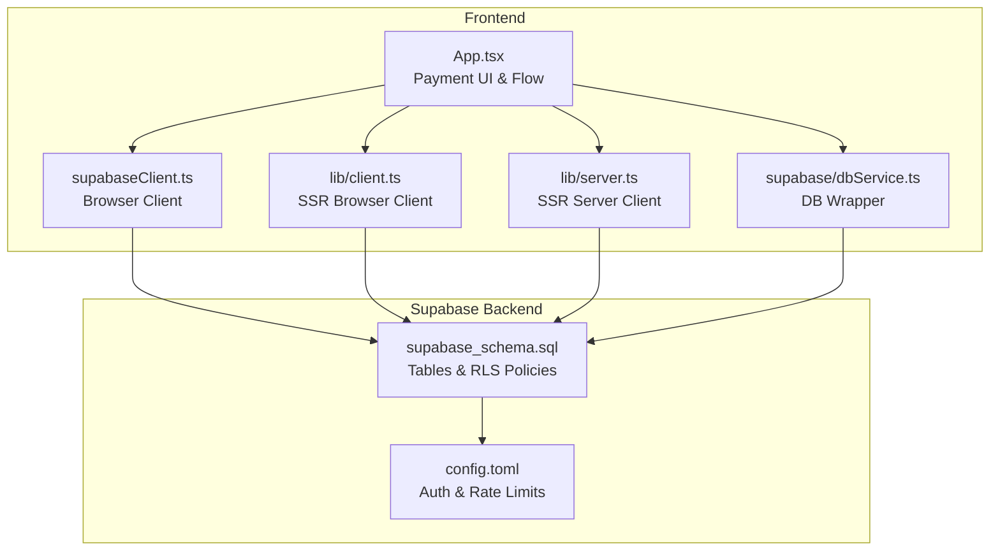
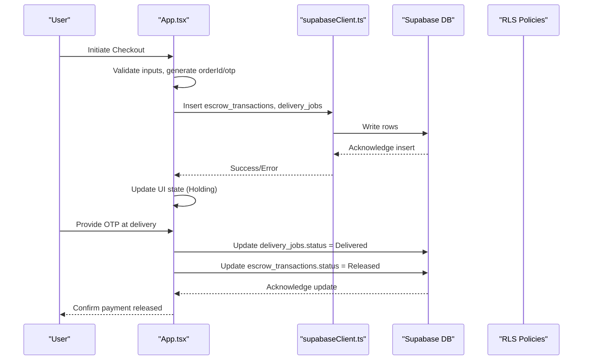
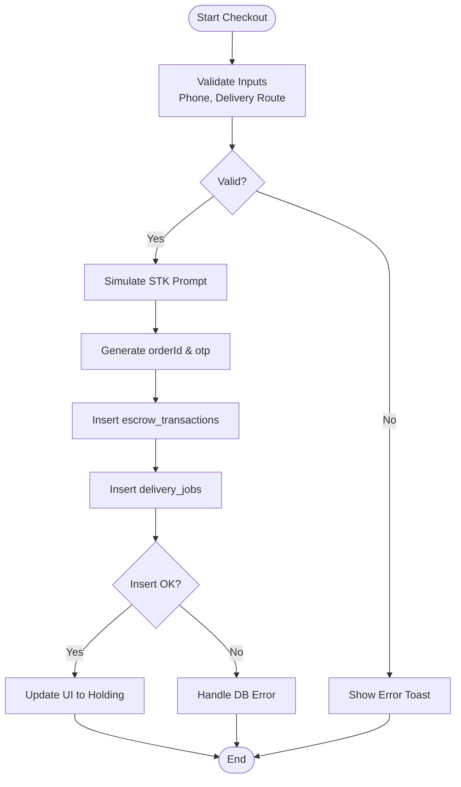
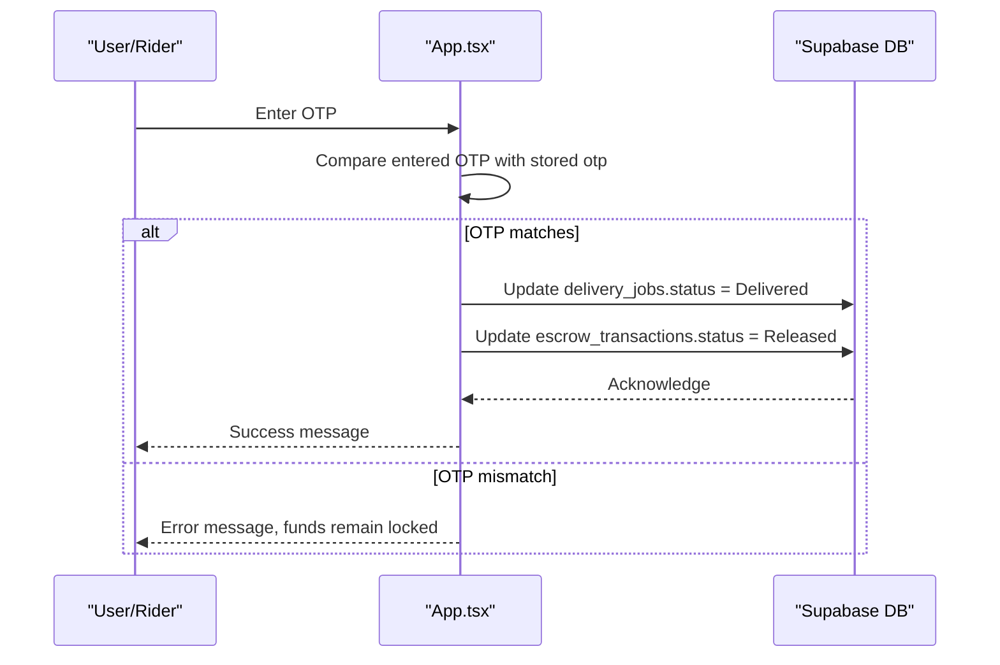
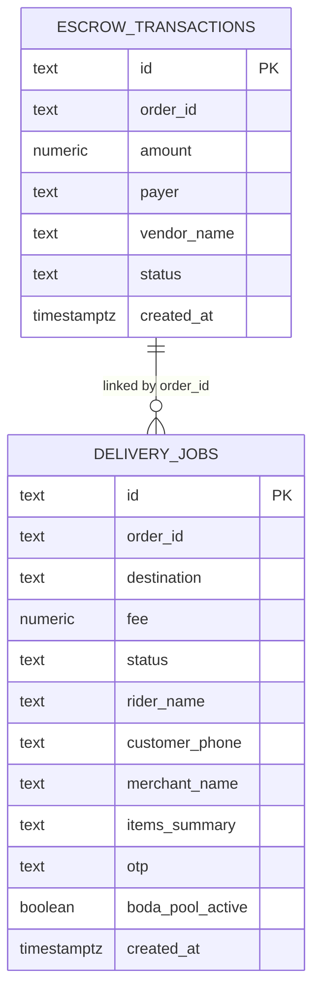
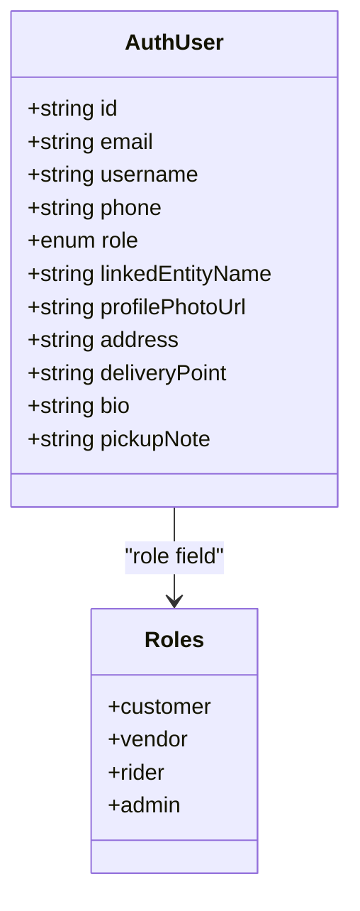
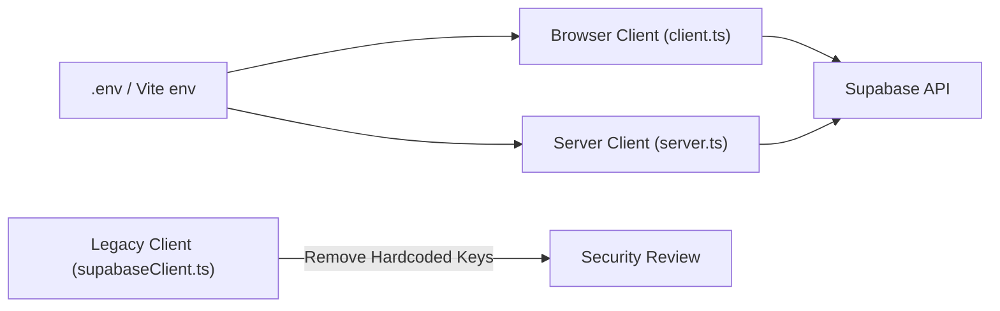
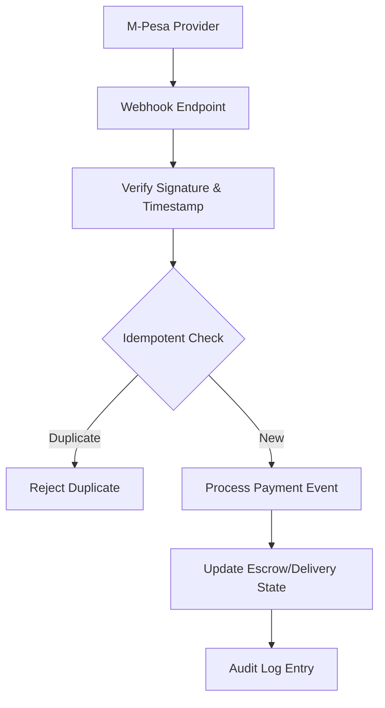
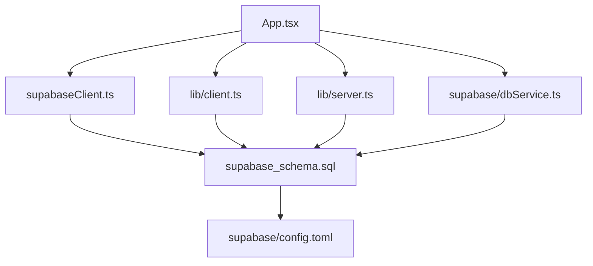

# Payment Security

<cite>
**Referenced Files in This Document**
- [App.tsx](file://src/App.tsx)
- [supabaseClient.ts](file://src/supabaseClient.ts)
- [server.ts](file://src/lib/server.ts)
- [client.ts](file://src/lib/client.ts)
- [dbService.ts](file://src/supabase/dbService.ts)
- [supabase_schema.sql](file://supabase_schema.sql)
- [config.toml](file://supabase/config.toml)
- [SUPABASE.md](file://SUPABASE.md)
- [package.json](file://package.json)
</cite>

## Table of Contents
1. [Introduction](#introduction)
2. [Project Structure](#project-structure)
3. [Core Components](#core-components)
4. [Architecture Overview](#architecture-overview)
5. [Detailed Component Analysis](#detailed-component-analysis)
6. [Dependency Analysis](#dependency-analysis)
7. [Performance Considerations](#performance-considerations)
8. [Troubleshooting Guide](#troubleshooting-guide)
9. [Conclusion](#conclusion)
10. [Appendices](#appendices)

## Introduction
This document provides a comprehensive security guide for payment processing within the marketplace. It focuses on PCI compliance considerations, data encryption strategies, secure communication protocols, fraud prevention (including OTP verification and transaction monitoring), access control and audit logging, data privacy and secure storage, protection against common vulnerabilities, webhook/callback security, third-party integrations, incident response, and security monitoring. The analysis is grounded in the repository’s implementation details and configuration files.

## Project Structure
The application is a React + TypeScript + Vite frontend that integrates with Supabase for authentication, database operations, and Row Level Security (RLS). Payment-related flows are implemented primarily in the main application component and supported by Supabase client utilities and schema definitions.

**Diagram sources**
- [App.tsx:1144-1231](file://src/App.tsx#L1144-L1231)
- [supabaseClient.ts:1-7](file://src/supabaseClient.ts#L1-L7)
- [client.ts:1-9](file://src/lib/client.ts#L1-L9)
- [server.ts:1-29](file://src/lib/server.ts#L1-L29)
- [dbService.ts:1-24](file://src/supabase/dbService.ts#L1-L24)
- [supabase_schema.sql:44-69](file://supabase_schema.sql#L44-L69)
- [config.toml:155-212](file://supabase/config.toml#L155-L212)

**Section sources**
- [App.tsx:1144-1231](file://src/App.tsx#L1144-L1231)
- [supabase_schema.sql:44-69](file://supabase_schema.sql#L44-L69)
- [config.toml:155-212](file://supabase/config.toml#L155-L212)

## Core Components
- Payment UI and Escrow Flow: The checkout flow triggers an M-Pesa STK prompt simulation, generates an order ID and OTP, records escrow transactions and delivery jobs, and updates UI state accordingly.
- OTP Verification: Delivery job completion requires matching the OTP to release funds from holding to vendor.
- Database Schema: Tables include escrow_transactions and delivery_jobs, with RLS policies enabling broad access for development.
- Supabase Clients: Browser and SSR clients configured via environment variables; a legacy client file contains hardcoded credentials.
- DB Wrapper: A typed wrapper around Supabase queries for consistent error handling.

Key responsibilities:
- App.tsx orchestrates payment initiation, OTP generation, and state transitions.
- supabase_schema.sql defines tables and default RLS policies.
- config.toml sets auth behavior and rate limits.
- supabaseClient.ts, client.ts, server.ts manage client initialization and cookie handling.
- dbService.ts standardizes query patterns and error propagation.

**Section sources**
- [App.tsx:1144-1231](file://src/App.tsx#L1144-L1231)
- [App.tsx:1627-1651](file://src/App.tsx#L1627-L1651)
- [supabase_schema.sql:44-69](file://supabase_schema.sql#L44-L69)
- [supabase_schema.sql:170-198](file://supabase_schema.sql#L170-L198)
- [config.toml:155-212](file://supabase/config.toml#L155-L212)
- [supabaseClient.ts:1-7](file://src/supabaseClient.ts#L1-L7)
- [client.ts:1-9](file://src/lib/client.ts#L1-L9)
- [server.ts:1-29](file://src/lib/server.ts#L1-L29)
- [dbService.ts:1-24](file://src/supabase/dbService.ts#L1-L24)

## Architecture Overview
The payment architecture combines frontend orchestration with Supabase-backed persistence and policy enforcement. The current implementation simulates external payment provider interactions and uses OTP-based authorization to release funds.

**Diagram sources**
- [App.tsx:1144-1231](file://src/App.tsx#L1144-L1231)
- [App.tsx:1627-1651](file://src/App.tsx#L1627-L1651)
- [supabase_schema.sql:44-69](file://supabase_schema.sql#L44-L69)

## Detailed Component Analysis

### Payment Initiation and Escrow Holding
The checkout process validates user input, simulates triggering an STK prompt, creates an order ID and OTP, persists escrow and delivery records, and transitions UI to a “Holding” state.

**Diagram sources**
- [App.tsx:1144-1231](file://src/App.tsx#L1144-L1231)

**Section sources**
- [App.tsx:1144-1231](file://src/App.tsx#L1144-L1231)

### OTP Verification and Fund Release
Delivery completion requires OTP verification. On successful match, the system updates both delivery and escrow statuses to reflect fund release.

**Diagram sources**
- [App.tsx:1627-1651](file://src/App.tsx#L1627-L1651)

**Section sources**
- [App.tsx:1627-1651](file://src/App.tsx#L1627-L1651)

### Data Model and Storage
The schema defines core entities for payments and delivery, including fields for amounts, payer/vendor info, status, and OTP. RLS policies currently allow broad access for development.

**Diagram sources**
- [supabase_schema.sql:44-69](file://supabase_schema.sql#L44-L69)

**Section sources**
- [supabase_schema.sql:44-69](file://supabase_schema.sql#L44-L69)

### Access Control and Role-Based Permissions
Roles are modeled in the application layer (customer, vendor, rider, admin). RLS policies in the schema currently enable full access for anon/authenticated/service roles across all tables.

**Diagram sources**
- [App.tsx:141-153](file://src/App.tsx#L141-L153)
- [supabase_schema.sql:170-198](file://supabase_schema.sql#L170-L198)

**Section sources**
- [App.tsx:141-153](file://src/App.tsx#L141-L153)
- [supabase_schema.sql:170-198](file://supabase_schema.sql#L170-L198)

### Secure Communication and Client Configuration
Clients are initialized using environment variables for URL and keys. A legacy client file contains hardcoded credentials which must be removed. SSR client handles cookies securely.

**Diagram sources**
- [client.ts:1-9](file://src/lib/client.ts#L1-L9)
- [server.ts:1-29](file://src/lib/server.ts#L1-L29)
- [supabaseClient.ts:1-7](file://src/supabaseClient.ts#L1-L7)

**Section sources**
- [client.ts:1-9](file://src/lib/client.ts#L1-L9)
- [server.ts:1-29](file://src/lib/server.ts#L1-L29)
- [supabaseClient.ts:1-7](file://src/supabaseClient.ts#L1-L7)
- [SUPABASE.md:1-38](file://SUPABASE.md#L1-L38)

### Third-Party Integration and Webhook Security
The current implementation simulates M-Pesa STK prompts without actual integration or webhook endpoints. Future integrations should implement robust webhook validation, idempotency, and signature verification.

[No sources needed since this diagram shows conceptual workflow, not actual code structure]

## Dependency Analysis
The payment flow depends on React components, Supabase clients, and the database schema. The SSR client ensures secure cookie handling, while the browser client relies on environment variables.

**Diagram sources**
- [App.tsx:1144-1231](file://src/App.tsx#L1144-L1231)
- [supabaseClient.ts:1-7](file://src/supabaseClient.ts#L1-L7)
- [client.ts:1-9](file://src/lib/client.ts#L1-L9)
- [server.ts:1-29](file://src/lib/server.ts#L1-L29)
- [dbService.ts:1-24](file://src/supabase/dbService.ts#L1-L24)
- [supabase_schema.sql:44-69](file://supabase_schema.sql#L44-L69)
- [config.toml:155-212](file://supabase/config.toml#L155-L212)

**Section sources**
- [package.json:1-48](file://package.json#L1-L48)

## Performance Considerations
- Minimize client-side delays: Replace simulated timeouts with real asynchronous calls to payment providers.
- Batch operations: Combine related inserts/updates where possible to reduce network overhead.
- Efficient queries: Use targeted column selection and indexes on frequently queried fields like order_id and status.
- Avoid unnecessary re-renders: Memoize derived data and avoid excessive state updates during payment flows.

[No sources needed since this section provides general guidance]

## Troubleshooting Guide
Common issues and mitigations:
- RLS misconfiguration: Ensure policies restrict access appropriately; overly permissive policies can expose sensitive data.
- Environment variable mismatches: Verify VITE_SUPABASE_URL and publishable keys; avoid hardcoding secrets.
- Query errors: Use the DB wrapper to capture and handle errors consistently.
- OTP mismatches: Validate OTP length and format; log attempts for audit purposes.

**Section sources**
- [SUPABASE.md:14-28](file://SUPABASE.md#L14-L28)
- [dbService.ts:5-11](file://src/supabase/dbService.ts#L5-L11)
- [supabase_schema.sql:170-198](file://supabase_schema.sql#L170-L198)

## Conclusion
The marketplace implements a foundational payment flow with OTP-based authorization and escrow-style holding. While functional, it lacks production-grade security controls such as strict RLS policies, encrypted sensitive data storage, robust webhook validation, and comprehensive audit logging. Addressing these gaps is critical for PCI compliance and overall security posture.

[No sources needed since this section summarizes without analyzing specific files]

## Appendices

### PCI Compliance Considerations
- Do not store PANs or CVV in plaintext; use tokenization via certified payment providers.
- Encrypt sensitive data at rest and in transit; enforce TLS everywhere.
- Limit scope of systems handling cardholder data; isolate payment flows.
- Implement strong access controls and least privilege principles.
- Maintain detailed audit logs for all payment-related actions.

[No sources needed since this section provides general guidance]

### Data Encryption Strategies
- Use HTTPS/TLS for all communications.
- Encrypt sensitive fields at rest using AES-256 or equivalent.
- Manage encryption keys via a secure key management service.
- Avoid logging sensitive data; redact or hash identifiers when necessary.

[No sources needed since this section provides general guidance]

### Fraud Prevention Measures
- OTP verification: Enforce one-time codes for high-risk actions; bind OTPs to orders and sessions.
- Transaction monitoring: Detect anomalies such as repeated failures, unusual amounts, or rapid retries.
- Suspicious activity detection: Flag IPs, devices, and accounts associated with fraudulent patterns.
- Rate limiting: Apply throttling on authentication and payment endpoints.

**Section sources**
- [config.toml:197-212](file://supabase/config.toml#L197-L212)

### Access Control and Audit Logging
- Implement fine-grained RLS policies per role and tenant.
- Enforce RBAC at application and database layers.
- Log all payment events with timestamps, actors, and outcomes.
- Retain audit logs securely and make them tamper-evident.

**Section sources**
- [supabase_schema.sql:170-198](file://supabase_schema.sql#L170-L198)

### Data Privacy and Secure Storage
- Minimize data collection; collect only what is necessary.
- Anonymize or pseudonymize personal data where possible.
- Securely delete data upon retention expiry.
- Comply with applicable privacy regulations (e.g., GDPR, CCPA).

[No sources needed since this section provides general guidance]

### Protection Against Common Vulnerabilities
- Input validation and sanitization on all endpoints.
- Prevent SQL injection via parameterized queries.
- Mitigate XSS by escaping outputs and using safe APIs.
- Secure cookies and sessions; enforce HttpOnly, Secure, SameSite flags.

[No sources needed since this section provides general guidance]

### Webhook and Callback Security
- Validate signatures and timestamps on incoming webhooks.
- Enforce idempotency to prevent duplicate processing.
- Restrict webhook endpoints to trusted sources via IP allowlists.
- Return appropriate HTTP status codes and acknowledgments.

[No sources needed since this section provides general guidance]

### Incident Response and Monitoring
- Define clear escalation procedures for payment incidents.
- Monitor for anomalies in transaction volumes and failure rates.
- Maintain runbooks for common scenarios (fraud spikes, outages).
- Conduct post-incident reviews and update controls accordingly.

[No sources needed since this section provides general guidance]