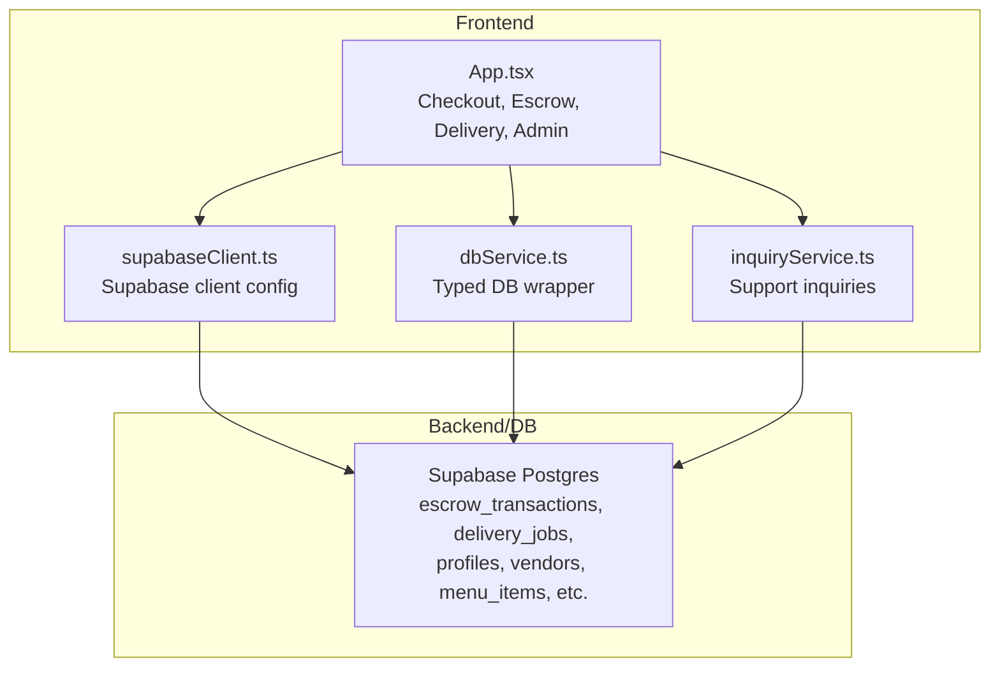
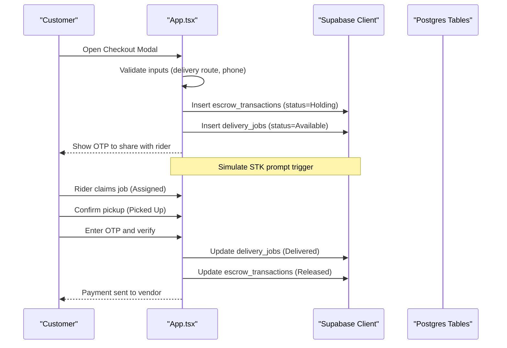
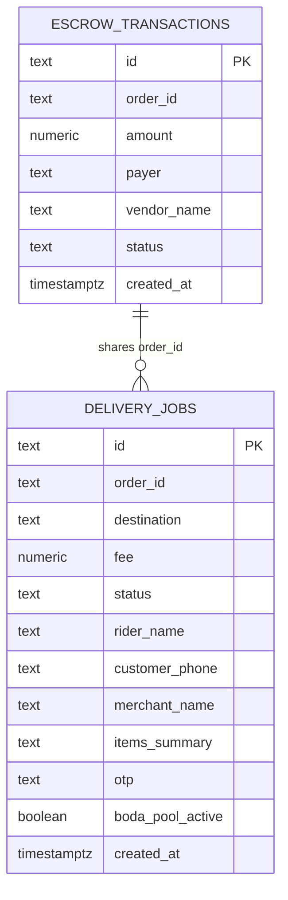
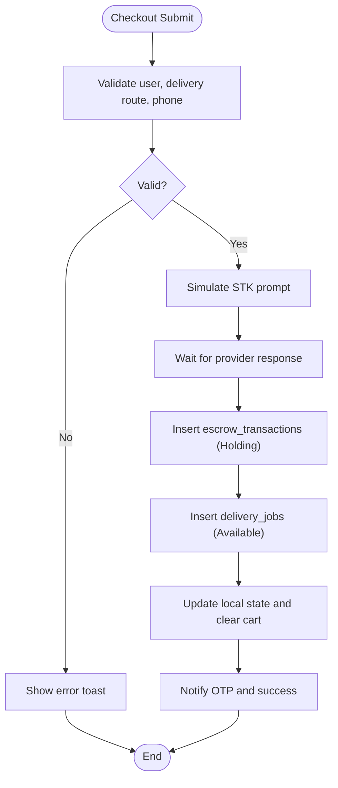
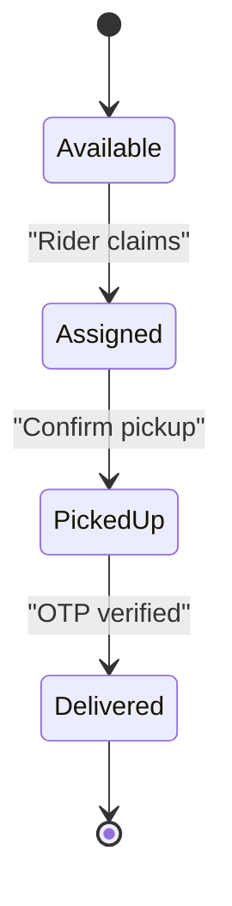
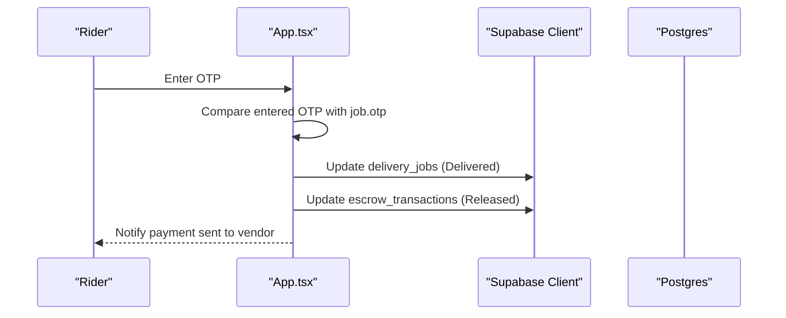
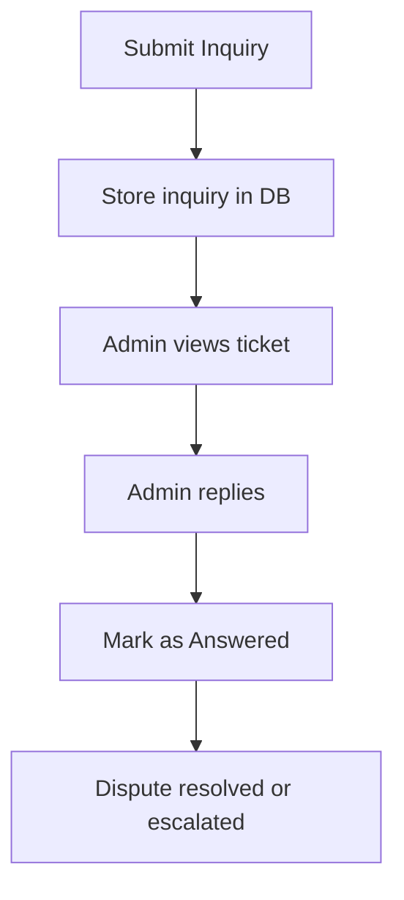
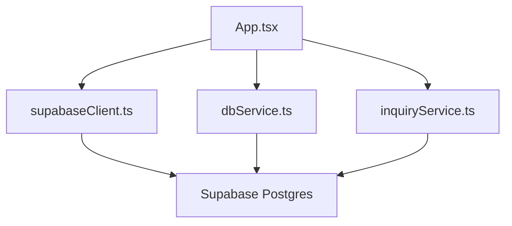

# Payment System

<cite>
**Referenced Files in This Document**
- [App.tsx](file://src/App.tsx)
- [supabaseClient.ts](file://src/supabaseClient.ts)
- [dbService.ts](file://src/supabase/dbService.ts)
- [inquiryService.ts](file://src/supabase/inquiryService.ts)
- [supabase_schema.sql](file://supabase_schema.sql)
- [package.json](file://package.json)
- [SUPABASE.md](file://SUPABASE.md)
</cite>

## Table of Contents
1. [Introduction](#introduction)
2. [Project Structure](#project-structure)
3. [Core Components](#core-components)
4. [Architecture Overview](#architecture-overview)
5. [Detailed Component Analysis](#detailed-component-analysis)
6. [Dependency Analysis](#dependency-analysis)
7. [Performance Considerations](#performance-considerations)
8. [Troubleshooting Guide](#troubleshooting-guide)
9. [Conclusion](#conclusion)
10. [Appendices](#appendices)

## Introduction
This document provides comprehensive documentation for the escrow payment system implemented in the application. It explains how payments are held securely until delivery confirmation, the transaction lifecycle and states, security measures, auditability, dispute handling, and integration points with Supabase. The system uses a client-side React UI to orchestrate checkout, hold funds via an M-Pesa STK prompt flow (simulated), create escrow records, manage delivery jobs, and release or refund funds based on delivery verification and administrative actions.

## Project Structure
The escrow payment system is primarily implemented within the main application component and supported by Supabase client utilities and schema definitions:
- Application logic and UI flows live in the main React component file.
- Supabase client configuration and helper services provide database access.
- The database schema defines tables for escrow transactions and related entities.
- Configuration guidance and environment setup instructions are provided in dedicated documentation files.

**Diagram sources**
- [App.tsx](file://src/App.tsx)
- [supabaseClient.ts](file://src/supabaseClient.ts)
- [dbService.ts](file://src/supabase/dbService.ts)
- [inquiryService.ts](file://src/supabase/inquiryService.ts)
- [supabase_schema.sql](file://supabase_schema.sql)

**Section sources**
- [App.tsx](file://src/App.tsx)
- [supabaseClient.ts](file://src/supabaseClient.ts)
- [dbService.ts](file://src/supabase/dbService.ts)
- [inquiryService.ts](file://src/supabase/inquiryService.ts)
- [supabase_schema.sql](file://supabase_schema.sql)
- [SUPABASE.md](file://SUPABASE.md)

## Core Components
- Checkout and Escrow Initiation: The checkout modal collects delivery route, optional group pooling, and customer phone number. On submission, it simulates triggering an M-Pesa STK prompt and creates both an escrow transaction record and a delivery job record.
- Delivery Job Lifecycle: Jobs progress through Available → Assigned → Picked Up → Delivered. At Picked Up, the rider verifies delivery using a One-Time Password (OTP) handshake.
- Escrow Release and Refund: Funds are released when delivery is confirmed via OTP or admin action. A refund state exists in the schema but is not wired in the current UI; it can be used for dispute resolution workflows.
- Support and Dispute Handling: Customers can submit support tickets. Admins can reply and mark issues as answered. This supports dispute resolution around payments and deliveries.

Key implementation highlights:
- Transaction creation writes to escrow_transactions and delivery_jobs.
- Status transitions are persisted via Supabase updates.
- OTP-based verification ensures secure handover before releasing funds.
- Admin controls allow manual release of funds from holding.

**Section sources**
- [App.tsx](file://src/App.tsx)
- [supabase_schema.sql](file://supabase_schema.sql)

## Architecture Overview
The escrow payment architecture integrates frontend orchestration with Supabase-backed persistence and Row Level Security policies. The flow emphasizes buyer protection by holding funds until delivery confirmation and seller protection by ensuring delivery verification before fund release.

**Diagram sources**
- [App.tsx](file://src/App.tsx)
- [supabase_schema.sql](file://supabase_schema.sql)

## Detailed Component Analysis

### Escrow Transaction Model and Schema
The escrow ledger is stored in a dedicated table with fields for order identification, amount, payer, vendor name, status, and timestamp. Status values include Holding, Released, and Refunded.

**Diagram sources**
- [supabase_schema.sql](file://supabase_schema.sql)

**Section sources**
- [supabase_schema.sql](file://supabase_schema.sql)

### Checkout and Escrow Initiation Flow
On checkout submission:
- Inputs are validated (user authentication, delivery route selection, valid mobile number).
- An M-Pesa STK prompt is simulated and a delay is applied to mimic provider latency.
- A unique order ID and OTP are generated.
- Both escrow transaction and delivery job records are inserted into Supabase.
- Local state is updated to reflect new records and clear the cart.

**Diagram sources**
- [App.tsx](file://src/App.tsx)

**Section sources**
- [App.tsx](file://src/App.tsx)

### Delivery Job Lifecycle and OTP Handshake
Delivery jobs follow a strict lifecycle:
- Available: Job posted and visible to riders.
- Assigned: Rider claims the job.
- Picked Up: Rider confirms pickup; OTP verification becomes active.
- Delivered: OTP matches; job marked delivered and escrow released.

**Diagram sources**
- [App.tsx](file://src/App.tsx)

**Section sources**
- [App.tsx](file://src/App.tsx)

### Escrow Release and Refund Mechanisms
- Release: Occurs automatically upon successful OTP verification or manually via admin action.
- Refund: The schema includes a Refunded state for future dispute resolution workflows. Currently, the UI does not implement refund actions; this can be extended to support refunds after disputes.

**Diagram sources**
- [App.tsx](file://src/App.tsx)

**Section sources**
- [App.tsx](file://src/App.tsx)

### Support and Dispute Resolution Workflow
Customers can submit support inquiries with topics such as Payment Dispute. Admins can respond and mark tickets as Answered. This provides a foundation for dispute resolution around payments and deliveries.

**Diagram sources**
- [App.tsx](file://src/App.tsx)
- [inquiryService.ts](file://src/supabase/inquiryService.ts)

**Section sources**
- [App.tsx](file://src/App.tsx)
- [inquiryService.ts](file://src/supabase/inquiryService.ts)

### Admin Controls and Financial Reporting
Administrators can:
- Approve vendor and rider registrations.
- Ban/unban stores.
- Release escrow funds manually from the holding queue.
- View support communications and respond.

Financial reporting capabilities are currently limited to UI displays of escrow ledgers and delivery queues. For robust reporting, consider adding server-side aggregation endpoints and export features.

**Section sources**
- [App.tsx](file://src/App.tsx)

## Dependency Analysis
The payment system depends on:
- React components for UI and state management.
- Supabase client for authentication and database operations.
- Typed DB wrapper for consistent query patterns.
- Database schema defining tables and RLS policies.

**Diagram sources**
- [App.tsx](file://src/App.tsx)
- [supabaseClient.ts](file://src/supabaseClient.ts)
- [dbService.ts](file://src/supabase/dbService.ts)
- [inquiryService.ts](file://src/supabase/inquiryService.ts)
- [supabase_schema.sql](file://supabase_schema.sql)

**Section sources**
- [package.json](file://package.json)
- [supabaseClient.ts](file://src/supabaseClient.ts)
- [dbService.ts](file://src/supabase/dbService.ts)
- [inquiryService.ts](file://src/supabase/inquiryService.ts)
- [supabase_schema.sql](file://supabase_schema.sql)

## Performance Considerations
- Batch operations: When inserting multiple records (e.g., default data seeding), use batch inserts to reduce round trips.
- Query optimization: Use selective column queries and indexes on frequently filtered fields like order_id and status.
- State synchronization: Keep local state minimal and rely on Supabase real-time subscriptions for live updates where needed.
- Avoid heavy computations in render loops; memoize derived data with useMemo.

[No sources needed since this section provides general guidance]

## Troubleshooting Guide
Common issues and resolutions:
- Empty query results: Ensure correct table names, field mappings, and RLS policies. Check that inserts succeeded and select queries match inserted payloads.
- Incorrect Supabase URL: Verify VITE_SUPABASE_URL is set to project URL without /rest/v1 suffix.
- RLS restrictions: Temporarily open policies for development, then tighten them for production.
- Auth failures: Confirm credentials and session retrieval. Handle legacy fallbacks gracefully.

**Section sources**
- [SUPABASE.md](file://SUPABASE.md)
- [supabaseClient.ts](file://src/supabaseClient.ts)

## Conclusion
The escrow payment system provides a robust mechanism for securing transactions between buyers and sellers. By holding funds until delivery confirmation and leveraging OTP-based verification, it protects both parties effectively. While the current implementation focuses on core functionality, extending refund workflows, webhook integrations, and financial reporting will enhance its maturity and compliance posture.

[No sources needed since this section summarizes without analyzing specific files]

## Appendices

### Implementation Details and Integration Points
- M-Pesa STK Prompt: Simulated in the checkout flow; replace with actual provider API calls for production.
- Webhook Handling: Not implemented yet; add serverless functions to handle payment provider callbacks and update escrow statuses accordingly.
- PCI Compliance: Avoid storing sensitive card data; rely on provider tokenization and ensure TLS encryption for all communications.
- Data Encryption: Encrypt sensitive fields at rest and in transit; validate and sanitize all inputs.
- Fraud Prevention: Implement rate limiting, device fingerprinting, and anomaly detection for suspicious activities.

**Section sources**
- [App.tsx](file://src/App.tsx)
- [supabase_schema.sql](file://supabase_schema.sql)