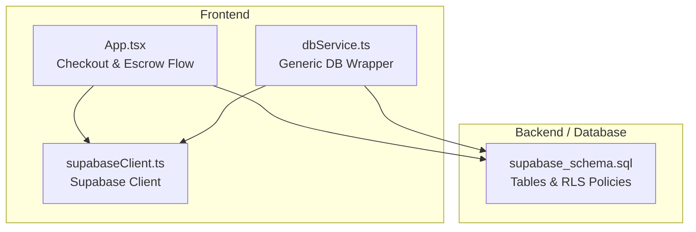
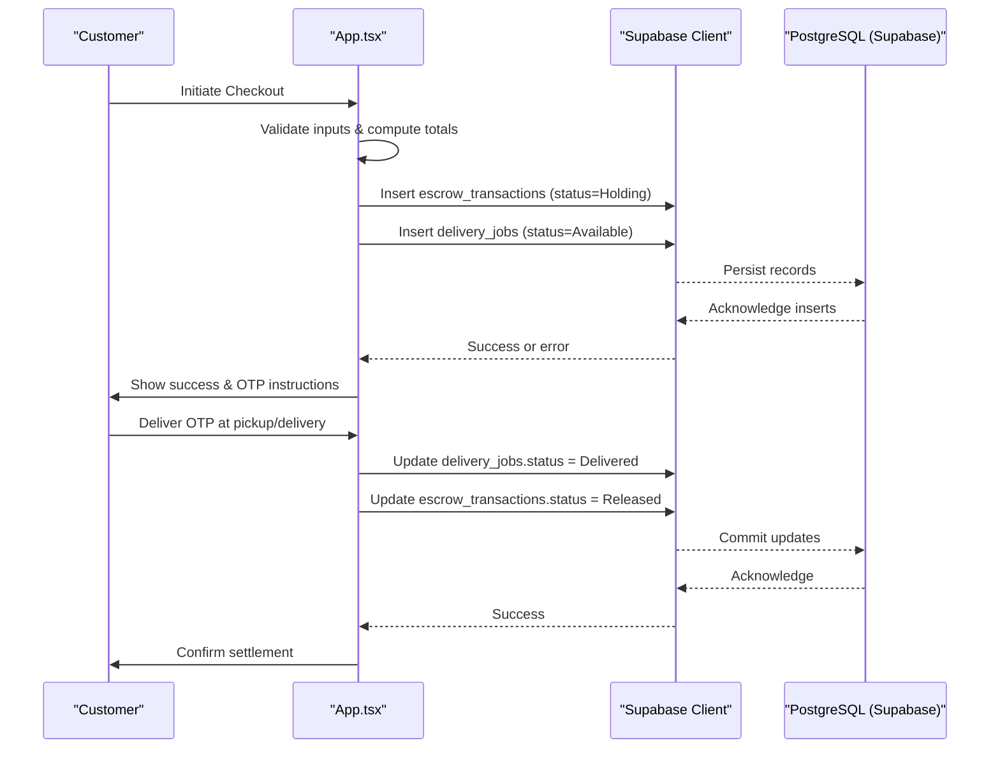
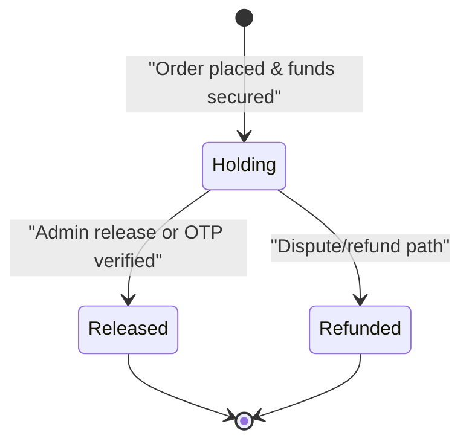
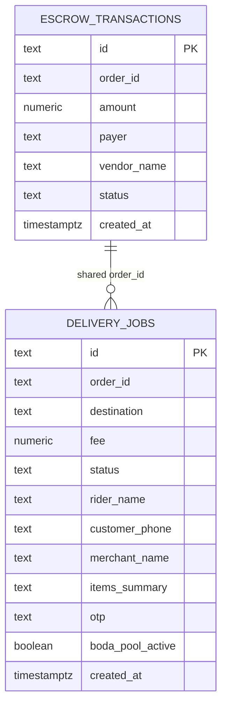
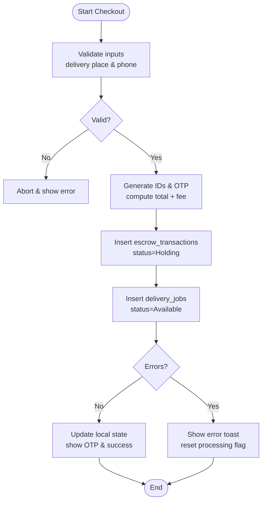
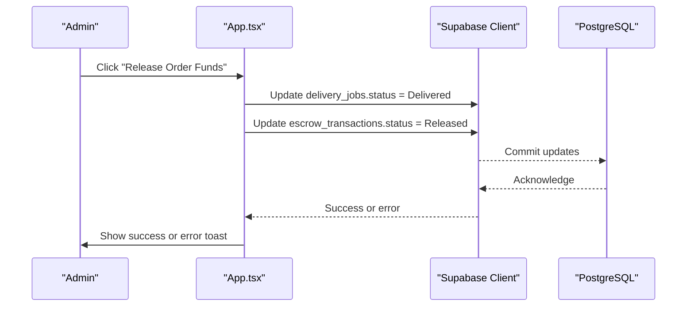
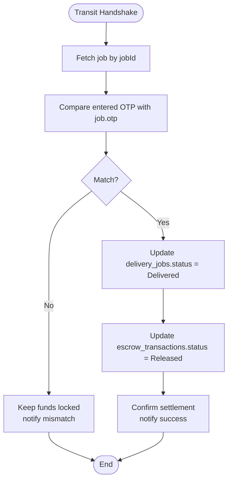
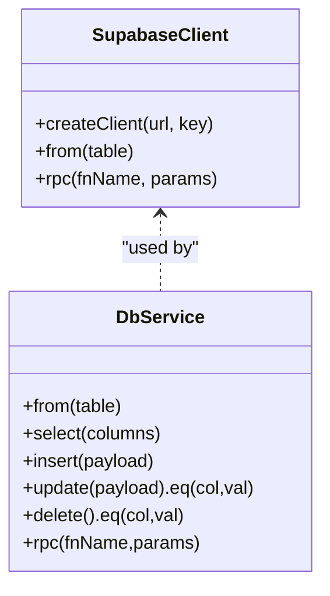
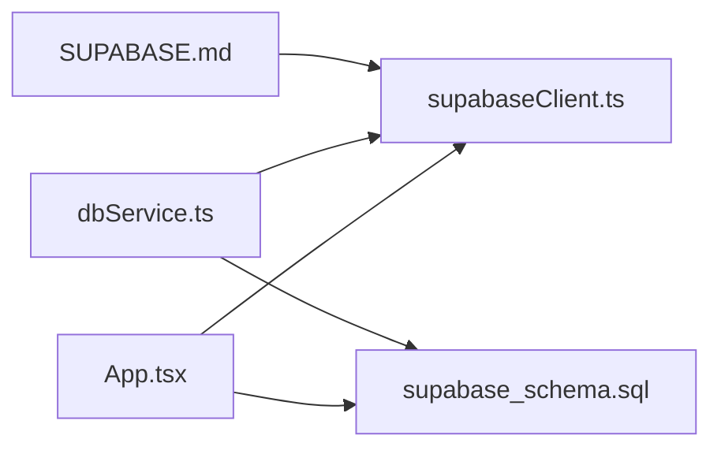

# Transaction Management

<cite>
**Referenced Files in This Document**
- [supabase_schema.sql](file://supabase_schema.sql)
- [App.tsx](file://src/App.tsx)
- [dbService.ts](file://src/supabase/dbService.ts)
- [supabaseClient.ts](file://src/supabase/supabaseClient.ts)
- [SUPABASE.md](file://SUPABASE.md)
</cite>

## Table of Contents
1. [Introduction](#introduction)
2. [Project Structure](#project-structure)
3. [Core Components](#core-components)
4. [Architecture Overview](#architecture-overview)
5. [Detailed Component Analysis](#detailed-component-analysis)
6. [Dependency Analysis](#dependency-analysis)
7. [Performance Considerations](#performance-considerations)
8. [Troubleshooting Guide](#troubleshooting-guide)
9. [Conclusion](#conclusion)

## Introduction
This document explains transaction management within the payment system, focusing on the escrow-based flow from order placement through payment processing to final settlement. It covers:
- The complete lifecycle and state transitions for escrow transactions
- Error handling strategies and rollback considerations
- Integration with Supabase for persistence, including the escrow_transactions table structure and relationships
- Auditing capabilities via timestamps and status tracking
- Validation, idempotency checks, and conflict resolution approaches
- Relationships between transactions and marketplace entities such as orders (via order_id), vendors, and customers

The implementation is primarily client-side using Supabase, with a schema-driven approach and explicit UI-driven state transitions.

## Project Structure
Transaction-related functionality spans the database schema and the React application:
- Database schema defines core tables including escrow_transactions and delivery_jobs, along with Row Level Security policies
- Application code orchestrates checkout, creates escrow records, manages delivery job states, and performs release/verification flows
- Supabase client configuration centralizes environment setup and provides a shared client instance
- A lightweight dbService wrapper demonstrates a consistent pattern for error handling and response normalization

**Diagram sources**
- [App.tsx](file://src/App.tsx)
- [dbService.ts](file://src/supabase/dbService.ts)
- [supabaseClient.ts](file://src/supabase/supabaseClient.ts)
- [supabase_schema.sql](file://supabase_schema.sql)

**Section sources**
- [supabase_schema.sql](file://supabase_schema.sql)
- [App.tsx](file://src/App.tsx)
- [dbService.ts](file://src/supabase/dbService.ts)
- [supabaseClient.ts](file://src/supabase/supabaseClient.ts)

## Core Components
- Escrow Transactions: Represent payments held in escrow until delivery confirmation or admin release. Statuses include Holding, Released, and Refunded.
- Delivery Jobs: Track fulfillment steps and OTP verification; their status transitions drive settlement.
- Supabase Client: Provides authenticated access to the database with environment validation.
- DB Service Wrapper: Normalizes responses and errors for consistent handling across operations.

Key responsibilities:
- Order placement triggers creation of an escrow record and a delivery job
- Delivery milestones update job status and can trigger escrow release upon OTP verification or admin action
- Errors are surfaced to users and logged via toast notifications
- Audit trail is maintained via created_at timestamps and status history

**Section sources**
- [supabase_schema.sql](file://supabase_schema.sql)
- [App.tsx](file://src/App.tsx)
- [dbService.ts](file://src/supabase/dbService.ts)
- [supabaseClient.ts](file://src/supabase/supabaseClient.ts)

## Architecture Overview
The transaction architecture combines client-side orchestration with server-side persistence and security policies.

**Diagram sources**
- [App.tsx](file://src/App.tsx)
- [supabase_schema.sql](file://supabase_schema.sql)

## Detailed Component Analysis

### Escrow Transaction Lifecycle and State Transitions
- Creation: On checkout, a new escrow record is inserted with status Holding and linked to an order_id.
- Release by Admin: An admin action updates the escrow status to Released and marks the delivery job as Delivered.
- Release by OTP Verification: When the correct OTP is provided during transit handover, both the delivery job and escrow transaction are updated to Delivered/Released respectively.
- Refund Path: While not implemented in the current flow, the schema supports a Refunded status for future dispute/refund scenarios.

**Diagram sources**
- [supabase_schema.sql](file://supabase_schema.sql)
- [App.tsx](file://src/App.tsx)

**Section sources**
- [supabase_schema.sql](file://supabase_schema.sql)
- [App.tsx](file://src/App.tsx)

### Database Schema: escrow_transactions and Related Entities
- escrow_transactions: Stores id, order_id, amount, payer, vendor_name, status, created_at
- delivery_jobs: Stores id, order_id, destination, fee, status, rider_name, customer_phone, merchant_name, items_summary, otp, boda_pool_active, created_at
- RLS policies: Open policies allow full CRUD for anon/authenticated/service_role roles

Relationships:
- escrow_transactions.order_id links to delivery_jobs.order_id
- payer and vendor_name provide contextual audit information
- created_at enables chronological auditing

**Diagram sources**
- [supabase_schema.sql](file://supabase_schema.sql)

**Section sources**
- [supabase_schema.sql](file://supabase_schema.sql)

### Checkout Flow: Creating Escrow and Delivery Job
- Inputs validated: delivery place, customer phone
- Generate unique IDs for transaction and job
- Insert escrow record with Holding status
- Insert delivery job with Available status and OTP
- Update local UI state and notify user

**Diagram sources**
- [App.tsx](file://src/App.tsx)

**Section sources**
- [App.tsx](file://src/App.tsx)

### Admin Release Flow
- Admin action updates delivery_jobs to Delivered and escrow_transactions to Released
- Local state reflects changes immediately
- Error handling surfaces failures via toast messages

**Diagram sources**
- [App.tsx](file://src/App.tsx)

**Section sources**
- [App.tsx](file://src/App.tsx)

### OTP Verification and Settlement
- Transit handshake verifies OTP against stored value
- On match, delivery job set to Delivered and escrow transaction set to Released
- Mismatch keeps funds locked and notifies user

**Diagram sources**
- [App.tsx](file://src/App.tsx)

**Section sources**
- [App.tsx](file://src/App.tsx)

### Supabase Client and DB Service Patterns
- supabaseClient.ts validates environment variables and exports a single client instance
- dbService.ts wraps Supabase calls into a consistent Response type with data and error fields
- These patterns promote reliability and uniform error handling across the app

**Diagram sources**
- [supabaseClient.ts](file://src/supabase/supabaseClient.ts)
- [dbService.ts](file://src/supabase/dbService.ts)

**Section sources**
- [supabaseClient.ts](file://src/supabase/supabaseClient.ts)
- [dbService.ts](file://src/supabase/dbService.ts)

## Dependency Analysis
- App.tsx depends on supabaseClient.ts for database access
- dbService.ts provides a reusable abstraction over Supabase methods
- supabase_schema.sql defines the data model and RLS policies that govern access
- SUPABASE.md documents environment setup and common pitfalls

**Diagram sources**
- [App.tsx](file://src/App.tsx)
- [supabaseClient.ts](file://src/supabase/supabaseClient.ts)
- [dbService.ts](file://src/supabase/dbService.ts)
- [supabase_schema.sql](file://supabase_schema.sql)
- [SUPABASE.md](file://SUPABASE.md)

**Section sources**
- [App.tsx](file://src/App.tsx)
- [supabaseClient.ts](file://src/supabase/supabaseClient.ts)
- [dbService.ts](file://src/supabase/dbService.ts)
- [supabase_schema.sql](file://supabase_schema.sql)
- [SUPABASE.md](file://SUPABASE.md)

## Performance Considerations
- Keep database operations short and focused; avoid long-running transactions around external calls
- Use efficient queries and limit payload sizes when loading initial data
- Prefer targeted updates (e.g., by order_id) to minimize lock contention
- Consider batching related writes where possible to reduce round-trips

[No sources needed since this section provides general guidance]

## Troubleshooting Guide
Common issues and resolutions:
- Missing credentials: Ensure VITE_SUPABASE_URL and VITE_SUPABASE_ANON_KEY are set correctly in the root .env file
- Incorrect URL format: Do not append /rest/v1/ to the project URL
- Query returns null data: Verify RLS policies and that rows exist in the database; confirm field names match schema
- Error handling: Use toast notifications to surface failures; check Supabase Studio for row existence and policy enforcement

**Section sources**
- [SUPABASE.md](file://SUPABASE.md)
- [supabaseClient.ts](file://src/supabase/supabaseClient.ts)
- [App.tsx](file://src/App.tsx)

## Conclusion
The transaction management system implements an escrow-based payment flow with clear state transitions and robust error handling. Persistence is handled via Supabase with a well-defined schema and open RLS policies suitable for development. Auditing is supported through timestamps and status tracking. Future enhancements could include stronger idempotency guarantees, atomic multi-table updates, and expanded refund workflows.

[No sources needed since this section summarizes without analyzing specific files]