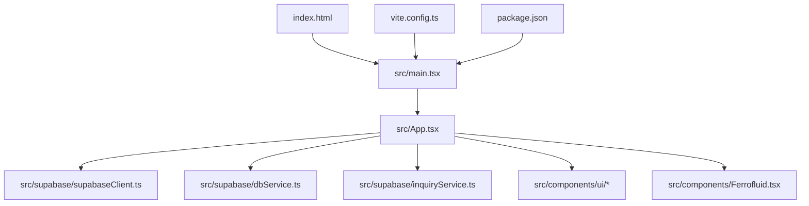
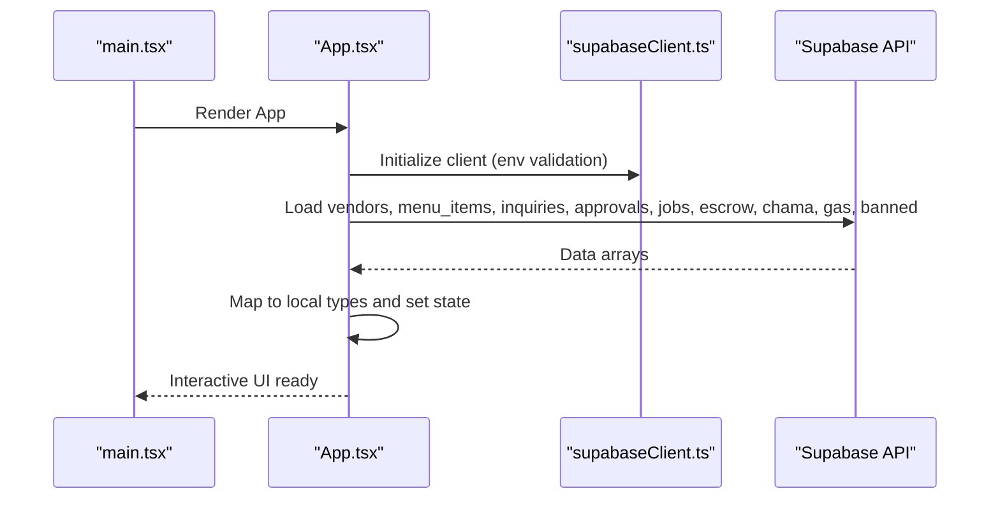
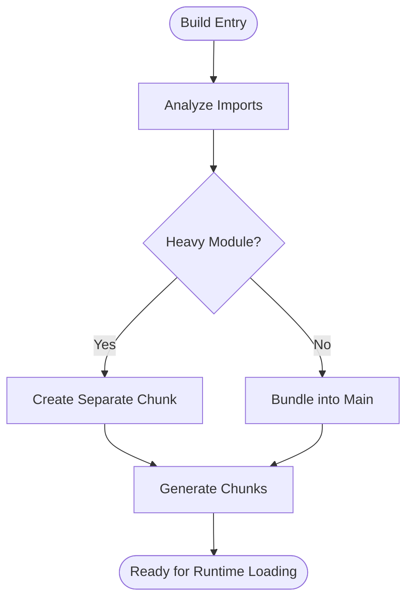
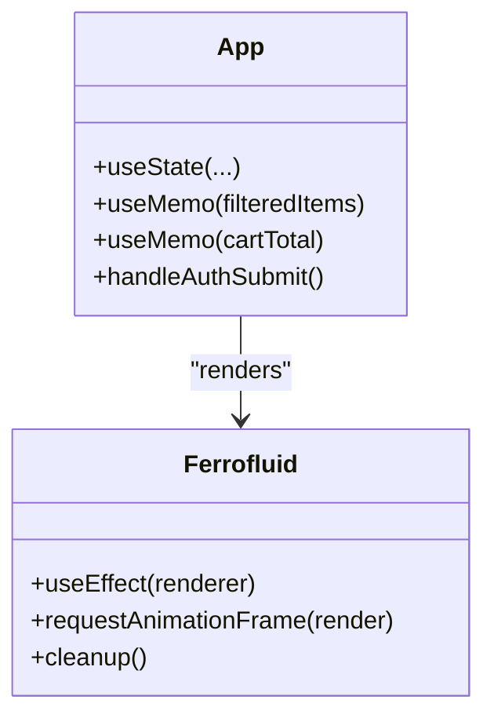
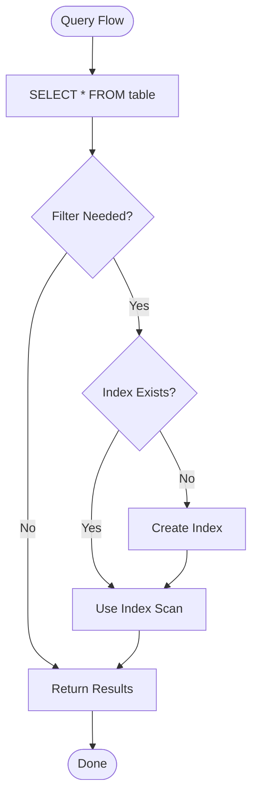
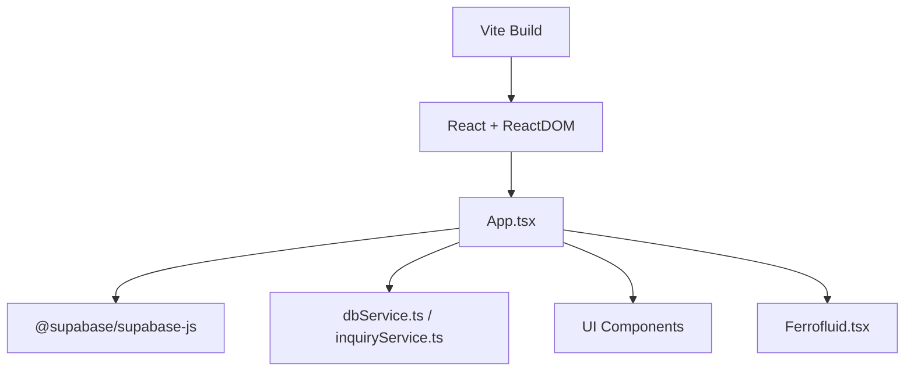

# Performance Optimization

<cite>
**Referenced Files in This Document**
- [vite.config.ts](file://vite.config.ts)
- [package.json](file://package.json)
- [src/main.tsx](file://src/main.tsx)
- [src/App.tsx](file://src/App.tsx)
- [src/supabase/supabaseClient.ts](file://src/supabase/supabaseClient.ts)
- [src/supabase/dbService.ts](file://src/supabase/dbService.ts)
- [src/supabase/inquiryService.ts](file://src/supabase/inquiryService.ts)
- [supabase_schema.sql](file://supabase_schema.sql)
- [supabase/config.toml](file://supabase/config.toml)
- [src/components/Ferrofluid.tsx](file://src/components/Ferrofluid.tsx)
- [src/components/ui/button.tsx](file://src/components/ui/button.tsx)
- [src/components/ui/card.tsx](file://src/components/ui/card.tsx)
- [.agents/skills/supabase-postgres-best-practices/references/conn-pooling.md](file://.agents/skills/supabase-postgres-best-practices/references/conn-pooling.md)
- [.agents/skills/supabase-postgres-best-practices/references/query-missing-indexes.md](file://.agents/skills/supabase-postgres-best-practices/references/query-missing-indexes.md)
- [.agents/skills/supabase-postgres-best-practices/references/monitor-explain-analyze.md](file://.agents/skills/supabase-postgres-best-practices/references/monitor-explain-analyze.md)
- [.agents/skills/supabase-postgres-best-practices/references/monitor-pg-stat-statements.md](file://.agents/skills/supabase-postgres-best-practices/references/monitor-pg-stat-statements.md)
</cite>

## Table of Contents
1. [Introduction](#introduction)
2. [Project Structure](#project-structure)
3. [Core Components](#core-components)
4. [Architecture Overview](#architecture-overview)
5. [Detailed Component Analysis](#detailed-component-analysis)
6. [Dependency Analysis](#dependency-analysis)
7. [Performance Considerations](#performance-considerations)
8. [Troubleshooting Guide](#troubleshooting-guide)
9. [Conclusion](#conclusion)
10. [Appendices](#appendices)

## Introduction
This document provides a comprehensive performance optimization guide for the Match & Market application. It covers code splitting with Vite and dynamic imports, React performance techniques (memoization, lazy loading, efficient re-renders), database query optimization (indexing, query planning, connection pooling), image and asset optimization, bundle analysis, monitoring and profiling, memory management, garbage collection considerations, and mobile performance strategies. The guidance is grounded in the current codebase configuration and patterns.

## Project Structure
The project uses Vite with React, Supabase for data access, and Tailwind CSS for styling. The entry point renders the root App component under StrictMode. Database interactions are centralized through a Supabase client and optional service wrappers.

**Diagram sources**
- [src/main.tsx:1-11](file://src/main.tsx#L1-L11)
- [src/App.tsx:1-800](file://src/App.tsx#L1-L800)
- [src/supabase/supabaseClient.ts:1-38](file://src/supabase/supabaseClient.ts#L1-L38)
- [src/supabase/dbService.ts:1-24](file://src/supabase/dbService.ts#L1-L24)
- [src/supabase/inquiryService.ts:1-19](file://src/supabase/inquiryService.ts#L1-L19)
- [vite.config.ts:1-8](file://vite.config.ts#L1-L8)
- [package.json:1-48](file://package.json#L1-L48)

**Section sources**
- [src/main.tsx:1-11](file://src/main.tsx#L1-L11)
- [vite.config.ts:1-8](file://vite.config.ts#L1-L8)
- [package.json:1-48](file://package.json#L1-L48)

## Core Components
Key components impacting performance:
- Application shell and stateful logic in App.tsx
- Supabase client initialization and environment validation
- Data service wrapper for consistent error handling
- UI primitives (Button, Card) and WebGL-based visual component (Ferrofluid)

Optimization opportunities:
- Memoize derived data and expensive computations
- Lazy-load heavy modules and routes
- Use stable references for event handlers and dependencies
- Offload heavy rendering to Web Workers or limit frame rates for WebGL

**Section sources**
- [src/App.tsx:1-800](file://src/App.tsx#L1-L800)
- [src/supabase/supabaseClient.ts:1-38](file://src/supabase/supabaseClient.ts#L1-L38)
- [src/supabase/dbService.ts:1-24](file://src/supabase/dbService.ts#L1-L24)
- [src/components/ui/button.tsx:1-57](file://src/components/ui/button.tsx#L1-L57)
- [src/components/ui/card.tsx:1-104](file://src/components/ui/card.tsx#L1-L104)
- [src/components/Ferrofluid.tsx:1-117](file://src/components/Ferrofluid.tsx#L1-L117)

## Architecture Overview
The runtime flow starts at main.tsx, which mounts App. App initializes state, loads initial data from Supabase, and manages UI interactions. Data layer calls go through supabaseClient.ts and optionally dbService.ts or inquiryService.ts.

**Diagram sources**
- [src/main.tsx:1-11](file://src/main.tsx#L1-L11)
- [src/App.tsx:349-602](file://src/App.tsx#L349-L602)
- [src/supabase/supabaseClient.ts:1-38](file://src/supabase/supabaseClient.ts#L1-L38)

**Section sources**
- [src/main.tsx:1-11](file://src/main.tsx#L1-L11)
- [src/App.tsx:349-602](file://src/App.tsx#L349-L602)
- [src/supabase/supabaseClient.ts:1-38](file://src/supabase/supabaseClient.ts#L1-L38)

## Detailed Component Analysis

### Vite Configuration and Code Splitting
Current configuration is minimal, enabling React plugin only. To improve initial load:
- Configure manual chunks for large libraries (e.g., framer-motion, ogl)
- Enable rollupOptions.output.manualChunks for vendor splitting
- Use dynamic imports for heavy features (e.g., Ferrofluid canvas, dashboards)
- Tune build settings like minify, sourcemaps, and target browsers

[No diagram sources needed since this diagram shows conceptual workflow, not actual code structure]

Recommendations:
- Add manual chunking for OGL and Framer Motion
- Implement route-level lazy loading for non-critical pages
- Use import() for on-demand feature toggles

**Section sources**
- [vite.config.ts:1-8](file://vite.config.ts#L1-L8)
- [package.json:1-48](file://package.json#L1-L48)

### React Performance Optimizations
Patterns observed and improvements:
- useMemo used for filtered lists and totals; ensure dependency arrays are precise
- Avoid creating new objects inline in render; memoize callbacks with useCallback
- Prefer React.lazy + Suspense for heavy components
- Use key props correctly for lists; avoid unnecessary re-renders by stabilizing props

**Diagram sources**
- [src/App.tsx:643-663](file://src/App.tsx#L643-L663)
- [src/components/Ferrofluid.tsx:56-111](file://src/components/Ferrofluid.tsx#L56-L111)

Best practices:
- Wrap heavy subcomponents in React.lazy
- Extract pure helper functions outside components
- Stabilize context values and prop references
- Debounce/throttle user input where appropriate

**Section sources**
- [src/App.tsx:643-663](file://src/App.tsx#L643-L663)
- [src/components/Ferrofluid.tsx:56-111](file://src/components/Ferrofluid.tsx#L56-L111)

### Database Query Optimization
Observations:
- Initial data loading performs multiple select('*') queries across many tables
- No explicit indexes defined in schema beyond primary keys
- RLS policies allow full access; consider tightening for production

Optimization strategies:
- Add indexes on frequently filtered columns (category, store_name, status)
- Use EXPLAIN ANALYZE to identify slow queries
- Enable pg_stat_statements to track hotspots
- Consider connection pooling via Supabase pooler settings

**Diagram sources**
- [supabase_schema.sql:72-96](file://supabase_schema.sql#L72-L96)
- [.agents/skills/supabase-postgres-best-practices/references/query-missing-indexes.md:1-44](file://.agents/skills/supabase-postgres-best-practices/references/query-missing-indexes.md#L1-L44)

Recommended indexes:
- menu_items(category, store_name)
- delivery_jobs(status, created_at)
- inquiries(status, created_at)
- vendor_approvals(phone, status)
- rider_approvals(phone, status)

Connection pooling:
- Enable and configure pooler in Supabase config
- Choose transaction mode for most apps; session mode if using prepared statements

**Section sources**
- [supabase_schema.sql:72-96](file://supabase_schema.sql#L72-L96)
- [supabase/config.toml:44-54](file://supabase/config.toml#L44-L54)
- [.agents/skills/supabase-postgres-best-practices/references/conn-pooling.md:1-42](file://.agents/skills/supabase-postgres-best-practices/references/conn-pooling.md#L1-L42)
- [.agents/skills/supabase-postgres-best-practices/references/query-missing-indexes.md:1-44](file://.agents/skills/supabase-postgres-best-practices/references/query-missing-indexes.md#L1-L44)

### Image Optimization and Asset Bundling
Guidelines:
- Serve images in modern formats (WebP/AVIF) with responsive sizes
- Use lazy loading for offscreen images
- Inline critical CSS; defer non-critical styles
- Compress assets and use CDN caching headers

Implementation tips:
- Integrate image transformation via Supabase Storage (if enabled)
- Use Vite’s asset handling to optimize imports
- Avoid bundling large fonts; subset and preload critical ones

[No sources needed since this section provides general guidance]

### Bundle Size Analysis
Tools and steps:
- Run vite build and analyze output with vite-bundle-analyzer
- Identify large dependencies and split them into separate chunks
- Remove unused code via tree-shaking and dead code elimination
- Monitor bundle growth over time with CI checks

[No sources needed since this section provides general guidance]

### Monitoring and Profiling Tools
Database:
- Enable pg_stat_statements to capture query metrics
- Use EXPLAIN ANALYZE to inspect execution plans

Frontend:
- Use React DevTools Profiler to identify re-renders
- Measure LCP, FID, CLS via browser performance tabs
- Track network waterfall and resource sizes

[No sources needed since this section provides general guidance]

### Memory Management and Garbage Collection
Recommendations:
- Avoid long-lived closures capturing large objects
- Clean up animation frames and event listeners in useEffect cleanup
- Reuse buffers and textures in WebGL components
- Profile heap snapshots to detect leaks

**Section sources**
- [src/components/Ferrofluid.tsx:108-111](file://src/components/Ferrofluid.tsx#L108-L111)

### Mobile Performance Optimization
Strategies:
- Reduce layout thrashing; batch DOM reads/writes
- Limit heavy animations; prefer transform and opacity
- Use intersection observer for lazy loading media
- Optimize touch interactions and reduce repaints

[No sources needed since this section provides general guidance]

## Dependency Analysis
High-level dependencies:
- Vite orchestrates build and dev server
- React and ReactDOM drive UI
- Supabase JS SDK handles data and auth
- Optional services wrap SDK for consistency

**Diagram sources**
- [package.json:12-28](file://package.json#L12-L28)
- [src/App.tsx:1-20](file://src/App.tsx#L1-L20)
- [src/supabase/supabaseClient.ts:1-28](file://src/supabase/supabaseClient.ts#L1-L28)

**Section sources**
- [package.json:12-28](file://package.json#L12-L28)
- [src/App.tsx:1-20](file://src/App.tsx#L1-L20)
- [src/supabase/supabaseClient.ts:1-28](file://src/supabase/supabaseClient.ts#L1-L28)

## Performance Considerations
- Code splitting: Manual chunks for heavy libs; dynamic imports for features
- React memoization: useMemo for derived data; useCallback for stable handlers
- Efficient re-renders: Stable keys, minimal state updates, avoid inline objects
- Database indexing: Add indexes on filter/join columns; monitor with EXPLAIN ANALYZE
- Connection pooling: Enable and tune pooler; choose correct mode
- Asset optimization: Modern image formats, lazy loading, CDN caching
- Monitoring: pg_stat_statements, React Profiler, Lighthouse
- Memory hygiene: Cleanup effects, reuse resources, profile heap
- Mobile: Minimize layout shifts, throttle animations, lazy media

[No sources needed since this section provides general guidance]

## Troubleshooting Guide
Common issues and resolutions:
- Missing Supabase credentials: Validate env variables and URL format
- Slow queries: Use EXPLAIN ANALYZE; add missing indexes
- High memory usage: Inspect long-lived refs and animation loops
- Excessive re-renders: Check dependency arrays and object identity

**Section sources**
- [src/supabase/supabaseClient.ts:6-19](file://src/supabase/supabaseClient.ts#L6-L19)
- [.agents/skills/supabase-postgres-best-practices/references/monitor-explain-analyze.md:1-46](file://.agents/skills/supabase-postgres-best-practices/references/monitor-explain-analyze.md#L1-L46)
- [.agents/skills/supabase-postgres-best-practices/references/monitor-pg-stat-statements.md:1-56](file://.agents/skills/supabase-postgres-best-practices/references/monitor-pg-stat-statements.md#L1-L56)

## Conclusion
By applying targeted code splitting, React memoization, database indexing, connection pooling, and robust monitoring, the Match & Market application can achieve significant performance gains. Focus on measurable improvements with profiling tools and iterative optimizations tailored to real-world usage patterns.

[No sources needed since this section summarizes without analyzing specific files]

## Appendices

### Database Schema Reference
Tables include profiles, gas_predictions, escrow_transactions, delivery_jobs, vendors, menu_items, inquiries, vendor_approvals, rider_approvals, chama_deals, and banned_vendors.

**Section sources**
- [supabase_schema.sql:8-163](file://supabase_schema.sql#L8-L163)

### Supabase Config Highlights
Pooler settings and API limits are configurable for development and production environments.

**Section sources**
- [supabase/config.toml:44-54](file://supabase/config.toml#L44-L54)