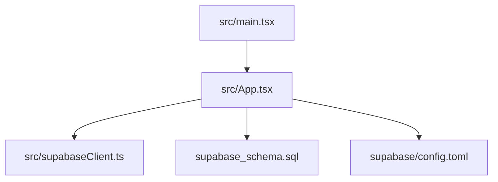
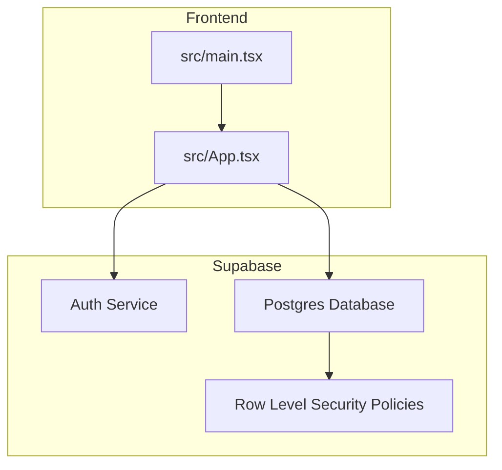
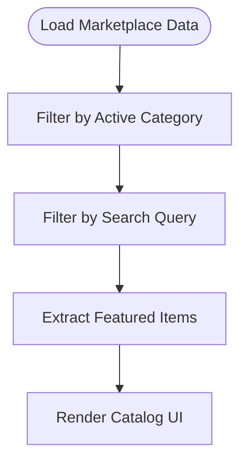
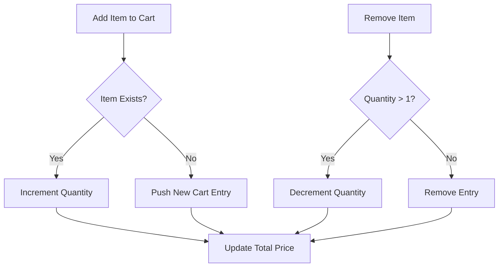
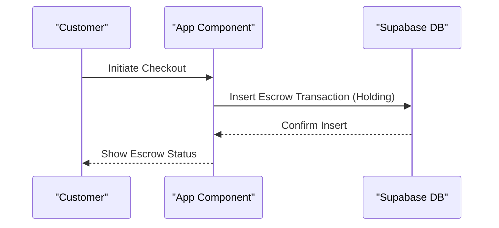
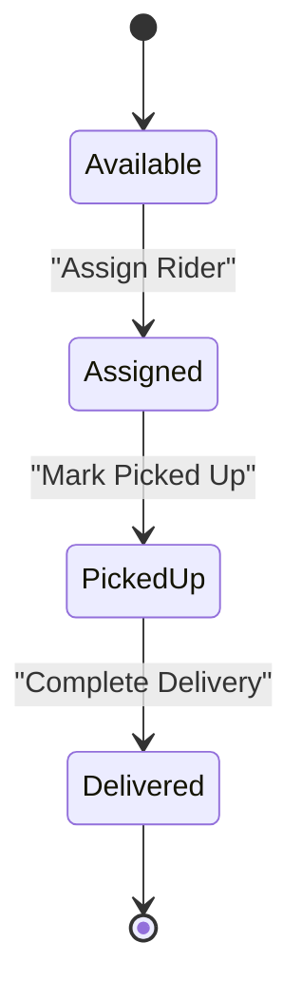
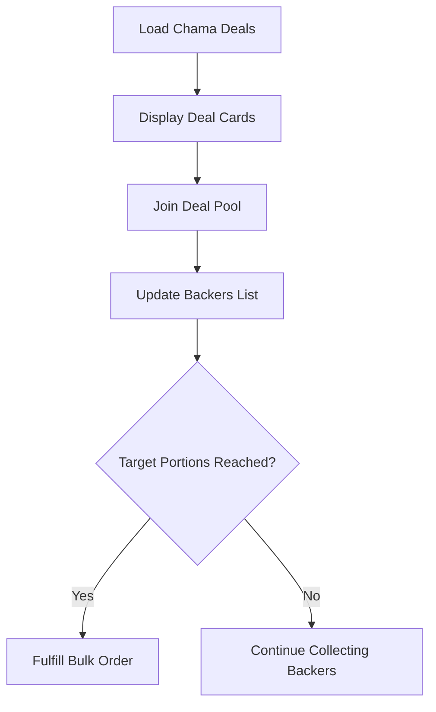
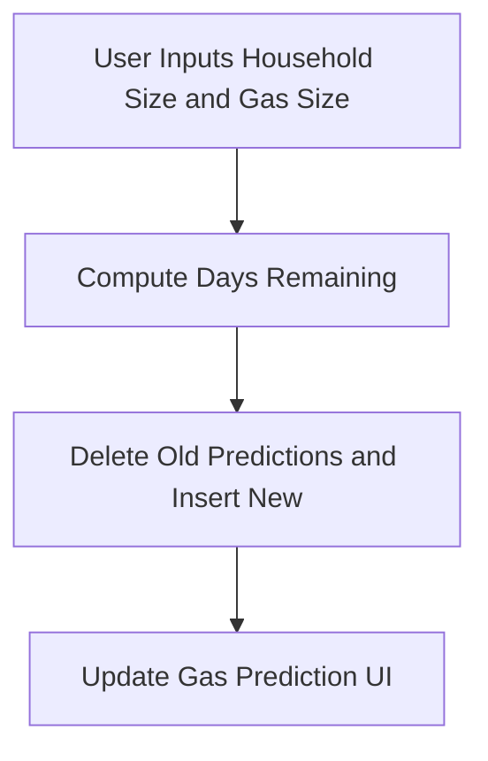
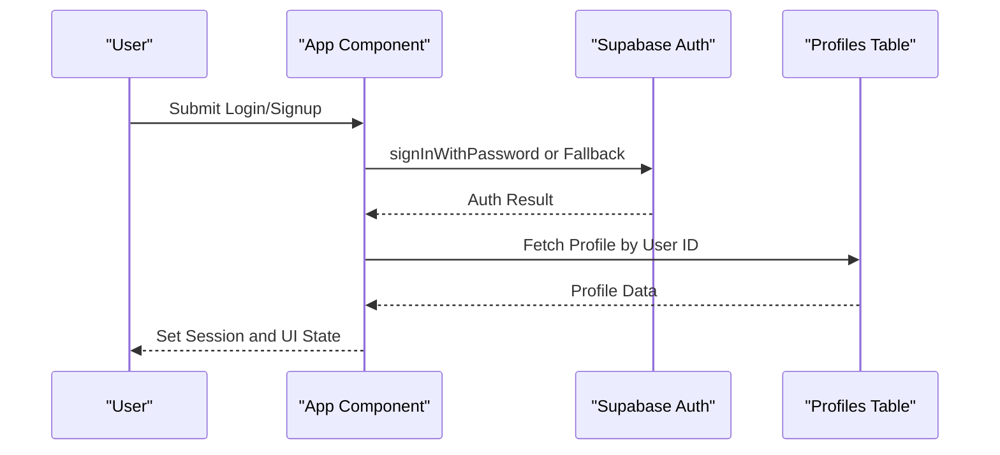
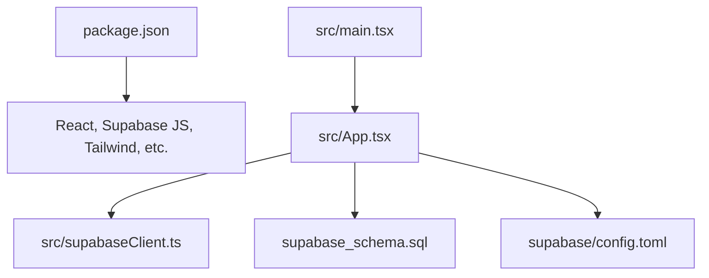

# Project Overview

<cite>
**Referenced Files in This Document**
- [README.md](file://README.md)
- [package.json](file://package.json)
- [SUPABASE.md](file://SUPABASE.md)
- [src/App.tsx](file://src/App.tsx)
- [src/main.tsx](file://src/main.tsx)
- [src/supabaseClient.ts](file://src/supabaseClient.ts)
- [supabase_schema.sql](file://supabase_schema.sql)
- [supabase/config.toml](file://supabase/config.toml)
</cite>

## Table of Contents
1. [Introduction](#introduction)
2. [Project Structure](#project-structure)
3. [Core Components](#core-components)
4. [Architecture Overview](#architecture-overview)
5. [Detailed Component Analysis](#detailed-component-analysis)
6. [Dependency Analysis](#dependency-analysis)
7. [Performance Considerations](#performance-considerations)
8. [Troubleshooting Guide](#troubleshooting-guide)
9. [Conclusion](#conclusion)

## Introduction
Match & Market is a multi-vendor marketplace platform that connects customers with local vendors for food delivery, fresh produce, services, and entertainment products. The platform enables secure transactions through escrow payment handling, real-time delivery tracking via a rider fleet, group buying (Chama deals), and AI-powered gas consumption predictions to help households plan refills. It supports multiple user roles—customers, vendors, riders, and administrators—each with tailored dashboards and workflows.

The project uses a modern React + TypeScript frontend powered by Vite and integrates directly with Supabase for authentication, database storage, and Row Level Security policies. The architecture emphasizes a single-page application with client-side state management and server-backed persistence for all marketplace entities.

**Section sources**
- [README.md:1-10](file://README.md#L1-L10)
- [package.json:1-20](file://package.json#L1-L20)
- [SUPABASE.md:1-12](file://SUPABASE.md#L1-L12)

## Project Structure
At a high level, the repository is organized as follows:
- Frontend entry point renders the React application using Vite and StrictMode.
- The main application component implements marketplace features, including vendor browsing, cart management, checkout, escrow ledger, delivery jobs, Chama deals, and gas predictions.
- Supabase client configuration provides a shared instance for database and auth operations.
- A SQL schema defines tables for profiles, menu items, vendors, delivery jobs, escrow transactions, inquiries, approvals, chama deals, banned vendors, and gas predictions, along with RLS policies.
- Supabase configuration includes API, database, realtime, studio, and auth settings for local development and deployment alignment.

**Diagram sources**
- [src/main.tsx:1-11](file://src/main.tsx#L1-L11)
- [src/App.tsx:1-200](file://src/App.tsx#L1-L200)
- [src/supabaseClient.ts:1-7](file://src/supabaseClient.ts#L1-L7)
- [supabase_schema.sql:1-60](file://supabase_schema.sql#L1-L60)
- [supabase/config.toml:1-120](file://supabase/config.toml#L1-L120)

**Section sources**
- [src/main.tsx:1-11](file://src/main.tsx#L1-L11)
- [package.json:1-20](file://package.json#L1-L20)
- [supabase_schema.sql:1-120](file://supabase_schema.sql#L1-L120)
- [supabase/config.toml:1-120](file://supabase/config.toml#L1-L120)

## Core Components
- Marketplace Catalog: Displays vendors and menu items across categories such as Food & Beverages, Fresh Produce, Services, and Entertainment. Supports search and filtering.
- Cart and Checkout: Adds/removes items, computes totals, and initiates checkout flows.
- Escrow Payment Handling: Maintains an escrow ledger with statuses Holding, Released, Refunded for audit and dispute resolution.
- Delivery Tracking: Manages delivery jobs with statuses Available, Assigned, Picked Up, Delivered; includes OTP-based anti-liar handshake and optional boda pool pooling.
- Group Buying (Chama Deals): Enables bulk purchasing with portion pricing and backer tracking.
- AI Gas Predictions: Estimates days remaining until cylinder refill based on household size and usage patterns; persists predictions per user.
- Authentication and Profiles: User roles include customer, vendor, rider, admin; supports login/signup and profile fields like address, delivery point, bio, pickup note.
- Support Inquiries: Captures support messages and admin responses.
- Vendor and Rider Approvals: Queues for onboarding and approval workflows.

These components are implemented primarily within the main application component and backed by Supabase tables defined in the schema.

**Section sources**
- [src/App.tsx:25-147](file://src/App.tsx#L25-L147)
- [supabase_schema.sql:1-198](file://supabase_schema.sql#L1-L198)

## Architecture Overview
The system follows a client-centric architecture:
- React + TypeScript app runs in the browser, managing UI state and orchestrating data operations.
- Supabase client handles authentication and direct database queries with Row Level Security policies.
- Database schema enforces structure and permissions; default seed data ensures initial marketplace content.

**Diagram sources**
- [src/main.tsx:1-11](file://src/main.tsx#L1-L11)
- [src/App.tsx:1-200](file://src/App.tsx#L1-L200)
- [src/supabaseClient.ts:1-7](file://src/supabaseClient.ts#L1-L7)
- [supabase_schema.sql:166-198](file://supabase_schema.sql#L166-L198)

## Detailed Component Analysis

### Marketplace Catalog and Search
- Categories: Food & Beverages, M & M Soko (Fresh Produce), M & M Services, M & M Fun Zone.
- Filtering: By category and search query across item name, store name, and description.
- Featured Items: Highlighted items marked as featured.

**Diagram sources**
- [src/App.tsx:643-660](file://src/App.tsx#L643-L660)

**Section sources**
- [src/App.tsx:643-660](file://src/App.tsx#L643-L660)

### Cart Management
- Add/Remove/Clear items with quantity adjustments.
- Compute total price from cart entries.

**Diagram sources**
- [src/App.tsx:665-686](file://src/App.tsx#L665-L686)

**Section sources**
- [src/App.tsx:665-686](file://src/App.tsx#L665-L686)

### Escrow Payment Handling
- Ledger tracks order ID, amount, payer, vendor name, status (Holding, Released, Refunded), and timestamp.
- Default escrow transaction seeded on first load if none exists.

**Diagram sources**
- [src/App.tsx:500-538](file://src/App.tsx#L500-L538)
- [supabase_schema.sql:44-53](file://supabase_schema.sql#L44-L53)

**Section sources**
- [src/App.tsx:500-538](file://src/App.tsx#L500-L538)
- [supabase_schema.sql:44-53](file://supabase_schema.sql#L44-L53)

### Delivery Tracking and Boda Pool
- Delivery jobs track destination, fee, status, rider assignment, OTP, and optional boda pool activation.
- Real-time updates reflect job lifecycle from Available to Delivered.

**Diagram sources**
- [src/App.tsx:97-109](file://src/App.tsx#L97-L109)
- [supabase_schema.sql:55-69](file://supabase_schema.sql#L55-L69)

**Section sources**
- [src/App.tsx:97-109](file://src/App.tsx#L97-L109)
- [supabase_schema.sql:55-69](file://supabase_schema.sql#L55-L69)

### Chama Deals (Group Buying)
- Bulk deals with total price, portion price, target portions, filled portions, and backers list.
- Users can join pools; default deal seeded on first load.

**Diagram sources**
- [src/App.tsx:540-578](file://src/App.tsx#L540-L578)
- [supabase_schema.sql:144-156](file://supabase_schema.sql#L144-L156)

**Section sources**
- [src/App.tsx:540-578](file://src/App.tsx#L540-L578)
- [supabase_schema.sql:144-156](file://supabase_schema.sql#L144-L156)

### AI-Powered Gas Consumption Predictions
- Computes estimated days remaining based on gas size and household size.
- Persists prediction per user and cleans old predictions to avoid duplicates.

**Diagram sources**
- [src/App.tsx:1342-1373](file://src/App.tsx#L1342-L1373)
- [supabase_schema.sql:33-42](file://supabase_schema.sql#L33-L42)

**Section sources**
- [src/App.tsx:1342-1373](file://src/App.tsx#L1342-L1373)
- [supabase_schema.sql:33-42](file://supabase_schema.sql#L33-L42)

### Authentication and Profiles
- Supports login/signup with Supabase Auth and legacy phone fallback.
- Profile fields include username, email, phone, role, linked entity name, photo URL, address, delivery point, bio, pickup note.

**Diagram sources**
- [src/App.tsx:688-800](file://src/App.tsx#L688-L800)
- [supabase_schema.sql:7-31](file://supabase_schema.sql#L7-L31)

**Section sources**
- [src/App.tsx:688-800](file://src/App.tsx#L688-L800)
- [supabase_schema.sql:7-31](file://supabase_schema.sql#L7-L31)

## Dependency Analysis
Key dependencies and relationships:
- Frontend entry renders App component which manages marketplace logic.
- Supabase client provides unified access to auth and database.
- Schema defines relational entities and RLS policies ensuring secure access.
- Configuration aligns local development environment with Supabase services.

**Diagram sources**
- [package.json:1-20](file://package.json#L1-L20)
- [src/main.tsx:1-11](file://src/main.tsx#L1-L11)
- [src/App.tsx:1-200](file://src/App.tsx#L1-L200)
- [src/supabaseClient.ts:1-7](file://src/supabaseClient.ts#L1-L7)
- [supabase_schema.sql:1-60](file://supabase_schema.sql#L1-L60)
- [supabase/config.toml:1-120](file://supabase/config.toml#L1-L120)

**Section sources**
- [package.json:1-20](file://package.json#L1-L20)
- [src/main.tsx:1-11](file://src/main.tsx#L1-L11)
- [src/App.tsx:1-200](file://src/App.tsx#L1-L200)
- [src/supabaseClient.ts:1-7](file://src/supabaseClient.ts#L1-L7)
- [supabase_schema.sql:1-60](file://supabase_schema.sql#L1-L60)
- [supabase/config.toml:1-120](file://supabase/config.toml#L1-L120)

## Performance Considerations
- Use memoization for filtered lists and computed totals to minimize re-renders.
- Batch insert operations when seeding default data to reduce network calls.
- Leverage Supabase RLS policies to enforce security without additional middleware overhead.
- Avoid excessive localStorage reads/writes; cache user session and preferences judiciously.

[No sources needed since this section provides general guidance]

## Troubleshooting Guide
Common issues and resolutions:
- Supabase query returns null data: Verify table rows exist, ensure correct URL and anon key, check RLS policies and field names.
- Incorrect Supabase URL: Ensure project URL does not append /rest/v1; use base project URL.
- Environment variables: Keep credentials in root .env file; remove duplicate env files to prevent conflicts.

**Section sources**
- [SUPABASE.md:14-33](file://SUPABASE.md#L14-L33)

## Conclusion
Match & Market delivers a comprehensive marketplace experience combining secure payments, real-time logistics, collaborative buying, and predictive utilities. Its React + TypeScript frontend integrates seamlessly with Supabase for robust authentication and data management. The modular architecture supports scalable feature expansion while maintaining clarity and performance.

[No sources needed since this section summarizes without analyzing specific files]