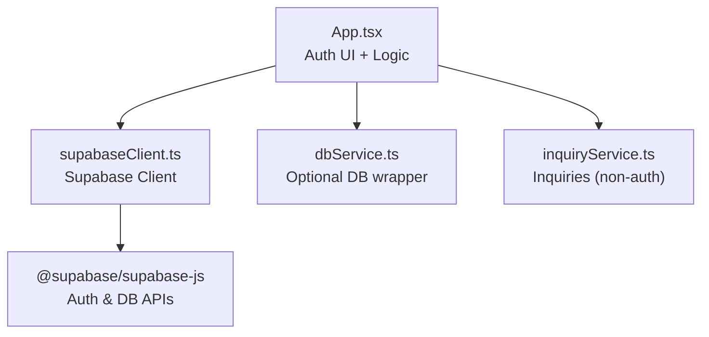
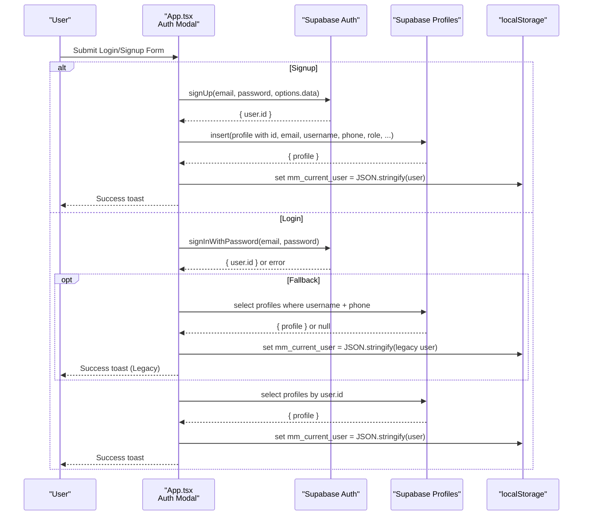
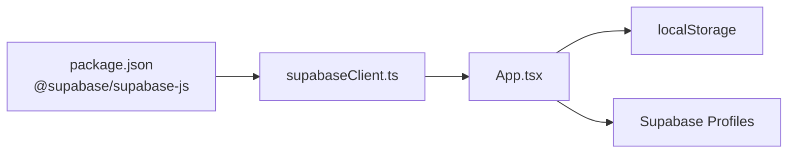

# Authentication System

<cite>
**Referenced Files in This Document**
- [App.tsx](file://src/App.tsx)
- [supabaseClient.ts](file://src/supabase/supabaseClient.ts)
- [dbService.ts](file://src/supabase/dbService.ts)
- [inquiryService.ts](file://src/supabase/inquiryService.ts)
- [SUPABASE.md](file://SUPABASE.md)
- [package.json](file://package.json)
</cite>

## Table of Contents
1. [Introduction](#introduction)
2. [Project Structure](#project-structure)
3. [Core Components](#core-components)
4. [Architecture Overview](#architecture-overview)
5. [Detailed Component Analysis](#detailed-component-analysis)
6. [Dependency Analysis](#dependency-analysis)
7. [Performance Considerations](#performance-considerations)
8. [Troubleshooting Guide](#troubleshooting-guide)
9. [Conclusion](#conclusion)
10. [Appendices](#appendices)

## Introduction
This document explains the authentication system implementation for the application, focusing on Supabase Auth integration and dual authentication flows:
- Email/password authentication via Supabase Auth
- Legacy phone-based fallback using local profile lookup

It covers user registration, login/logout, session management with React state and localStorage persistence, form validation, password requirements, error handling strategies, protected routes, authentication callbacks, and cross-component session usage.

## Project Structure
The authentication logic is primarily implemented within the main application component and supported by a shared Supabase client and optional service utilities.

**Diagram sources**
- [App.tsx:2217-2411](file://src/App.tsx#L2217-L2411)
- [supabaseClient.ts:1-38](file://src/supabase/supabaseClient.ts#L1-L38)
- [dbService.ts:1-24](file://src/supabase/dbService.ts#L1-L24)
- [inquiryService.ts:1-19](file://src/supabase/inquiryService.ts#L1-L19)

**Section sources**
- [App.tsx:2217-2411](file://src/App.tsx#L2217-L2411)
- [supabaseClient.ts:1-38](file://src/supabase/supabaseClient.ts#L1-L38)
- [dbService.ts:1-24](file://src/supabase/dbService.ts#L1-L24)
- [inquiryService.ts:1-19](file://src/supabase/inquiryService.ts#L1-L19)

## Core Components
- Supabase Client: Centralized configuration and environment validation.
- App Component: Contains all auth UI, state, handlers, and persistence.
- Optional Services: dbService and inquiryService provide typed wrappers and helpers.

Key responsibilities:
- Supabase client initialization and environment checks
- Dual auth flow (email/password and legacy phone)
- Registration with profile creation
- Login with Supabase Auth and fallback to legacy profiles
- Logout and session cleanup
- Profile updates and metadata sync
- Protected route gating based on currentUser

**Section sources**
- [supabaseClient.ts:1-38](file://src/supabase/supabaseClient.ts#L1-L38)
- [App.tsx:227-313](file://src/App.tsx#L227-L313)
- [App.tsx:688-957](file://src/App.tsx#L688-L957)
- [App.tsx:959-1036](file://src/App.tsx#L959-L1036)

## Architecture Overview
The authentication architecture combines Supabase Auth for secure credential handling with a local profile table for extended user data. The app maintains an in-memory currentUser state persisted to localStorage for quick access across components.

**Diagram sources**
- [App.tsx:688-957](file://src/App.tsx#L688-L957)
- [App.tsx:786-855](file://src/App.tsx#L786-L855)
- [App.tsx:860-956](file://src/App.tsx#L860-L956)

## Detailed Component Analysis

### Supabase Client Configuration
- Reads VITE_SUPABASE_URL and VITE_SUPABASE_ANON_KEY from environment
- Validates presence and warns if REST path is incorrectly appended
- Exports a single Supabase client instance used throughout the app

Security notes:
- Anon key is exposed to the browser; enforce Row Level Security (RLS) policies on tables
- Avoid storing secrets in code; rely on .env variables

**Section sources**
- [supabaseClient.ts:1-38](file://src/supabase/supabaseClient.ts#L1-L38)
- [SUPABASE.md:1-38](file://SUPABASE.md#L1-L38)

### Authentication State Management
- currentUser state initialized from localStorage on mount
- Synced fields for auth form inputs when user exists
- Sign-out clears state, localStorage, and resets forms

Persistence:
- mm_current_user stores serialized user object
- On logout, mm_current_user is removed

Protected routing:
- UI elements like dashboard and checkout gate functionality based on !!currentUser
- Role-based tabs are shown conditionally

**Section sources**
- [App.tsx:227-248](file://src/App.tsx#L227-L248)
- [App.tsx:292-313](file://src/App.tsx#L292-L313)
- [App.tsx:1754-1768](file://src/App.tsx#L1754-L1768)

### Dual Authentication Flow

#### Email/Password Login
- Uses supabase.auth.signInWithPassword
- On success, fetches profile by user.id and constructs AuthUser
- Persists user to localStorage and updates UI state

#### Legacy Phone-based Login
- Triggered when no password provided and only phone supplied
- Falls back to querying profiles by username and phone
- If found, logs in directly without Supabase Auth credentials

Error handling:
- Toast messages for failures
- Graceful fallback behavior for legacy users

**Section sources**
- [App.tsx:688-777](file://src/App.tsx#L688-L777)
- [App.tsx:778-855](file://src/App.tsx#L778-L855)

### User Registration
- Calls supabase.auth.signUp with email/password and options.data containing profile fields
- Inserts a new profile record using the returned user.id
- Persists user to localStorage and updates UI state

Validation:
- Requires email, password, and confirm password
- Enforces minimum password length
- Ensures passwords match

**Section sources**
- [App.tsx:860-956](file://src/App.tsx#L860-L956)

### Logout and Session Cleanup
- Calls supabase.auth.signOut
- Clears currentUser and related form states
- Removes mm_current_user from localStorage
- Resets cart and shows info toast

**Section sources**
- [App.tsx:292-313](file://src/App.tsx#L292-L313)

### Profile Updates
- Updates Supabase Auth metadata (email, password, custom data)
- Upserts profile record with latest fields
- Persists updated user to localStorage
- Provides loading state and error feedback

**Section sources**
- [App.tsx:959-1036](file://src/App.tsx#L959-L1036)

### Form Validation and Password Requirements
- Login: requires username and either email or phone; password required unless legacy phone mode
- Signup: requires email, password, confirm password; password must be at least 8 characters; passwords must match
- Profile update: optional email and password changes; other fields optional

Feedback:
- Immediate toast notifications for validation errors and operation results

**Section sources**
- [App.tsx:692-719](file://src/App.tsx#L692-L719)

### Protected Routes and Callbacks
- Dashboard and checkout features gated by !!currentUser
- Role-based tabs show admin tab only when currentUser.role === 'admin'
- Checkout triggers sign-in modal if not authenticated

Callbacks:
- Success/error toasts guide user experience
- Local state updates reflect immediate UI changes

**Section sources**
- [App.tsx:1754-1768](file://src/App.tsx#L1754-L1768)
- [App.tsx:1144-1149](file://src/App.tsx#L1144-L1149)

### Error Handling Strategies
- Try/catch blocks around async operations
- Normalize errors into consistent message strings
- Display user-friendly toasts for failures
- Log detailed errors to console for debugging

**Section sources**
- [App.tsx:856-859](file://src/App.tsx#L856-L859)
- [App.tsx:952-955](file://src/App.tsx#L952-L955)

### Data Models and Types
- AuthUser interface defines core user properties including id, email, username, phone, role, and optional profile fields
- Role resolution considers vendor/rider approvals and existing vendors

**Section sources**
- [App.tsx:141-153](file://src/App.tsx#L141-L153)
- [App.tsx:326-334](file://src/App.tsx#L326-L334)

## Dependency Analysis
The authentication system depends on:
- @supabase/supabase-js for Auth and database operations
- Environment variables for Supabase project URL and anon key
- React hooks for state management and side effects
- localStorage for session persistence

**Diagram sources**
- [package.json:12-17](file://package.json#L12-L17)
- [supabaseClient.ts:1-38](file://src/supabase/supabaseClient.ts#L1-L38)
- [App.tsx:227-313](file://src/App.tsx#L227-L313)

**Section sources**
- [package.json:12-17](file://package.json#L12-L17)
- [supabaseClient.ts:1-38](file://src/supabase/supabaseClient.ts#L1-L38)
- [App.tsx:227-313](file://src/App.tsx#L227-L313)

## Performance Considerations
- Single Supabase client instance reduces overhead
- Minimal network calls: only essential queries for profile retrieval
- LocalStorage provides fast read/write for session state
- Avoid unnecessary re-renders by keeping auth state centralized

[No sources needed since this section provides general guidance]

## Troubleshooting Guide
Common issues and resolutions:
- Missing environment variables: ensure VITE_SUPABASE_URL and VITE_SUPABASE_ANON_KEY are set in root .env
- Incorrect Supabase URL: do not append /rest/v1/ to the base URL
- RLS blocking queries: temporarily allow open inserts/selects for anon role during development
- Query returns null data: verify row existence and field names match schema

Debugging steps:
- Use debugSupabaseInfo() to log effective host and anon key presence
- Check Supabase Studio for inserted rows and policy configurations
- Validate that primary keys and query fields align with inserted payloads

**Section sources**
- [SUPABASE.md:1-38](file://SUPABASE.md#L1-L38)
- [supabaseClient.ts:30-37](file://src/supabase/supabaseClient.ts#L30-L37)

## Conclusion
The authentication system integrates Supabase Auth with a flexible dual-flow approach supporting modern email/password and legacy phone-based logins. It leverages React state and localStorage for robust session management, includes comprehensive form validation and error handling, and provides clear patterns for protected routes and cross-component session sharing. Proper environment setup and RLS policies are critical for security and reliability.

[No sources needed since this section summarizes without analyzing specific files]

## Appendices

### Implementation Examples

#### Protected Route Pattern
- Gate sensitive features behind !!currentUser check
- Redirect to auth modal if not authenticated
- Show role-specific tabs based on currentUser.role

Example references:
- [App.tsx:1754-1768](file://src/App.tsx#L1754-L1768)
- [App.tsx:1144-1149](file://src/App.tsx#L1144-L1149)

#### Authentication Callbacks
- Use toasts for user feedback on success/failure
- Update local state immediately for responsive UI
- Persist user data to localStorage for session continuity

Example references:
- [App.tsx:856-859](file://src/App.tsx#L856-L859)
- [App.tsx:952-955](file://src/App.tsx#L952-L955)

#### Session Management Across Components
- Initialize currentUser from localStorage on app start
- Share currentUser through props or context in larger applications
- Clear session on logout and reset related state

Example references:
- [App.tsx:227-248](file://src/App.tsx#L227-L248)
- [App.tsx:292-313](file://src/App.tsx#L292-L313)