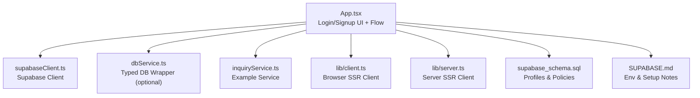
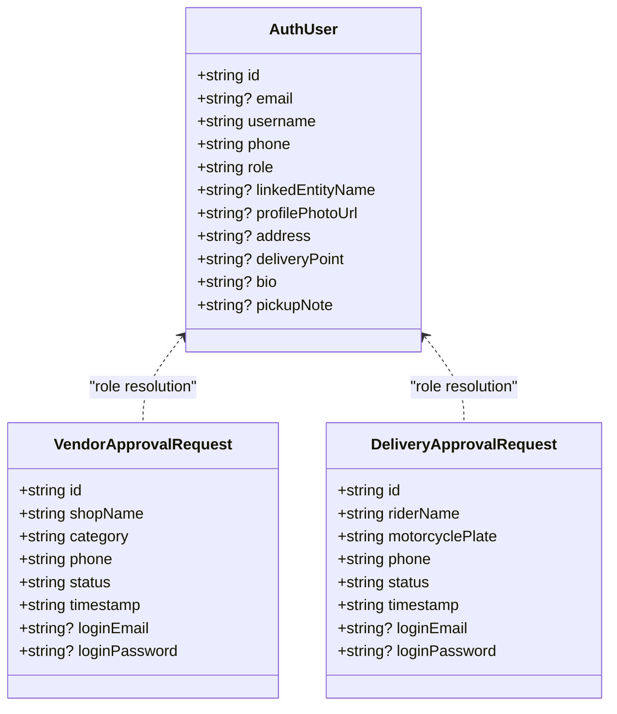
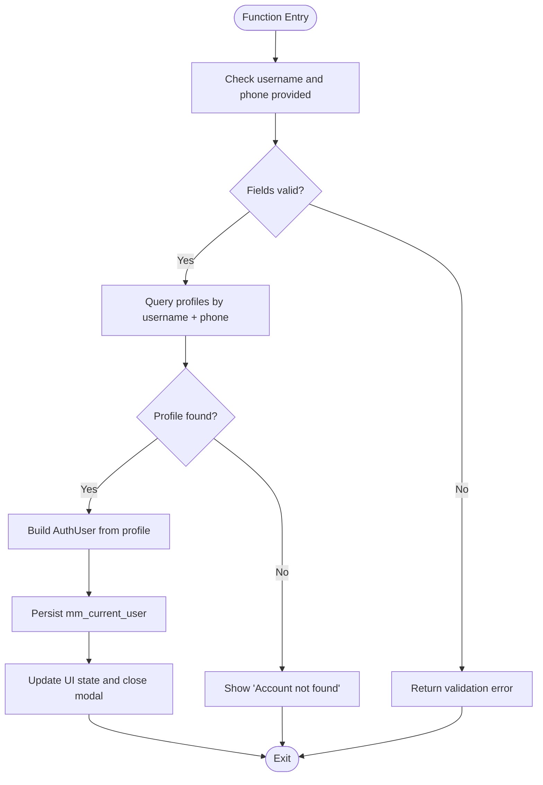
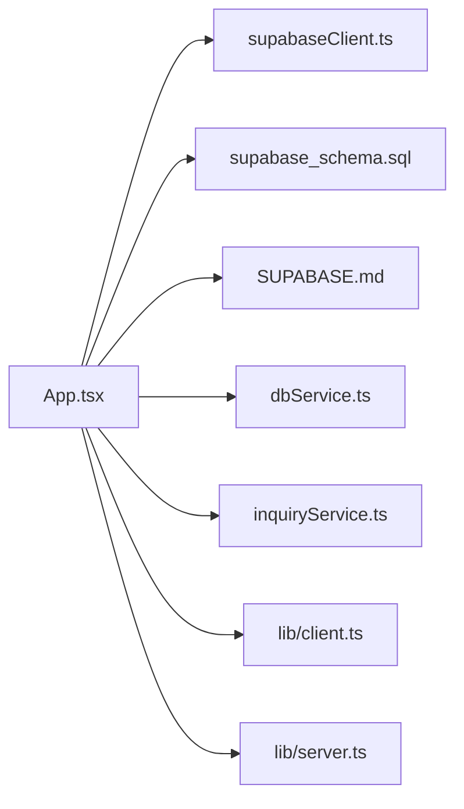

# Login & Authentication

<cite>
**Referenced Files in This Document**
- [App.tsx](file://src/App.tsx)
- [supabaseClient.ts](file://src/supabase/supabaseClient.ts)
- [dbService.ts](file://src/supabase/dbService.ts)
- [inquiryService.ts](file://src/supabase/inquiryService.ts)
- [client.ts](file://src/lib/client.ts)
- [server.ts](file://src/lib/server.ts)
- [supabase_schema.sql](file://supabase_schema.sql)
- [SUPABASE.md](file://SUPABASE.md)
</cite>

## Table of Contents
1. [Introduction](#introduction)
2. [Project Structure](#project-structure)
3. [Core Components](#core-components)
4. [Architecture Overview](#architecture-overview)
5. [Detailed Component Analysis](#detailed-component-analysis)
6. [Dependency Analysis](#dependency-analysis)
7. [Performance Considerations](#performance-considerations)
8. [Troubleshooting Guide](#troubleshooting-guide)
9. [Conclusion](#conclusion)
10. [Appendices](#appendices)

## Introduction
This document explains the login and authentication system for the application, which supports two flows:
- Modern email/password authentication via Supabase Auth
- Legacy phone-based fallback authentication using a local profile lookup

It covers form validation, credential processing, session establishment, user data synchronization, error handling, and examples of how to implement login forms, callbacks, and error messages.

## Project Structure
The authentication logic is primarily implemented in the main application component and supported by Supabase client utilities and schema definitions.



**Diagram sources**
- [App.tsx](file://src/App.tsx)
- [supabaseClient.ts](file://src/supabase/supabaseClient.ts)
- [dbService.ts](file://src/supabase/dbService.ts)
- [inquiryService.ts](file://src/supabase/inquiryService.ts)
- [client.ts](file://src/lib/client.ts)
- [server.ts](file://src/lib/server.ts)
- [supabase_schema.sql](file://supabase_schema.sql)
- [SUPABASE.md](file://SUPABASE.md)

**Section sources**
- [App.tsx](file://src/App.tsx)
- [supabaseClient.ts](file://src/supabase/supabaseClient.ts)
- [SUPABASE.md](file://SUPABASE.md)

## Core Components
- Supabase client initialization and environment validation
- Dual authentication flow:
  - Email/password via Supabase Auth
  - Legacy phone-only fallback via profiles table lookup
- Form validation and credential processing
- Session establishment and persistence
- User profile synchronization between auth metadata and database
- Error handling and user feedback

Key responsibilities:
- Validate inputs before calling authentication APIs
- Attempt modern auth first; fall back to legacy lookup when appropriate
- Persist authenticated state locally and update UI state
- Handle errors with clear messages

**Section sources**
- [supabaseClient.ts](file://src/supabase/supabaseClient.ts)
- [App.tsx](file://src/App.tsx)

## Architecture Overview
The authentication architecture combines Supabase Auth with a local profiles table for backward compatibility.

```mermaid
sequenceDiagram
participant U as "User"
participant UI as "App.tsx"
participant SA as "Supabase Auth"
participant DB as "Supabase Profiles"
participant LS as "localStorage"
U->>UI : Submit login form
UI->>UI : Validate fields
alt Password provided
UI->>SA : signInWithPassword(email, password)
SA-->>UI : Success or Error
opt Success
UI->>DB : Select profile by userId
DB-->>UI : Profile data
UI->>LS : Save mm_current_user
UI-->>U : Welcome message
else Error
UI-->>U : Show error toast
end
else No password (legacy path)
UI->>DB : Lookup profiles by username + phone
DB-->>UI : Profile or null
opt Found
UI->>LS : Save mm_current_user
UI-->>U : Welcome (Legacy)
else Not found
UI-->>U : Account not found
end
end
```

**Diagram sources**
- [App.tsx](file://src/App.tsx)
- [supabaseClient.ts](file://src/supabase/supabaseClient.ts)
- [supabase_schema.sql](file://supabase_schema.sql)

## Detailed Component Analysis

### Supabase Client and Environment
- Initializes Supabase client from environment variables
- Validates presence of URL and anon key
- Warns if REST path is incorrectly included
- Provides debug helper to log host and key presence

Implementation highlights:
- Reads VITE_SUPABASE_URL and VITE_SUPABASE_ANON_KEY
- Creates a single shared client instance
- Exports client and debug utility

**Section sources**
- [supabaseClient.ts](file://src/supabase/supabaseClient.ts)
- [SUPABASE.md](file://SUPABASE.md)

### Database Wrapper (Optional)
- Wraps Supabase calls into typed responses
- Normalizes { data, error } shape
- Supports select, insert, update, delete, rpc

Use cases:
- Centralized error handling
- Consistent response types across services

**Section sources**
- [dbService.ts](file://src/supabase/dbService.ts)

### Inquiry Service (Example)
- Demonstrates service pattern for Supabase queries
- Encapsulates common operations like getAllInquiries and createInquiry

**Section sources**
- [inquiryService.ts](file://src/supabase/inquiryService.ts)

### SSR Clients (Browser and Server)
- Browser client uses createBrowserClient
- Server client uses createServerClient with cookie handling

These are available for future SSR integration but current login flow uses the browser client directly.

**Section sources**
- [client.ts](file://src/lib/client.ts)
- [server.ts](file://src/lib/server.ts)

### Schema and RLS Policies
- Defines profiles table with fields used by login and profile sync
- Enables RLS policies for development (open access)
- Grants permissions to anon, authenticated, service_role

Important fields for login:
- id, email, username, phone, role, linked_entity_name
- Optional profile fields: profile_photo_url, address, delivery_point, bio, pickup_note

**Section sources**
- [supabase_schema.sql](file://supabase_schema.sql)

### App.tsx Authentication Flow
- Maintains auth-related state: currentUser, authMode, form fields
- Validates inputs for both login and signup
- Implements dual authentication:
  - Modern: signInWithPassword then fetch profile by userId
  - Legacy: skip auth call and query profiles by username + phone
- Persists session to localStorage under mm_current_user
- Syncs UI fields with user data
- Handles sign-out by clearing state and Supabase session
- Provides robust error handling and toast notifications

Key behaviors:
- If password is missing in login mode without explicit legacy flag, prompts for password
- If password is present, attempts Supabase Auth
- On Auth failure and only phone provided, falls back to profiles lookup
- On success, loads profile and sets currentUser
- On signup, creates auth user and inserts profile record

**Section sources**
- [App.tsx](file://src/App.tsx)

#### Class Diagram: Auth Data Model


**Diagram sources**
- [App.tsx](file://src/App.tsx)

#### Sequence Diagram: Login Flow
```mermaid
sequenceDiagram
participant U as "User"
participant A as "App.tsx"
participant S as "Supabase Auth"
participant P as "Profiles Table"
participant L as "localStorage"
U->>A : Submit login
A->>A : Validate inputs
alt Password provided
A->>S : signInWithPassword
S-->>A : Error or Success
opt Success
A->>P : Select by userId
P-->>A : Profile
A->>L : Save mm_current_user
A-->>U : Welcome
else Error
A-->>U : Toast error
end
else No password (legacy)
A->>P : Select by username + phone
P-->>A : Profile or null
opt Found
A->>L : Save mm_current_user
A-->>U : Welcome (Legacy)
else Not found
A-->>U : Account not found
end
end
```

**Diagram sources**
- [App.tsx](file://src/App.tsx)

#### Flowchart: Legacy Phone Lookup


**Diagram sources**
- [App.tsx](file://src/App.tsx)

### Sign-Up Flow
- Validates email, password, and confirmation
- Computes role based on approvals and vendor matching
- Creates Supabase Auth user with metadata
- Inserts profile record with mapped fields
- Persists session and updates UI

**Section sources**
- [App.tsx](file://src/App.tsx)

### Profile Update Flow
- Updates Supabase Auth metadata (email, password, custom data)
- Upserts profile record to keep database in sync
- Persists updated user to localStorage
- Shows success or error messages

**Section sources**
- [App.tsx](file://src/App.tsx)

### Sign-Out Flow
- Calls Supabase signOut
- Clears local state and localStorage
- Resets form fields and cart
- Displays info toast

**Section sources**
- [App.tsx](file://src/App.tsx)

## Dependency Analysis
The authentication module depends on:
- Supabase client for auth and database operations
- Local storage for session persistence
- Schema definitions for table structure and policies



**Diagram sources**
- [App.tsx](file://src/App.tsx)
- [supabaseClient.ts](file://src/supabase/supabaseClient.ts)
- [supabase_schema.sql](file://supabase_schema.sql)
- [dbService.ts](file://src/supabase/dbService.ts)
- [inquiryService.ts](file://src/supabase/inquiryService.ts)
- [client.ts](file://src/lib/client.ts)
- [server.ts](file://src/lib/server.ts)
- [SUPABASE.md](file://SUPABASE.md)

**Section sources**
- [App.tsx](file://src/App.tsx)

## Performance Considerations
- Prefer minimal network calls: batch profile fetches where possible
- Avoid redundant localStorage writes; persist only on successful auth
- Use maybeSingle for single-row queries to reduce payload
- Keep toast messages short-lived to avoid unnecessary re-renders
- Consider caching frequently accessed data in memory during a session

[No sources needed since this section provides general guidance]

## Troubleshooting Guide
Common issues and resolutions:
- Missing credentials: Ensure VITE_SUPABASE_URL and VITE_SUPABASE_ANON_KEY are set correctly
- Incorrect URL: Do not append /rest/v1/ to the project URL
- Empty results: Verify rows exist and RLS policies allow access
- Network errors: Check connectivity and Supabase service status
- Legacy login failures: Confirm username and phone match an existing profile

Relevant checks:
- Environment validation logs in supabaseClient.ts
- Console warnings for incorrect URL patterns
- Toast messages for user-facing errors

**Section sources**
- [supabaseClient.ts](file://src/supabase/supabaseClient.ts)
- [SUPABASE.md](file://SUPABASE.md)
- [App.tsx](file://src/App.tsx)

## Conclusion
The authentication system provides a robust dual-flow approach:
- Modern email/password via Supabase Auth for new users
- Legacy phone-based fallback for existing users without passwords
It includes comprehensive validation, error handling, and session management, ensuring a smooth user experience while maintaining compatibility with older accounts.

[No sources needed since this section summarizes without analyzing specific files]

## Appendices

### Example: Login Form Implementation
- Fields: Username, Email, Phone, Password
- Validation rules:
  - Username required
  - Either email or phone required
  - Password required for modern login
  - Signup requires email, password, and confirmation
- Callbacks:
  - On submit: validate, attempt auth, handle success/failure
  - On error: show toast with descriptive message
- State management:
  - Update currentUser and persist to localStorage
  - Sync form fields with user data

Reference paths:
- [App.tsx](file://src/App.tsx)

### Example: Authentication Callbacks
- onSuccess:
  - Fetch profile by userId
  - Persist session
  - Close modal and show welcome message
- onError:
  - Display toast with error details
  - Optionally switch to signup mode for legacy fallback

Reference paths:
- [App.tsx](file://src/App.tsx)

### Example: Error Message Handling
- Validation errors: Inline toasts for missing or invalid fields
- Network errors: Generic connection error messages
- Account not found: Prompt to switch to signup
- Auth failures: Specific error messages from Supabase

Reference paths:
- [App.tsx](file://src/App.tsx)