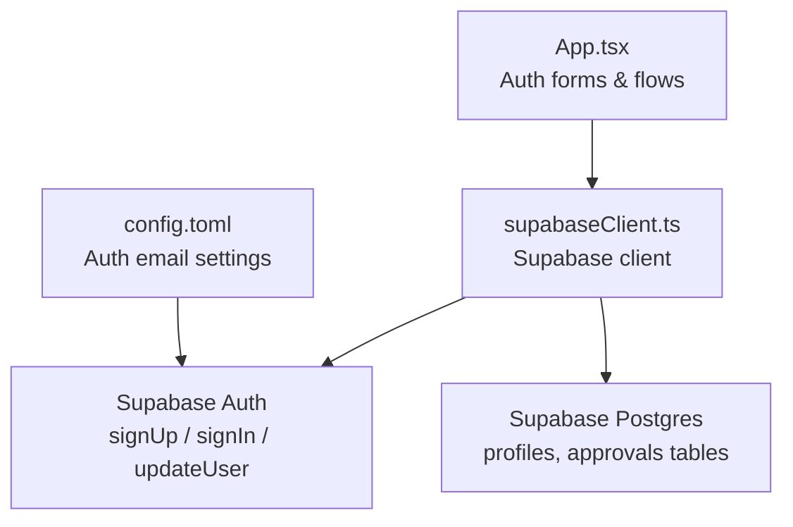
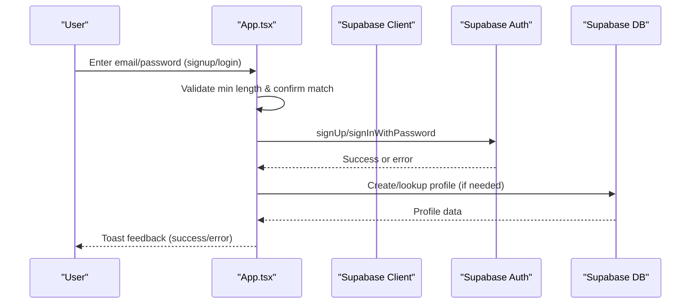
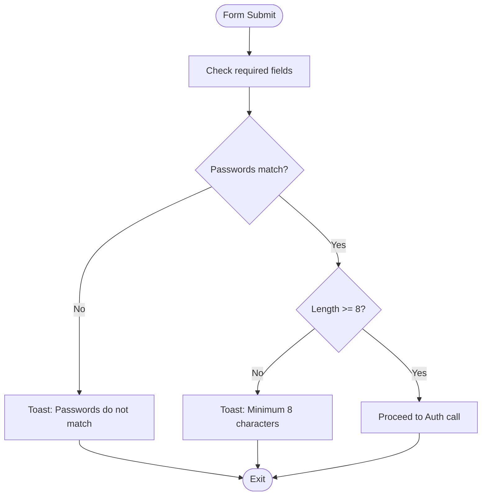
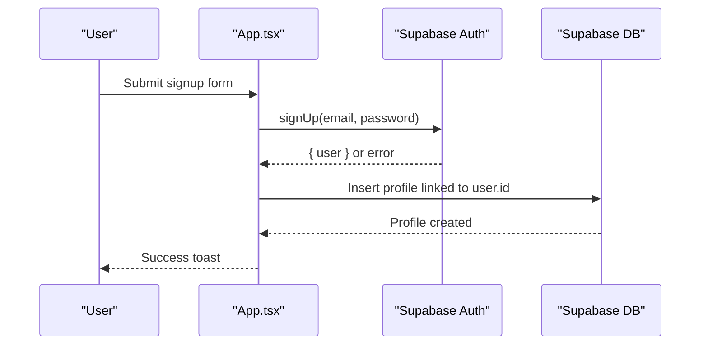
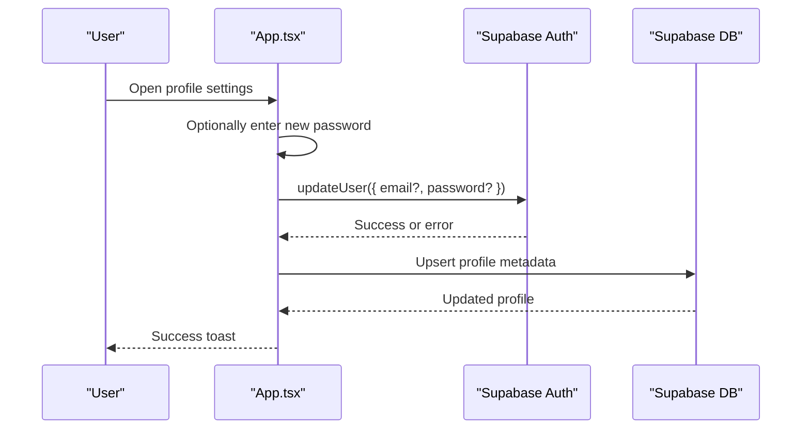
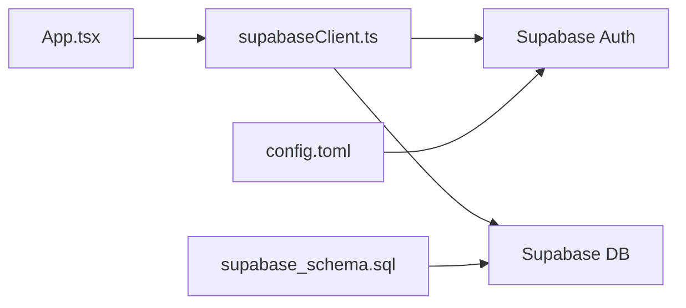

# Password Security

<cite>
**Referenced Files in This Document**
- [App.tsx](file://src/App.tsx)
- [supabaseClient.ts](file://src/supabase/supabaseClient.ts)
- [config.toml](file://supabase/config.toml)
- [supabase_schema.sql](file://supabase_schema.sql)
</cite>

## Table of Contents
1. Introduction
2. Project Structure
3. Core Components
4. Architecture Overview
5. Detailed Component Analysis
6. Dependency Analysis
7. Performance Considerations
8. Troubleshooting Guide
9. Conclusion

## Introduction
This document explains how password security is implemented across the application, focusing on validation rules, hashing via Supabase Auth, secure storage practices, and user-facing workflows for password changes and recovery. It also covers input masking, real-time validation feedback, and error handling for weak passwords.

## Project Structure
Password-related logic spans the main application component (UI and flows), the Supabase client configuration, and server-side configuration for email/password behavior. Database schema files define where non-auth profile data is stored; sensitive credentials are managed by Supabase Auth rather than custom tables.

**Diagram sources**
- [App.tsx](file://src/App.tsx)
- [supabaseClient.ts](file://src/supabase/supabaseClient.ts)
- [config.toml](file://supabase/config.toml)
- [supabase_schema.sql](file://supabase_schema.sql)

**Section sources**
- [App.tsx](file://src/App.tsx)
- [supabaseClient.ts](file://src/supabase/supabaseClient.ts)
- [config.toml](file://supabase/config.toml)
- [supabase_schema.sql](file://supabase_schema.sql)

## Core Components
- Validation and UX:
  - Minimum length requirement enforced at signup and registration flows.
  - Confirmation matching enforced before submission.
  - Real-time toasts provide immediate feedback on errors or success.
- Authentication and Hashing:
  - Passwords are sent to Supabase Auth for hashing and verification.
  - Profile updates can optionally change the password through Supabase Auth.
- Storage:
  - User profiles are stored in a dedicated table without storing plaintext passwords.
  - Approval queues may contain temporary login_password fields used during onboarding workflows.

Key implementation references:
- Signup validation and confirmation checks: [App.tsx](file://src/App.tsx)
- Login flow using Supabase Auth: [App.tsx](file://src/App.tsx)
- Password update via profile update: [App.tsx](file://src/App.tsx)
- Supabase client initialization: [supabaseClient.ts](file://src/supabase/supabaseClient.ts)
- Email/password auth configuration: [config.toml](file://supabase/config.toml)
- Profiles and approval tables schema: [supabase_schema.sql](file://supabase_schema.sql)

**Section sources**
- [App.tsx](file://src/App.tsx)
- [supabaseClient.ts](file://src/supabase/supabaseClient.ts)
- [config.toml](file://supabase/config.toml)
- [supabase_schema.sql](file://supabase_schema.sql)

## Architecture Overview
The password workflow leverages Supabase Auth for secure hashing and session management. The frontend validates inputs and provides immediate feedback, while Supabase enforces server-side policies and stores hashed credentials.

**Diagram sources**
- [App.tsx](file://src/App.tsx)
- [supabaseClient.ts](file://src/supabase/supabaseClient.ts)

## Detailed Component Analysis

### Password Validation Rules
- Minimum length: Enforced for signup and vendor/rider registration flows.
- Confirmation matching: Required for signup and registration flows.
- Real-time feedback: Toast messages inform users about missing fields, mismatches, and minimum length violations.

Implementation references:
- Signup validation and toast feedback: [App.tsx](file://src/App.tsx)
- Vendor registration validation: [App.tsx](file://src/App.tsx)
- Rider registration validation: [App.tsx](file://src/App.tsx)

**Diagram sources**
- [App.tsx](file://src/App.tsx)

**Section sources**
- [App.tsx](file://src/App.tsx)

### Password Hashing with Supabase Auth
- Signing up sends the plaintext password to Supabase Auth, which hashes it securely.
- Logging in verifies the password against the stored hash via Supabase Auth.
- Updating the profile can include an optional password field that Supabase Auth handles securely.

Implementation references:
- SignUp call: [App.tsx](file://src/App.tsx)
- SignIn call: [App.tsx](file://src/App.tsx)
- Update user password via updateUser: [App.tsx](file://src/App.tsx)
- Supabase client setup: [supabaseClient.ts](file://src/supabase/supabaseClient.ts)

**Diagram sources**
- [App.tsx](file://src/App.tsx)
- [supabaseClient.ts](file://src/supabase/supabaseClient.ts)

**Section sources**
- [App.tsx](file://src/App.tsx)
- [supabaseClient.ts](file://src/supabase/supabaseClient.ts)

### Secure Password Storage Practices
- Do not store plaintext passwords in application tables.
- Use Supabase Auth for credential hashing and session management.
- Profile table stores non-sensitive metadata only.
- Approval tables may temporarily hold login_password for onboarding workflows; ensure these are handled carefully and removed after use.

References:
- Profiles schema (no password column): [supabase_schema.sql](file://supabase_schema.sql)
- Vendor/Rider approvals schema (temporary login_password columns): [supabase_schema.sql](file://supabase_schema.sql)

**Section sources**
- [supabase_schema.sql](file://supabase_schema.sql)

### Password Reset and Recovery Workflow
- The current UI indicates manual admin-assisted recovery for account reset.
- Supabase Auth supports email-based password resets; enabling this requires appropriate configuration in Supabase settings.

References:
- Forgot mode UI guidance: [App.tsx](file://src/App.tsx)
- Auth email configuration (OTP/expiry/min frequency): [config.toml](file://supabase/config.toml)

Recommendation:
- Enable email-based password reset in Supabase Auth and implement a dedicated reset flow in the UI if desired.

**Section sources**
- [App.tsx](file://src/App.tsx)
- [config.toml](file://supabase/config.toml)

### Password Change Workflow
- Users can update their profile and optionally set a new password via Supabase Auth’s updateUser method.
- If no password is provided, the existing password is retained.

References:
- Profile update including optional password change: [App.tsx](file://src/App.tsx)

**Diagram sources**
- [App.tsx](file://src/App.tsx)

**Section sources**
- [App.tsx](file://src/App.tsx)

### Input Masking and Real-Time Feedback
- All password inputs use masked types to prevent accidental exposure.
- Immediate feedback is provided via toast notifications for validation errors and successes.

References:
- Masked password inputs across login/signup/profile/vendor/rider forms: [App.tsx](file://src/App.tsx)
- Toast utility for feedback: [App.tsx](file://src/App.tsx)

**Section sources**
- [App.tsx](file://src/App.tsx)

### Error Handling for Weak Passwords
- Frontend enforces minimum length and confirmation matching before any network calls.
- Errors are surfaced to users via concise toast messages.
- Server-side Supabase Auth will enforce additional constraints if configured.

References:
- Length and confirmation checks: [App.tsx](file://src/App.tsx)
- Toast messaging: [App.tsx](file://src/App.tsx)

**Section sources**
- [App.tsx](file://src/App.tsx)

## Dependency Analysis
- App.tsx depends on supabaseClient.ts for all Supabase operations.
- Supabase Auth handles password hashing and authentication.
- config.toml controls email/password behaviors such as OTP expiry and reauthentication requirements.
- Database schema defines where non-sensitive profile data is stored.

**Diagram sources**
- [App.tsx](file://src/App.tsx)
- [supabaseClient.ts](file://src/supabase/supabaseClient.ts)
- [config.toml](file://supabase/config.toml)
- [supabase_schema.sql](file://supabase_schema.sql)

**Section sources**
- [App.tsx](file://src/App.tsx)
- [supabaseClient.ts](file://src/supabase/supabaseClient.ts)
- [config.toml](file://supabase/config.toml)
- [supabase_schema.sql](file://supabase_schema.sql)

## Performance Considerations
- Keep validation on the client side to reduce unnecessary network requests.
- Avoid logging sensitive data (passwords, tokens) in console output.
- Use Supabase Auth for efficient, secure credential handling instead of custom hashing.

[No sources needed since this section provides general guidance]

## Troubleshooting Guide
Common issues and resolutions:
- Missing Supabase credentials: Ensure environment variables are correctly set and validated by the client.
- Incorrect Supabase URL: Use the project base URL, not the REST endpoint path.
- RLS policy blocks queries: Verify policies allow intended operations for anon/authenticated roles.
- Password mismatch or too short: Review frontend validation and toast messages for clarity.

References:
- Environment validation and warnings: [supabaseClient.ts](file://src/supabase/supabaseClient.ts)
- RLS policies and permissions: [supabase_schema.sql](file://supabase_schema.sql)
- Auth error handling and toasts: [App.tsx](file://src/App.tsx)

**Section sources**
- [supabaseClient.ts](file://src/supabase/supabaseClient.ts)
- [supabase_schema.sql](file://supabase_schema.sql)
- [App.tsx](file://src/App.tsx)

## Conclusion
The application implements robust password security by delegating hashing and authentication to Supabase Auth, enforcing minimum length and confirmation matching on the client, and providing clear user feedback. Sensitive credentials are not stored in application tables; profile data is kept separate from authentication secrets. For enhanced recovery, consider enabling email-based password reset in Supabase Auth and implementing a corresponding UI flow.

[No sources needed since this section summarizes without analyzing specific files]