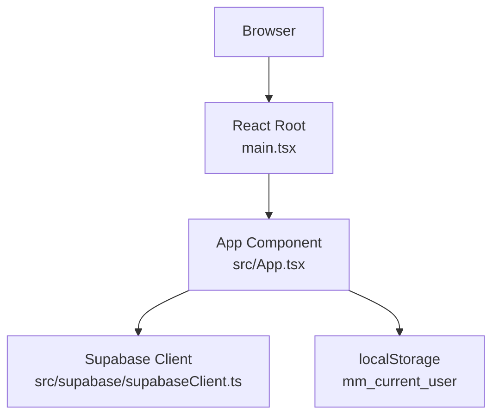
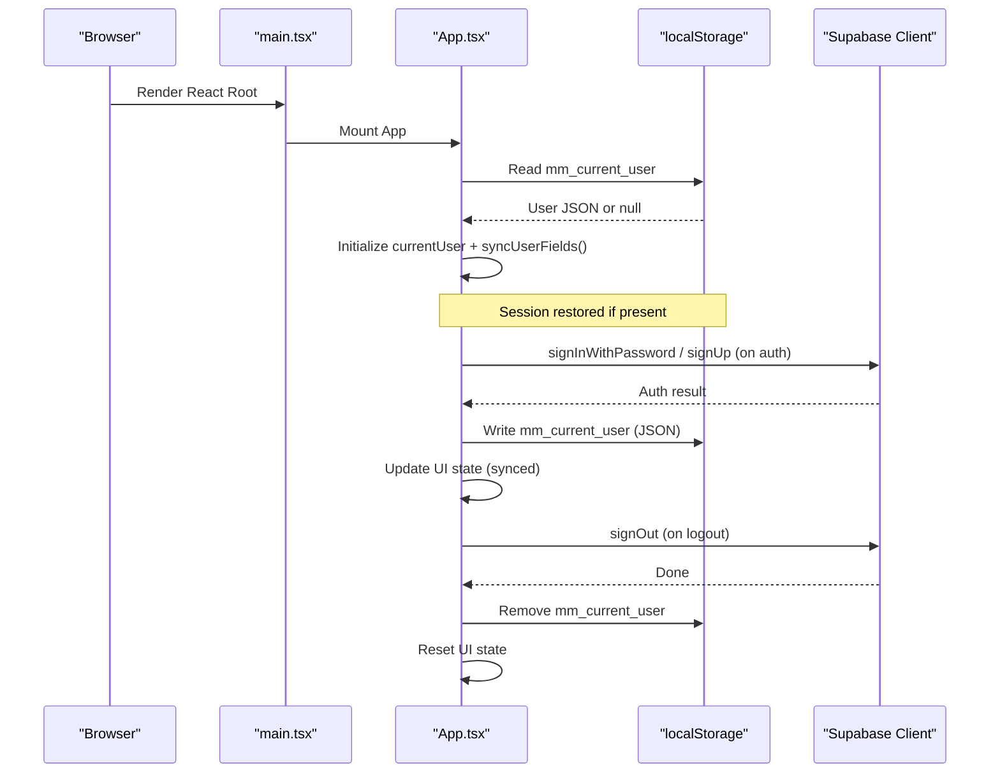
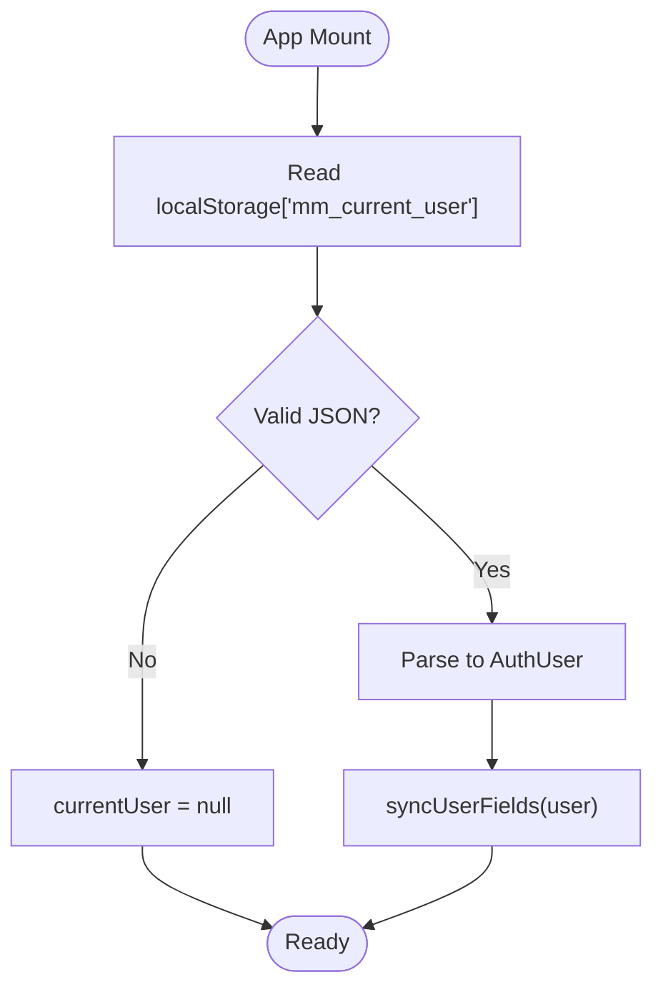
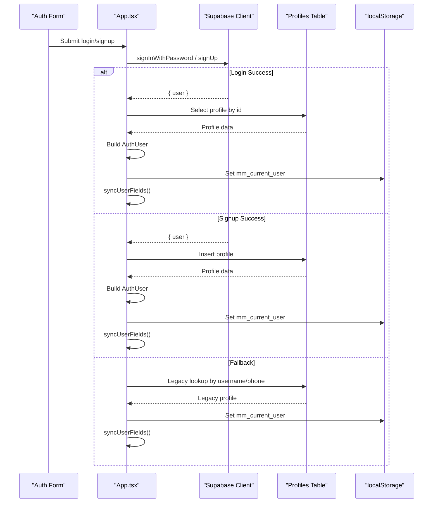
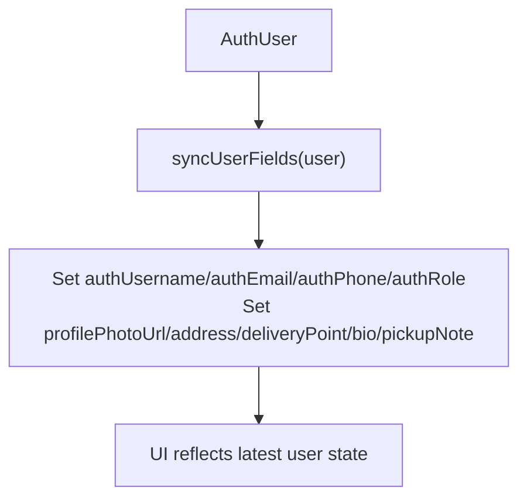
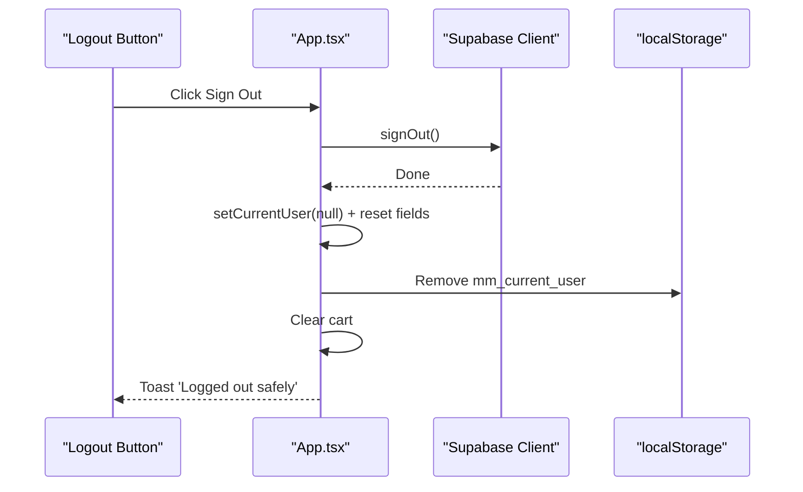
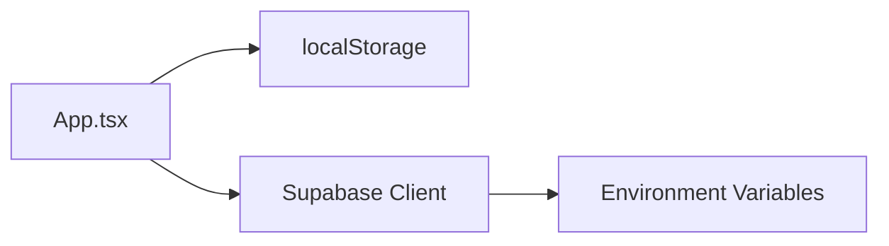

# Session Management

<cite>
**Referenced Files in This Document**
- [App.tsx](file://src/App.tsx)
- [supabaseClient.ts](file://src/supabase/supabaseClient.ts)
- [main.tsx](file://src/main.tsx)
</cite>

## Table of Contents
1. [Introduction](#introduction)
2. [Project Structure](#project-structure)
3. [Core Components](#core-components)
4. [Architecture Overview](#architecture-overview)
5. [Detailed Component Analysis](#detailed-component-analysis)
6. [Dependency Analysis](#dependency-analysis)
7. [Performance Considerations](#performance-considerations)
8. [Troubleshooting Guide](#troubleshooting-guide)
9. [Conclusion](#conclusion)

## Introduction
This document explains how the application manages user sessions using browser localStorage with the key mm_current_user. It covers session creation, persistence, restoration on startup, automatic state synchronization, and logout behavior that clears local storage and signs out from Supabase. It also includes validation strategies for corrupted sessions, error handling patterns, and security considerations when storing user data locally.

## Project Structure
Session management is implemented primarily within the root React component and the Supabase client configuration:
- Application entry renders the main App component.
- The App component initializes current user state from localStorage and persists updates to it.
- Supabase client is configured via environment variables and used for authentication and profile operations.

**Diagram sources**
- [main.tsx:1-11](file://src/main.tsx#L1-L11)
- [App.tsx:227-230](file://src/App.tsx#L227-L230)
- [supabaseClient.ts:1-38](file://src/supabase/supabaseClient.ts#L1-L38)

**Section sources**
- [main.tsx:1-11](file://src/main.tsx#L1-L11)
- [App.tsx:227-230](file://src/App.tsx#L227-L230)
- [supabaseClient.ts:1-38](file://src/supabase/supabaseClient.ts#L1-L38)

## Core Components
- LocalStorage-backed user session:
  - Key: mm_current_user
  - Value: JSON-serialized user object (AuthUser)
- State initialization and restoration:
  - On mount, the App reads mm_current_user and hydrates currentUser and related UI fields.
- Synchronization helper:
  - syncUserFields maps persisted user properties into form/profile state.
- Logout flow:
  - Clears Supabase session, resets all UI state, removes mm_current_user, and empties cart.

Key behaviors:
- Creation: After successful login or signup, the AuthUser is set in state and written to localStorage.
- Restoration: On app start, currentUser is initialized from localStorage; if present, UI fields are synchronized.
- Cleanup: On logout, Supabase signOut is called, state is reset, and mm_current_user is removed.

**Section sources**
- [App.tsx:227-230](file://src/App.tsx#L227-L230)
- [App.tsx:266-284](file://src/App.tsx#L266-L284)
- [App.tsx:292-313](file://src/App.tsx#L292-L313)

## Architecture Overview
The session architecture combines a client-side store (localStorage) with server-side identity (Supabase Auth). The App component orchestrates persistence and UI synchronization.

**Diagram sources**
- [main.tsx:1-11](file://src/main.tsx#L1-L11)
- [App.tsx:227-230](file://src/App.tsx#L227-L230)
- [App.tsx:292-313](file://src/App.tsx#L292-L313)
- [supabaseClient.ts:1-38](file://src/supabase/supabaseClient.ts#L1-L38)

## Detailed Component Analysis

### Session Initialization and Restoration
- On component mount, currentUser is initialized by reading mm_current_user from localStorage and parsing it. If invalid or missing, currentUser becomes null.
- After restoration, syncUserFields ensures that form fields and profile states reflect the persisted user.

**Diagram sources**
- [App.tsx:227-230](file://src/App.tsx#L227-L230)
- [App.tsx:266-284](file://src/App.tsx#L266-L284)

**Section sources**
- [App.tsx:227-230](file://src/App.tsx#L227-L230)
- [App.tsx:266-284](file://src/App.tsx#L266-L284)

### Session Creation (Login/Signup)
- Login path:
  - Attempts Supabase password-based sign-in.
  - On success, fetches profile by userId, constructs AuthUser, sets state, synchronizes UI fields, and writes mm_current_user.
- Signup path:
  - Registers via Supabase Auth, creates or infers role, inserts/upserts profile, constructs AuthUser, sets state, synchronizes UI fields, and writes mm_current_user.
- Legacy fallback:
  - If standard login fails and only phone was provided, attempts legacy lookup and persists the resulting user to localStorage.

**Diagram sources**
- [App.tsx:721-855](file://src/App.tsx#L721-L855)
- [App.tsx:860-956](file://src/App.tsx#L860-L956)

**Section sources**
- [App.tsx:721-855](file://src/App.tsx#L721-L855)
- [App.tsx:860-956](file://src/App.tsx#L860-L956)

### Automatic State Synchronization
- syncUserFields maps AuthUser fields into corresponding UI state variables (username, email, phone, role, profile photo, address, delivery point, bio, pickup note).
- Ensures that after any change to currentUser (initialization, login, signup, profile update), the UI remains consistent.

**Diagram sources**
- [App.tsx:266-284](file://src/App.tsx#L266-L284)

**Section sources**
- [App.tsx:266-284](file://src/App.tsx#L266-L284)

### Session Cleanup and Logout
- handleSignOut performs:
  - Supabase signOut call
  - Resets currentUser and all related UI fields
  - Removes mm_current_user from localStorage
  - Clears cart
  - Shows informational toast

**Diagram sources**
- [App.tsx:292-313](file://src/App.tsx#L292-L313)

**Section sources**
- [App.tsx:292-313](file://src/App.tsx#L292-L313)

### Session Validation and Error Handling
- Corrupted session handling:
  - When reading mm_current_user, JSON.parse may throw if the stored value is malformed. Wrap read logic in try/catch to avoid crashes and treat invalid entries as null.
- Network and auth errors:
  - All Supabase calls are wrapped with try/catch and user-facing toasts are shown on failure.
- Profile update flow:
  - Updates both Supabase Auth metadata and profiles table; errors are caught and surfaced to the user.

Recommendations:
- Encapsulate localStorage reads/writes in a small utility with try/catch and type checks.
- Validate required fields before persisting (e.g., id, role).
- Log detailed errors in development while keeping user messages concise.

**Section sources**
- [App.tsx:227-230](file://src/App.tsx#L227-L230)
- [App.tsx:292-313](file://src/App.tsx#L292-L313)
- [App.tsx:959-1036](file://src/App.tsx#L959-L1036)

### Security Considerations for Local Storage
- Risks:
  - localStorage is accessible to any script running on the page; XSS can read or overwrite mm_current_user.
  - Storing sensitive credentials in localStorage is discouraged.
- Mitigations:
  - Store only non-sensitive identifiers and display-only profile fields.
  - Avoid storing passwords or tokens in localStorage.
  - Use HTTPS and ensure CSP headers to reduce XSS risk.
  - Consider short-lived sessions and re-authentication for sensitive actions.
  - Sanitize inputs and validate roles on the server side.

[No sources needed since this section provides general guidance]

## Dependency Analysis
The session layer depends on:
- React state hooks for currentUser and UI fields
- localStorage for persistence
- Supabase client for authentication and profile operations

**Diagram sources**
- [App.tsx:227-230](file://src/App.tsx#L227-L230)
- [supabaseClient.ts:1-38](file://src/supabase/supabaseClient.ts#L1-L38)

**Section sources**
- [App.tsx:227-230](file://src/App.tsx#L227-L230)
- [supabaseClient.ts:1-38](file://src/supabase/supabaseClient.ts#L1-L38)

## Performance Considerations
- localStorage operations are synchronous and fast but should be minimized to critical moments (startup, login/logout, profile updates).
- Avoid heavy serialization; keep the AuthUser minimal and stable.
- Batch UI updates where possible to prevent excessive re-renders.

[No sources needed since this section provides general guidance]

## Troubleshooting Guide
Common issues and resolutions:
- App crashes on startup due to corrupted mm_current_user:
  - Wrap localStorage.getItem and JSON.parse in try/catch; default to null if parse fails.
- User not logged in after refresh:
  - Ensure mm_current_user is written after successful login/signup and that no code clears it unexpectedly.
- Logout does not clear session:
  - Verify supabase.auth.signOut is called and mm_current_user is removed.
- Profile updates fail silently:
  - Check Supabase RLS policies and network errors; surface error messages to users.

**Section sources**
- [App.tsx:227-230](file://src/App.tsx#L227-L230)
- [App.tsx:292-313](file://src/App.tsx#L292-L313)
- [App.tsx:959-1036](file://src/App.tsx#L959-L1036)

## Conclusion
The application implements a straightforward and effective session management pattern:
- Persist the minimal AuthUser in localStorage under mm_current_user.
- Restore and synchronize state on startup.
- Integrate with Supabase Auth for secure identity management.
- Provide robust logout that clears both server and client state.
To improve resilience and security, add explicit try/catch around localStorage parsing, minimize stored data, and enforce server-side validations and policies.

[No sources needed since this section summarizes without analyzing specific files]