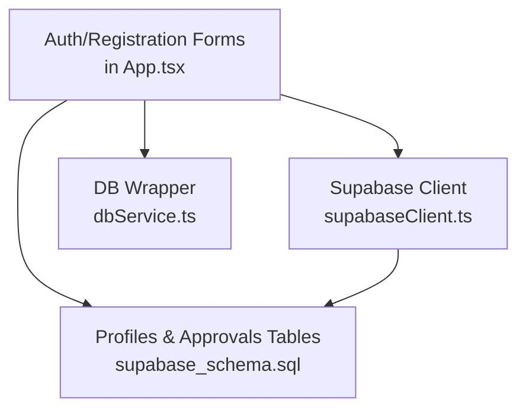
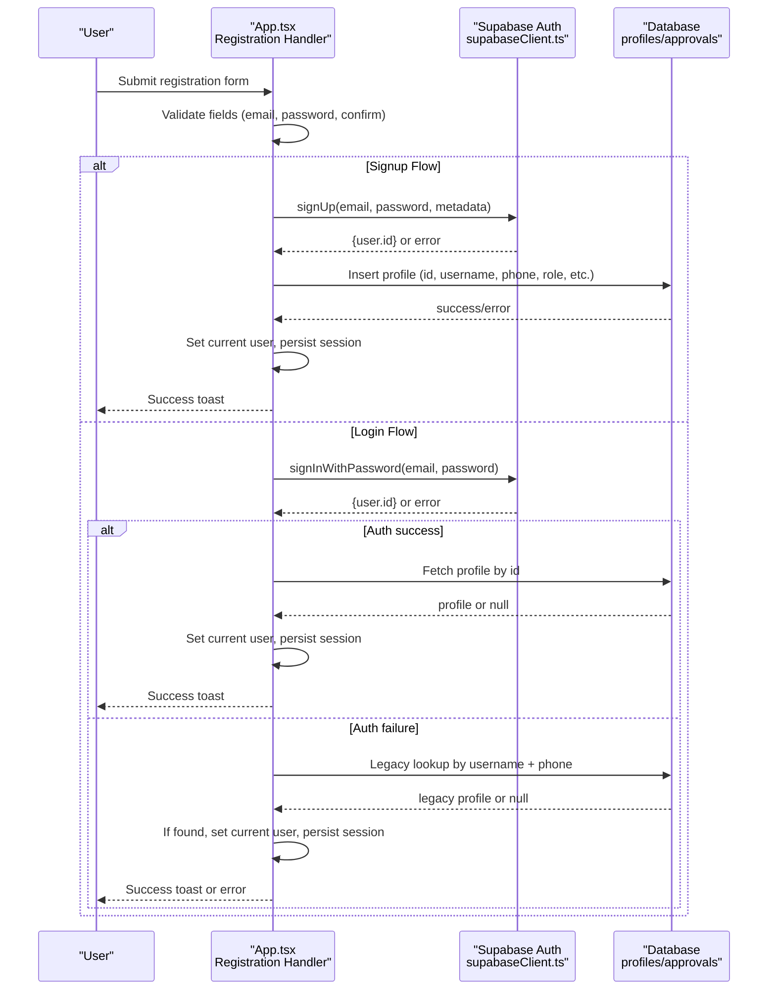
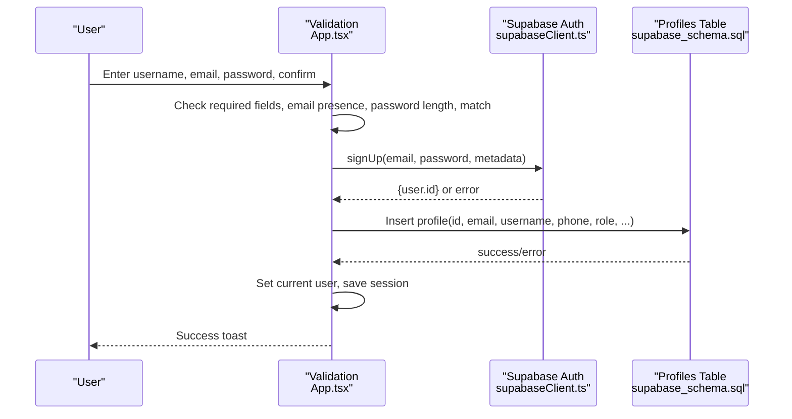
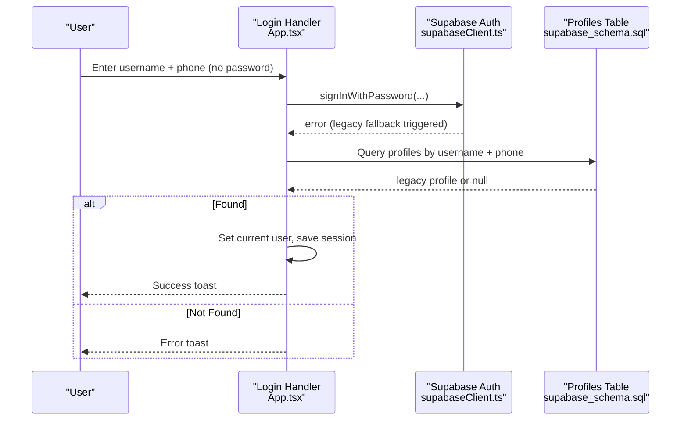
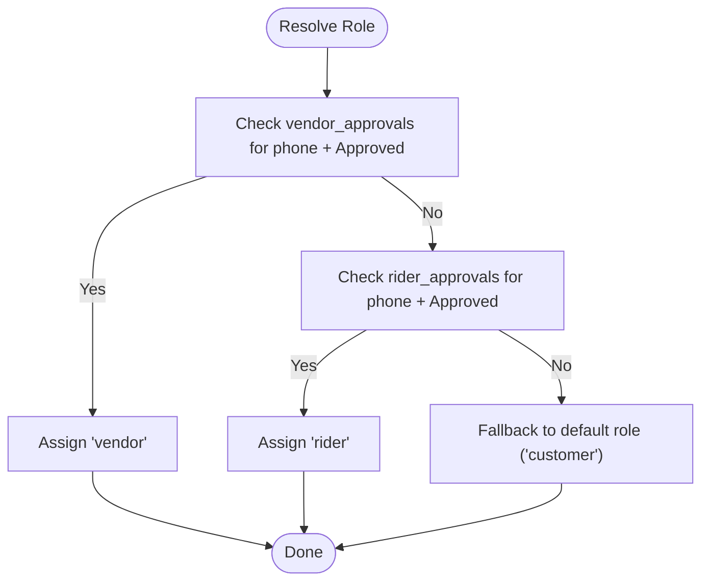
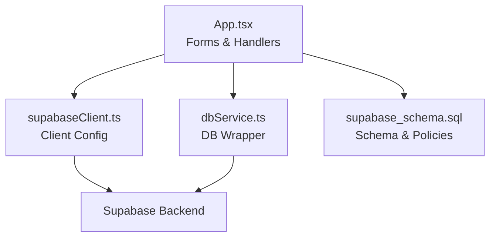

# User Registration

<cite>
**Referenced Files in This Document**
- [App.tsx](file://src/App.tsx)
- [supabaseClient.ts](file://src/supabase/supabaseClient.ts)
- [dbService.ts](file://src/supabase/dbService.ts)
- [supabase_schema.sql](file://supabase_schema.sql)
</cite>

## Table of Contents
1. Introduction
2. Project Structure
3. Core Components
4. Architecture Overview
5. Detailed Component Analysis
6. Dependency Analysis
7. Performance Considerations
8. Troubleshooting Guide
9. Conclusion

## Introduction
This document explains the user registration system with a dual flow:
- Email/password registration via Supabase Auth for customers and vendors.
- Legacy phone-based authentication fallback for existing users who only have a phone number.

It also covers form validation (username, email format, password strength, confirmation), role-based registration for customers, vendors, and riders, Supabase Auth integration, error handling strategies, and profile creation. Examples include registration form components, validation logic, and successful workflows.

## Project Structure
The registration feature is implemented primarily in the main application component, with Supabase client configuration and database schema supporting the data model and security policies.

**Diagram sources**
- [App.tsx](file://src/App.tsx)
- [supabaseClient.ts](file://src/supabase/supabaseClient.ts)
- [dbService.ts](file://src/supabase/dbService.ts)
- [supabase_schema.sql](file://supabase_schema.sql)

**Section sources**
- [App.tsx](file://src/App.tsx)
- [supabaseClient.ts](file://src/supabase/supabaseClient.ts)
- [dbService.ts](file://src/supabase/dbService.ts)
- [supabase_schema.sql](file://supabase_schema.sql)

## Core Components
- Authentication and Registration Form: Handles both login and signup modes, validates inputs, and routes to appropriate flows.
- Role Resolution: Determines user role based on approval queues and vendor matching.
- Supabase Auth Integration: Creates accounts, stores metadata, and persists profiles.
- Legacy Phone Fallback: Allows login using phone-only credentials when password is missing.
- Vendor/Rider Onboarding: Separate forms that create pending approvals for admin review.

Key responsibilities:
- Validate username presence, email format, password length, and confirmation match.
- Assign roles (customer, vendor, rider) based on approvals or vendor name matching.
- Create Supabase Auth user and corresponding profile record.
- Persist session and update UI state.

**Section sources**
- [App.tsx](file://src/App.tsx)

## Architecture Overview
The registration architecture combines frontend validation, Supabase Auth, and database persistence.

**Diagram sources**
- [App.tsx](file://src/App.tsx)
- [supabaseClient.ts](file://src/supabase/supabaseClient.ts)
- [supabase_schema.sql](file://supabase_schema.sql)

## Detailed Component Analysis

### Dual Registration Flow (Email/Password and Legacy Phone)
- Signup mode requires:
  - Username present
  - Email provided
  - Password and confirmation provided and equal
  - Password minimum length enforced
- Login mode supports:
  - Standard email/password via Supabase Auth
  - Legacy phone-only fallback when no password is provided; falls back to profile lookup by username and phone

Validation highlights:
- Enforces non-empty username and either email or phone during general checks.
- For signup, ensures email presence, password presence, equality, and minimum length.
- For login, detects legacy phone-only path and bypasses password requirement.

Role resolution:
- Resolves role from approval queues (vendor/rider) if approved; otherwise defaults to customer.
- Auto-promotes to vendor if username matches an approved vendor name.

Profile creation:
- After successful auth signup, inserts a profile row with id, email, username, phone, role, and optional fields.
- On login, fetches profile by user id; if missing, creates a fallback profile.

Error handling:
- Displays user-friendly toasts for validation errors, auth failures, and database errors.
- Catches unexpected exceptions and reports them clearly.

**Section sources**
- [App.tsx](file://src/App.tsx)

#### Sequence Diagram: Signup Flow

**Diagram sources**
- [App.tsx](file://src/App.tsx)
- [supabaseClient.ts](file://src/supabase/supabaseClient.ts)
- [supabase_schema.sql](file://supabase_schema.sql)

#### Sequence Diagram: Legacy Phone Login Fallback

**Diagram sources**
- [App.tsx](file://src/App.tsx)
- [supabaseClient.ts](file://src/supabase/supabaseClient.ts)
- [supabase_schema.sql](file://supabase_schema.sql)

### Form Validation Rules
- Username: Required during general checks.
- Email: Required for signup; validated presence.
- Password: Minimum length enforced; must match confirmation.
- Phone: Used for legacy login fallback and role resolution.

Implementation details:
- Validation occurs before any network calls.
- Errors are surfaced via toasts immediately.

**Section sources**
- [App.tsx](file://src/App.tsx)

### Role-Based Registration (Customers, Vendors, Riders)
- Customers: Default role unless overridden by approvals or vendor matching.
- Vendors: Assigned if vendor approval exists for the phone or username matches an approved vendor.
- Riders: Assigned if rider approval exists for the phone.

Vendor/Rider onboarding:
- Separate forms collect required fields and submit to approval tables with status Pending.
- Admin can approve requests, which updates role resolution accordingly.

**Section sources**
- [App.tsx](file://src/App.tsx)

#### Flowchart: Role Resolution

**Diagram sources**
- [App.tsx](file://src/App.tsx)

### Supabase Auth Integration
- Client initialization reads environment variables and validates configuration.
- SignUp uses Supabase Auth with metadata including username, phone, role, and profile fields.
- SignIn attempts standard email/password; on failure, triggers legacy phone fallback.
- Profile persistence ensures consistent user data across sessions.

Environment and debugging:
- Validates presence of URL and anon key.
- Warns about incorrect base URL patterns.
- Provides debug helper to log host and key presence.

**Section sources**
- [supabaseClient.ts](file://src/supabase/supabaseClient.ts)
- [App.tsx](file://src/App.tsx)

### Database Schema and Security Policies
- Profiles table includes id, email, username, phone, role, linked_entity_name, profile_photo_url, address, delivery_point, bio, pickup_note, created_at.
- Vendor and Rider approvals tables store pending onboarding requests with login_email and login_password for later account creation.
- Row Level Security policies enable full access for client apps during development.

**Section sources**
- [supabase_schema.sql](file://supabase_schema.sql)

### Example Registration Form Components
- Customer/Vendor Signup Form:
  - Fields: Full Name (username), Email Address, Mobile Contact, New Password, Confirm Password.
  - Validation: Presence checks, password length, confirmation match.
  - Submission: Calls signup handler, creates auth user and profile.
- Vendor Onboarding Form:
  - Fields: Store Name, Category, Contact Phone, Password, Confirm Password.
  - Submission: Inserts into vendor_approvals with status Pending.
- Rider Onboarding Form:
  - Fields: Rider Full Name, Motorcycle Plate, Contact Phone, Password, Confirm Password.
  - Submission: Inserts into rider_approvals with status Pending.

These forms are embedded within the application UI and trigger respective handlers.

**Section sources**
- [App.tsx](file://src/App.tsx)

## Dependency Analysis
The registration system depends on:
- React state management for form inputs and user session.
- Supabase client for authentication and database operations.
- Database schema for profiles and approvals.

**Diagram sources**
- [App.tsx](file://src/App.tsx)
- [supabaseClient.ts](file://src/supabase/supabaseClient.ts)
- [dbService.ts](file://src/supabase/dbService.ts)
- [supabase_schema.sql](file://supabase_schema.sql)

**Section sources**
- [App.tsx](file://src/App.tsx)
- [supabaseClient.ts](file://src/supabase/supabaseClient.ts)
- [dbService.ts](file://src/supabase/dbService.ts)
- [supabase_schema.sql](file://supabase_schema.sql)

## Performance Considerations
- Minimize redundant queries by caching approval lists and vendor data in local state.
- Use maybeSingle for single-record lookups to avoid unnecessary overhead.
- Avoid excessive re-renders by updating state only on meaningful changes.
- Ensure environment validation runs once at startup to prevent repeated warnings.

[No sources needed since this section provides general guidance]

## Troubleshooting Guide
Common issues and resolutions:
- Missing Supabase credentials:
  - Ensure VITE_SUPABASE_URL and VITE_SUPABASE_ANON_KEY are set correctly.
  - Verify the URL does not include /rest/v1 paths.
- Auth registration failures:
  - Check email format and password requirements.
  - Review Supabase Auth logs for specific error messages.
- Profile insertion errors:
  - Confirm database permissions and RLS policies allow inserts.
  - Validate field mappings between frontend and schema.
- Legacy login not working:
  - Ensure username and phone match an existing profile.
  - Confirm no password was provided to trigger fallback.

**Section sources**
- [supabaseClient.ts](file://src/supabase/supabaseClient.ts)
- [App.tsx](file://src/App.tsx)

## Conclusion
The registration system provides a robust dual flow supporting modern email/password authentication and legacy phone-based login. It enforces strong validation rules, resolves roles dynamically based on approvals and vendor matching, and integrates seamlessly with Supabase Auth and database schemas. Clear error handling and user feedback ensure a smooth experience for customers, vendors, and riders.

[No sources needed since this section summarizes without analyzing specific files]