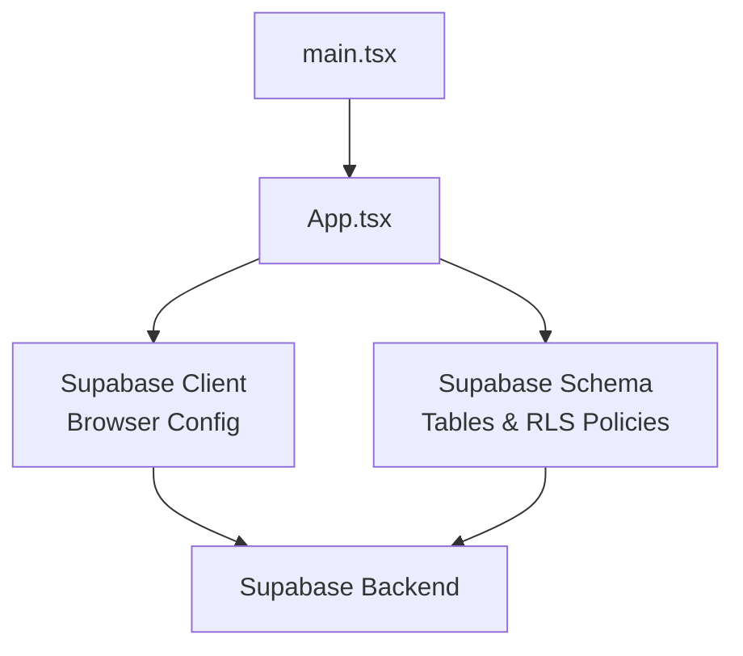
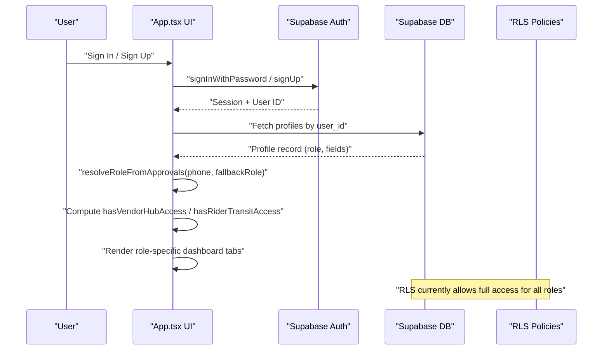
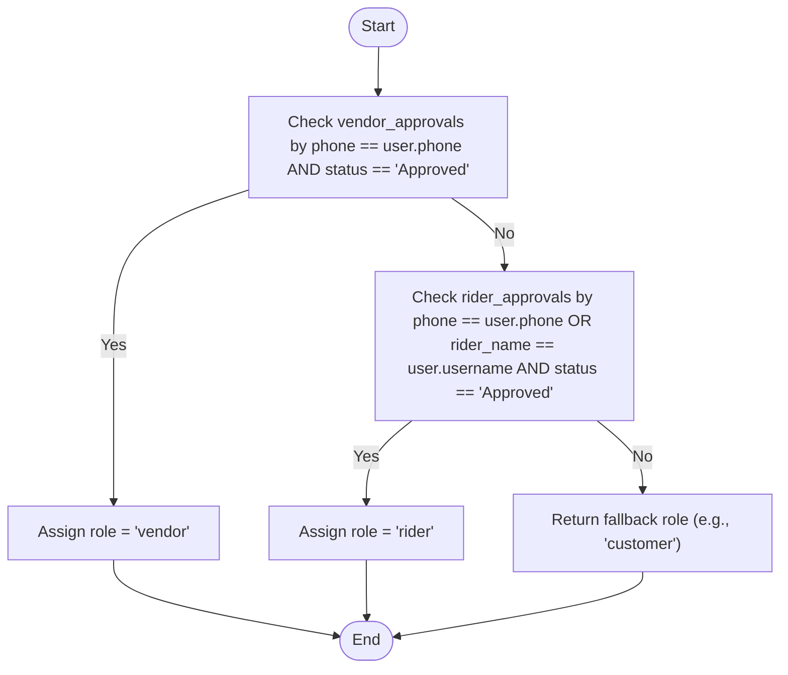
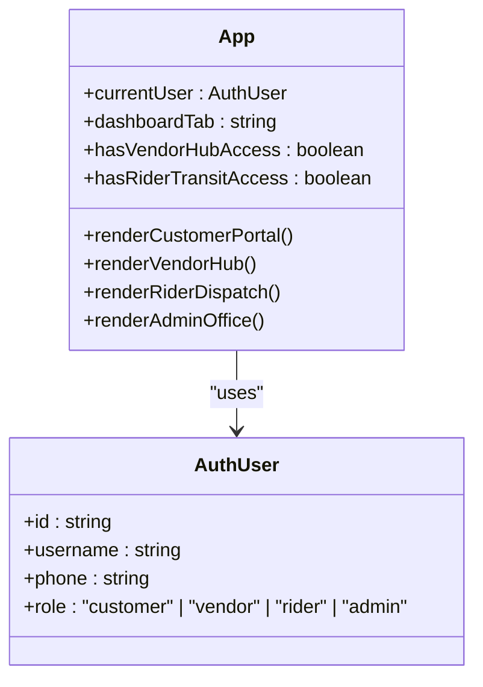
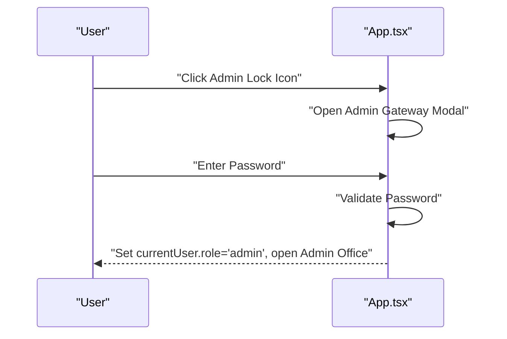
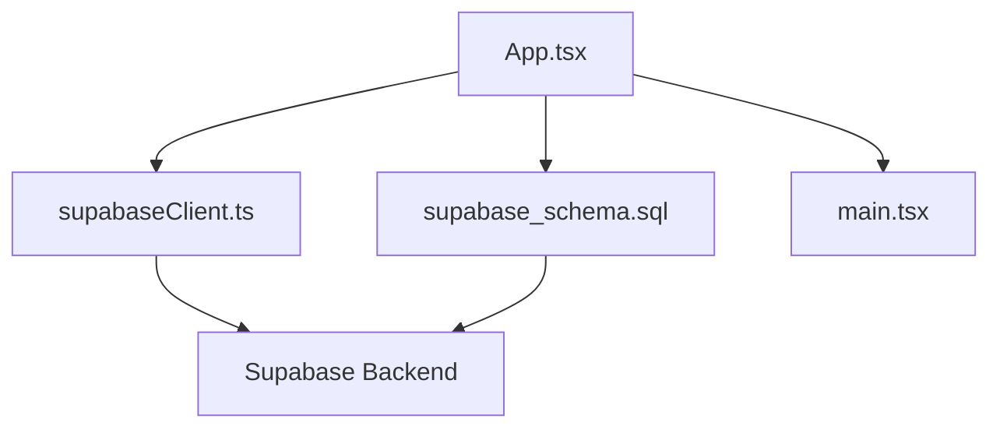

# Role-Based Access Control

<cite>
**Referenced Files in This Document**
- [App.tsx](file://src/App.tsx)
- [supabase_schema.sql](file://supabase_schema.sql)
- [supabaseClient.ts](file://src/supabaseClient.ts)
- [main.tsx](file://src/main.tsx)
</cite>

## Table of Contents
1. Introduction
2. Project Structure
3. Core Components
4. Architecture Overview
5. Detailed Component Analysis
6. Dependency Analysis
7. Performance Considerations
8. Troubleshooting Guide
9. Conclusion

## Introduction
This document explains the role-based access control (RBAC) system implemented in the application. It covers the four user roles (customer, vendor, rider, admin), their permissions and capabilities, the role resolution logic based on approval status and profile data, and how dashboard sections are conditionally rendered per role. It also provides implementation patterns for protecting routes, restricting features, displaying role-specific UI elements, checking roles, implementing guards, and handling unauthorized access scenarios.

## Project Structure
The RBAC logic is primarily implemented within the main application component and supported by the database schema and Supabase client configuration:
- Application entry point renders the root App component.
- The App component manages authentication state, role resolution, and conditional rendering of role-specific dashboards.
- The Supabase schema defines tables that store profiles, approvals, and other entities used to determine roles and permissions.
- The Supabase client is configured for browser-side usage.

**Diagram sources**
- [main.tsx:1-11](file://src/main.tsx#L1-L11)
- [App.tsx:217-350](file://src/App.tsx#L217-L350)
- [supabase_schema.sql:1-198](file://supabase_schema.sql#L1-L198)
- [supabaseClient.ts:1-7](file://src/supabaseClient.ts#L1-L7)

**Section sources**
- [main.tsx:1-11](file://src/main.tsx#L1-L11)
- [App.tsx:217-350](file://src/App.tsx#L217-L350)
- [supabase_schema.sql:1-198](file://supabase_schema.sql#L1-L198)
- [supabaseClient.ts:1-7](file://src/supabaseClient.ts#L1-L7)

## Core Components
- AuthUser model: Holds id, email, username, phone, role, and optional profile fields. Role values include customer, vendor, rider, admin.
- Role resolution function: Determines effective role using approval records and fallback role.
- Access flags: hasVendorHubAccess and hasRiderTransitAccess compute whether a user can access vendor or rider dashboards respectively.
- Dashboard tabs: Customer, Vendor, Rider, and Admin tabs are conditionally shown based on currentUser.role.
- Data loading: On mount, the app loads vendors, menu items, inquiries, approvals, delivery jobs, escrow transactions, chama deals, gas predictions, and banned vendors from Supabase.

Key responsibilities:
- Authentication flow integrates with Supabase Auth and persists user session locally.
- Profile creation/update writes to the profiles table and updates local state.
- Approval workflows update vendor_approvals and rider_approvals statuses.
- Admin-only actions are gated behind an explicit role check and a hidden gateway.

**Section sources**
- [App.tsx:141-153](file://src/App.tsx#L141-L153)
- [App.tsx:326-346](file://src/App.tsx#L326-L346)
- [App.tsx:348-602](file://src/App.tsx#L348-L602)
- [App.tsx:688-956](file://src/App.tsx#L688-L956)
- [App.tsx:959-1036](file://src/App.tsx#L959-L1036)
- [App.tsx:1432-1450](file://src/App.tsx#L1432-L1450)

## Architecture Overview
The RBAC architecture combines client-side role checks with server-side Row Level Security (RLS) policies. While the current RLS policy grants broad access for development, it can be tightened later to enforce fine-grained permissions at the database level.

**Diagram sources**
- [App.tsx:688-956](file://src/App.tsx#L688-L956)
- [App.tsx:326-346](file://src/App.tsx#L326-L346)
- [supabase_schema.sql:170-198](file://supabase_schema.sql#L170-L198)

## Detailed Component Analysis

### Roles and Permissions Matrix
- Customer
  - Capabilities: Browse marketplace, add items to cart, initiate checkout, submit support inquiries, view notifications, use Gas-O-Meter and Chama pools.
  - Restrictions: Cannot access vendor hub or rider dispatch unless explicitly approved; cannot perform admin operations.
- Vendor
  - Capabilities: Upload products, manage catalog, purchase ad banners, view listings.
  - Restrictions: Requires either role=vendor in profile, approved vendor request by phone, or linked vendor name match.
- Rider
  - Capabilities: Claim available jobs, confirm pickup, verify OTP handshake, see delivery details.
  - Restrictions: Requires either role=rider in profile, approved rider request by phone/name, or matching identity.
- Admin
  - Capabilities: Approve vendor/rider requests, ban/unban stores, release escrow funds, reply to inquiries, unlock admin office via gateway.
  - Restrictions: Only accessible when currentUser.role === 'admin' and after passing the hidden admin gateway.

Implementation highlights:
- Role resolution uses resolveRoleFromApprovals to override default role based on approvals.
- hasVendorHubAccess and hasRiderTransitAccess gate feature visibility.
- Admin tab is appended only if currentUser.role === 'admin'.

**Section sources**
- [App.tsx:326-346](file://src/App.tsx#L326-L346)
- [App.tsx:2580-2599](file://src/App.tsx#L2580-L2599)
- [App.tsx:2835-3026](file://src/App.tsx#L2835-L3026)
- [App.tsx:3030-3187](file://src/App.tsx#L3030-L3187)
- [App.tsx:3191-3355](file://src/App.tsx#L3191-L3355)

### Role Resolution Logic
The role resolution prioritizes approval status over the initial role selection:
- If a vendor approval exists with status Approved for the user’s phone, assign role vendor.
- Else if a rider approval exists with status Approved for the user’s phone or name, assign role rider.
- Otherwise, return the fallback role (typically customer).

**Diagram sources**
- [App.tsx:326-334](file://src/App.tsx#L326-L334)

**Section sources**
- [App.tsx:326-334](file://src/App.tsx#L326-L334)

### Conditional Rendering of Dashboard Sections
- Customer Portal: Always visible; shows messages, notifications, support chat, payment records, and Chama pool info.
- Vendor Hub: Shows onboarding form if not approved; otherwise shows product upload and catalog management.
- Rider Dispatch: Shows enrollment form if not approved; otherwise shows live job board with claim/verify flows.
- Admin Office: Visible only if currentUser.role === 'admin'; includes approval queues, store bans, escrow releases, and support replies.

**Diagram sources**
- [App.tsx:2580-2599](file://src/App.tsx#L2580-L2599)
- [App.tsx:2835-3026](file://src/App.tsx#L2835-L3026)
- [App.tsx:3030-3187](file://src/App.tsx#L3030-L3187)
- [App.tsx:3191-3355](file://src/App.tsx#L3191-L3355)

**Section sources**
- [App.tsx:2580-2599](file://src/App.tsx#L2580-L2599)
- [App.tsx:2835-3026](file://src/App.tsx#L2835-L3026)
- [App.tsx:3030-3187](file://src/App.tsx#L3030-L3187)
- [App.tsx:3191-3355](file://src/App.tsx#L3191-L3355)

### Protecting Routes and Restricting Features
Patterns used in the codebase:
- Feature flags computed from currentUser and approval data:
  - hasVendorHubAccess: Allows vendor features if role=vendor or approved vendor request or linked vendor name match.
  - hasRiderTransitAccess: Allows rider features if role=rider or approved rider request by phone/name.
- Tab gating:
  - Admin tab is appended only when currentUser.role === 'admin'.
- UI gating:
  - Restricted overlays show when access flags are false, prompting onboarding or approval.
- Action gating:
  - Checkout triggers sign-in if no currentUser.
  - Admin-only actions require admin role and gateway verification.

Examples:
- Checking roles: Use currentUser.role comparisons throughout the component to decide what to render.
- Implementing guards: Wrap sensitive UI blocks with conditions like {!hasVendorHubAccess ? <Onboarding /> : <Dashboard />} and similar for riders.
- Handling unauthorized access: Show informative toasts and prompts to sign in or await approval.

**Section sources**
- [App.tsx:336-346](file://src/App.tsx#L336-L346)
- [App.tsx:2580-2599](file://src/App.tsx#L2580-L2599)
- [App.tsx:2835-3026](file://src/App.tsx#L2835-L3026)
- [App.tsx:3030-3187](file://src/App.tsx#L3030-L3187)
- [App.tsx:3191-3191](file://src/App.tsx#L3191-L3191)

### Admin Gateway and Hidden Access
A hidden lock icon opens a password-gated modal. Upon correct input, a temporary admin session is created and the admin tab becomes available.

**Diagram sources**
- [App.tsx:1783-1790](file://src/App.tsx#L1783-L1790)
- [App.tsx:1432-1450](file://src/App.tsx#L1432-L1450)
- [App.tsx:3191-3191](file://src/App.tsx#L3191-L3191)

**Section sources**
- [App.tsx:1783-1790](file://src/App.tsx#L1783-L1790)
- [App.tsx:1432-1450](file://src/App.tsx#L1432-L1450)
- [App.tsx:3191-3191](file://src/App.tsx#L3191-L3191)

### Database Schema and RLS Policies
The schema defines core tables including profiles, vendor_approvals, rider_approvals, delivery_jobs, escrow_transactions, inquiries, vendors, menu_items, chama_deals, gas_predictions, and banned_vendors. RLS policies are enabled for all tables with a broad “Public Full Access” policy allowing select/insert/update/delete for anon/authenticated/service_role.

Recommendations:
- Tighten RLS policies to enforce tenant isolation and role-based access at the database layer.
- Use auth.uid() and role claims to restrict rows per user and role.
- Add indexes on frequently filtered columns (e.g., user_id, phone, status).

**Section sources**
- [supabase_schema.sql:8-163](file://supabase_schema.sql#L8-L163)
- [supabase_schema.sql:170-198](file://supabase_schema.sql#L170-L198)

## Dependency Analysis
The RBAC system depends on:
- Supabase Auth for session management.
- Supabase client for querying and mutating data.
- Local state for currentUser, approvals, and UI flags.
- Supabase schema for storing role-related data and approvals.

**Diagram sources**
- [App.tsx:217-350](file://src/App.tsx#L217-L350)
- [supabaseClient.ts:1-7](file://src/supabaseClient.ts#L1-L7)
- [supabase_schema.sql:1-198](file://supabase_schema.sql#L1-L198)
- [main.tsx:1-11](file://src/main.tsx#L1-L11)

**Section sources**
- [App.tsx:217-350](file://src/App.tsx#L217-L350)
- [supabaseClient.ts:1-7](file://src/supabaseClient.ts#L1-L7)
- [supabase_schema.sql:1-198](file://supabase_schema.sql#L1-L198)
- [main.tsx:1-11](file://src/main.tsx#L1-L11)

## Performance Considerations
- Avoid excessive re-renders by memoizing derived values where possible (e.g., filtering items, computing totals).
- Keep approval lookups efficient; consider indexing phone and status fields in vendor_approvals and rider_approvals.
- Minimize network calls by batching reads/writes and caching results in local state.
- When tightening RLS, ensure policies are optimized to avoid per-row function calls; prefer indexed filters.

[No sources needed since this section provides general guidance]

## Troubleshooting Guide
Common issues and resolutions:
- Login fails due to missing credentials: Ensure email/phone and password are provided; legacy phone fallback may apply.
- Role not assigned correctly: Verify approval records exist and have status Approved; check resolveRoleFromApprovals logic.
- Vendor/Rider features hidden: Confirm hasVendorHubAccess or hasRiderTransitAccess evaluates true; validate phone/name matches.
- Admin tab not visible: Ensure currentUser.role === 'admin' and gateway password is accepted.
- Database errors: Inspect Supabase error messages; verify RLS policies and table permissions.

**Section sources**
- [App.tsx:688-956](file://src/App.tsx#L688-L956)
- [App.tsx:326-346](file://src/App.tsx#L326-L346)
- [App.tsx:1432-1450](file://src/App.tsx#L1432-L1450)
- [supabase_schema.sql:170-198](file://supabase_schema.sql#L170-L198)

## Conclusion
The RBAC system leverages client-side role checks and approval-based overrides to control access to vendor, rider, and admin features. While the current RLS policies are permissive for development, they should be hardened to enforce strict, database-level permissions. The patterns demonstrated here—feature flags, conditional rendering, action gating, and admin gateway—provide a solid foundation for secure, role-aware UI behavior. Future enhancements should focus on tightening RLS policies, optimizing queries, and centralizing role checks into reusable guards.

[No sources needed since this section summarizes without analyzing specific files]