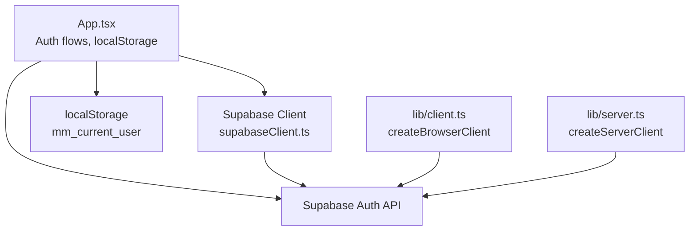
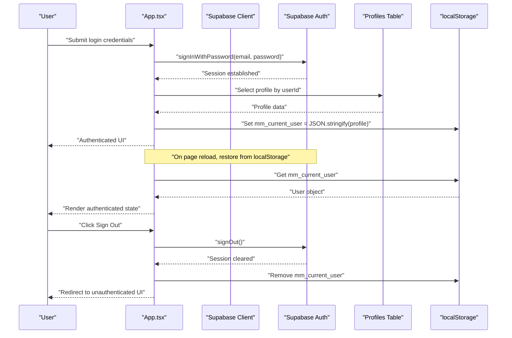
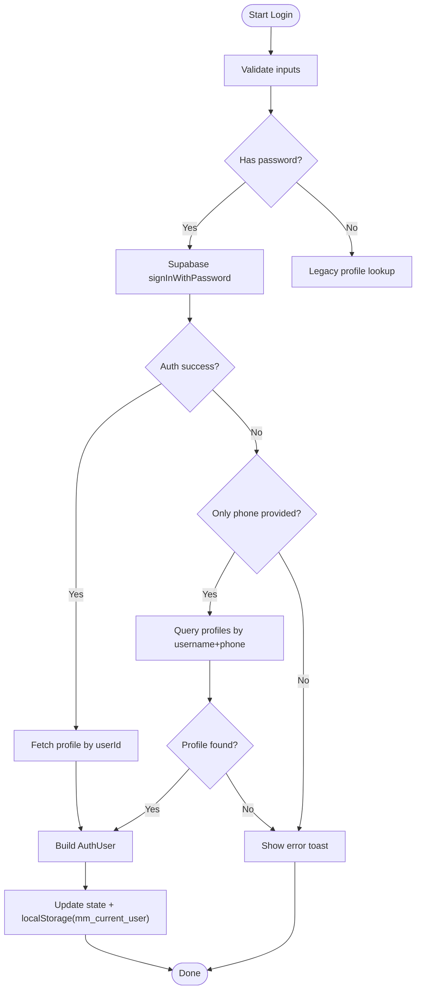
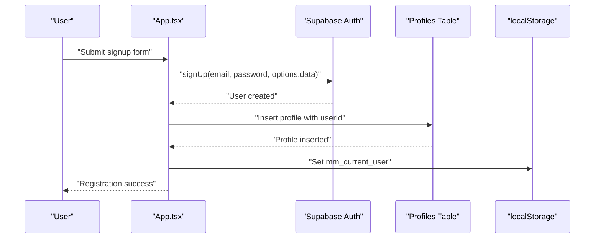
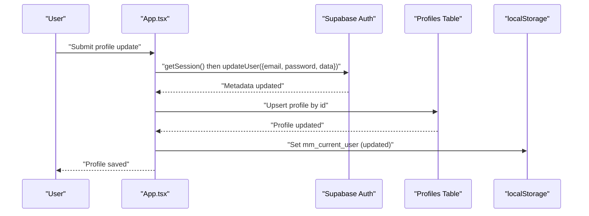
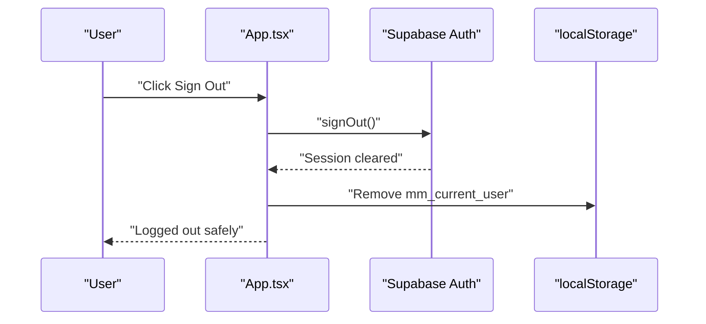
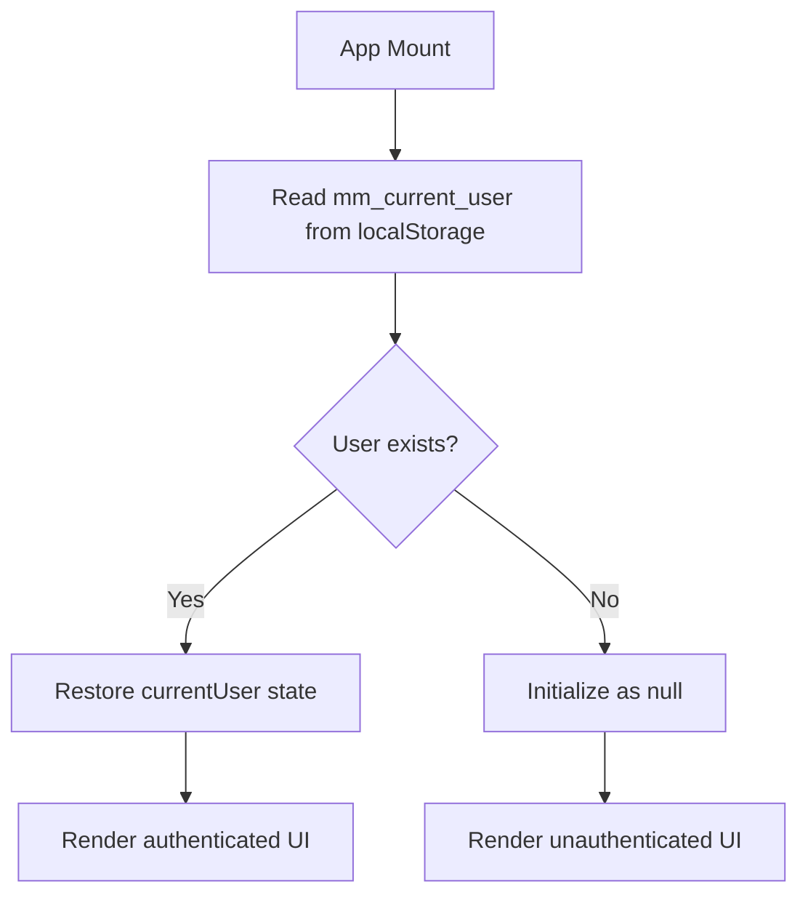
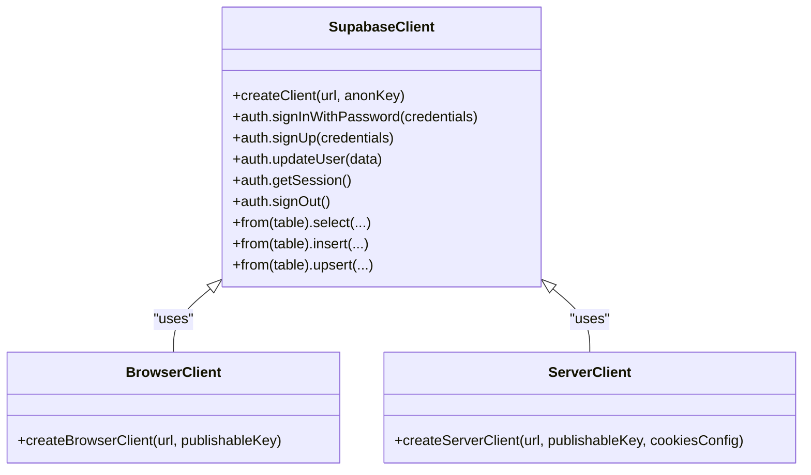
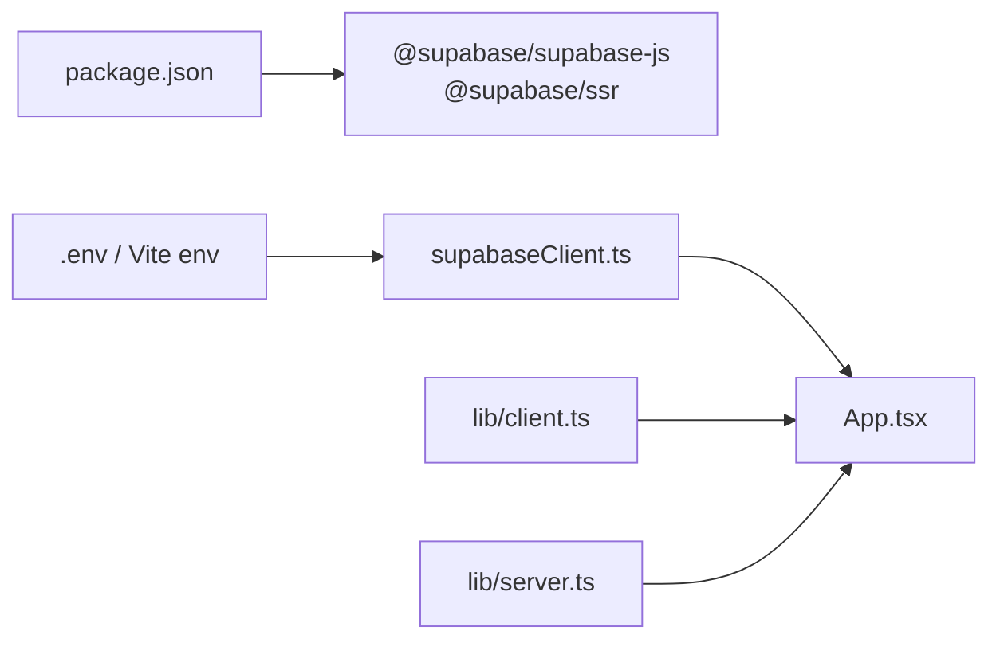

# Session Management

<cite>
**Referenced Files in This Document**
- [App.tsx](file://src/App.tsx)
- [supabaseClient.ts](file://src/supabase/supabaseClient.ts)
- [client.ts](file://src/lib/client.ts)
- [server.ts](file://src/lib/server.ts)
- [package.json](file://package.json)
- [SUPABASE.md](file://SUPABASE.md)
</cite>

## Table of Contents
1. [Introduction](#introduction)
2. [Project Structure](#project-structure)
3. [Core Components](#core-components)
4. [Architecture Overview](#architecture-overview)
5. [Detailed Component Analysis](#detailed-component-analysis)
6. [Dependency Analysis](#dependency-analysis)
7. [Performance Considerations](#performance-considerations)
8. [Troubleshooting Guide](#troubleshooting-guide)
9. [Conclusion](#conclusion)

## Introduction
This document explains how sessions are created, maintained, and destroyed across the application lifecycle. It covers:
- How Supabase Auth is used for authentication and session management
- How local state mirrors Supabase sessions using localStorage
- How to check authentication status, handle session refresh, and implement secure logout
- Security considerations and best practices for protecting user data

The implementation uses a client-side React application with Supabase JS SDK for authentication and persistence. A server-side client helper is also provided for SSR scenarios.

## Project Structure
Key files involved in session management:
- src/App.tsx: UI and application logic for login, signup, profile updates, and sign-out; persists current user to localStorage
- src/supabase/supabaseClient.ts: Creates and exports the Supabase client instance from environment variables
- src/lib/client.ts: Browser client factory using @supabase/ssr
- src/lib/server.ts: Server client factory using @supabase/ssr with cookie handling
- package.json: Lists dependencies including @supabase/supabase-js and @supabase/ssr
- SUPABASE.md: Guidance on environment configuration and common issues

**Diagram sources**
- [App.tsx](file://src/App.tsx)
- [supabaseClient.ts](file://src/supabase/supabaseClient.ts)
- [client.ts](file://src/lib/client.ts)
- [server.ts](file://src/lib/server.ts)

**Section sources**
- [package.json](file://package.json)
- [SUPABASE.md](file://SUPABASE.md)

## Core Components
- Supabase client initialization:
  - The Supabase client is created from environment variables and exported for use across the app.
- Browser and server clients:
  - Browser client uses createBrowserClient from @supabase/ssr.
  - Server client uses createServerClient with cookie parsing/serialization for SSR.
- Application auth flow:
  - Login attempts via Supabase Auth (email/password), fallback to legacy profile lookup if needed.
  - Signup creates an Auth user and inserts a profile record.
  - Profile updates synchronize metadata with Supabase Auth and persist to the profiles table.
  - Sign-out clears Supabase session and removes local user data.

**Section sources**
- [supabaseClient.ts](file://src/supabase/supabaseClient.ts)
- [client.ts](file://src/lib/client.ts)
- [server.ts](file://src/lib/server.ts)
- [App.tsx](file://src/App.tsx)

## Architecture Overview
The session architecture combines Supabase Auth with local state synchronization:
- On login/signup, Supabase Auth establishes a session.
- The app fetches or creates a profile record and stores it in localStorage under mm_current_user.
- On app load, the current user is restored from localStorage to initialize UI state.
- On sign-out, Supabase session is terminated and localStorage is cleared.

**Diagram sources**
- [App.tsx](file://src/App.tsx)
- [supabaseClient.ts](file://src/supabase/supabaseClient.ts)

## Detailed Component Analysis

### Authentication Flow (Login)
- Validates form inputs and attempts Supabase Auth login.
- If login fails and only phone was provided, falls back to legacy profile lookup.
- On success, fetches profile by userId, constructs AuthUser, updates local state, and persists to localStorage.

**Diagram sources**
- [App.tsx](file://src/App.tsx)

**Section sources**
- [App.tsx](file://src/App.tsx)

### Registration Flow (Signup)
- Registers user via Supabase Auth with email and password.
- Inserts a new profile record into the database.
- Updates local state and persists user to localStorage.

**Diagram sources**
- [App.tsx](file://src/App.tsx)

**Section sources**
- [App.tsx](file://src/App.tsx)

### Profile Update Flow
- Updates Supabase Auth metadata (email, password, custom data).
- Upserts profile record in the database.
- Refreshes local state and persists updated user to localStorage.

**Diagram sources**
- [App.tsx](file://src/App.tsx)

**Section sources**
- [App.tsx](file://src/App.tsx)

### Sign-Out Flow
- Calls Supabase Auth signOut to terminate the session.
- Clears all related local state fields and removes mm_current_user from localStorage.
- Resets cart and shows informational toast.

**Diagram sources**
- [App.tsx](file://src/App.tsx)

**Section sources**
- [App.tsx](file://src/App.tsx)

### Session Persistence and Restoration
- On component mount, currentUser is initialized from localStorage (mm_current_user).
- After successful login/signup/profile update, the user object is serialized and stored in localStorage.
- On sign-out, the key is removed to ensure no stale session remains.

**Diagram sources**
- [App.tsx](file://src/App.tsx)

**Section sources**
- [App.tsx](file://src/App.tsx)

### Supabase Client Configuration
- Client is created using environment variables VITE_SUPABASE_URL and VITE_SUPABASE_ANON_KEY.
- Validation warns about incorrect URL formats and missing credentials.
- For SSR, browser and server clients are provided via @supabase/ssr helpers.

**Diagram sources**
- [supabaseClient.ts](file://src/supabase/supabaseClient.ts)
- [client.ts](file://src/lib/client.ts)
- [server.ts](file://src/lib/server.ts)

**Section sources**
- [supabaseClient.ts](file://src/supabase/supabaseClient.ts)
- [client.ts](file://src/lib/client.ts)
- [server.ts](file://src/lib/server.ts)

## Dependency Analysis
- Dependencies:
  - @supabase/supabase-js: Core SDK for Supabase client and Auth APIs
  - @supabase/ssr: Utilities for creating browser and server clients with cookie handling
- Environment variables:
  - VITE_SUPABASE_URL: Base project URL
  - VITE_SUPABASE_ANON_KEY: Anon key for client access
  - VITE_SUPABASE_PUBLISHABLE_KEY: Used by SSR client helpers

**Diagram sources**
- [package.json](file://package.json)
- [supabaseClient.ts](file://src/supabase/supabaseClient.ts)
- [client.ts](file://src/lib/client.ts)
- [server.ts](file://src/lib/server.ts)

**Section sources**
- [package.json](file://package.json)
- [SUPABASE.md](file://SUPABASE.md)

## Performance Considerations
- Minimize redundant localStorage reads/writes by centralizing user state updates.
- Avoid unnecessary network calls by caching profile data locally when appropriate.
- Use Supabase Auth session events to react to changes without polling.
- Ensure environment validation runs once at startup to prevent repeated warnings.

[No sources needed since this section provides general guidance]

## Troubleshooting Guide
Common issues and resolutions:
- Missing environment variables:
  - Ensure VITE_SUPABASE_URL and VITE_SUPABASE_ANON_KEY are set in the root .env file.
- Incorrect Supabase URL:
  - Do not append /rest/v1/ to the base URL; use the project URL only.
- Query returns null data:
  - Verify rows exist in Supabase Studio and confirm RLS policies allow anon access during development.
- Auth errors:
  - Check network connectivity and correct credentials; review error messages from Supabase Auth.

**Section sources**
- [SUPABASE.md](file://SUPABASE.md)
- [supabaseClient.ts](file://src/supabase/supabaseClient.ts)

## Conclusion
The session management integrates Supabase Auth with local state synchronization through localStorage. The app maintains consistency between server-managed sessions and client-side user data. Secure logout procedures clear both Supabase sessions and local storage. Proper environment configuration and adherence to best practices ensure robust and secure session handling.

[No sources needed since this section summarizes without analyzing specific files]