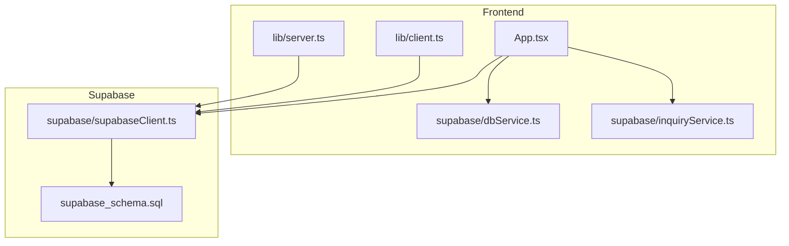
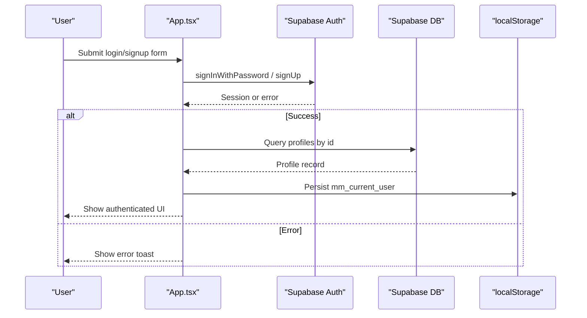
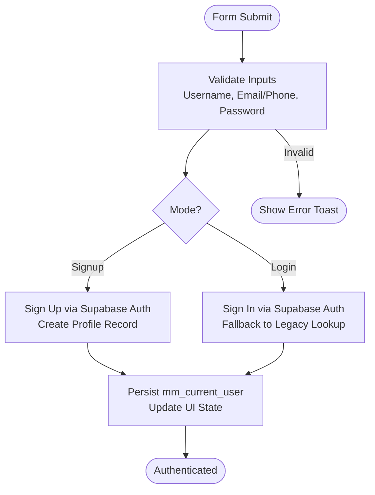
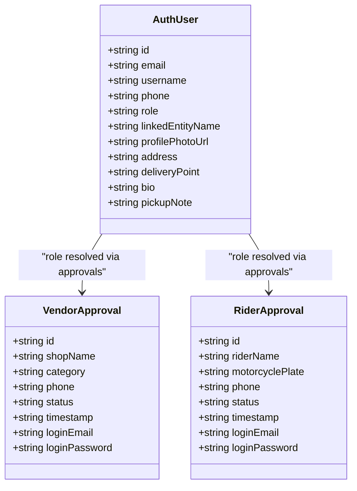
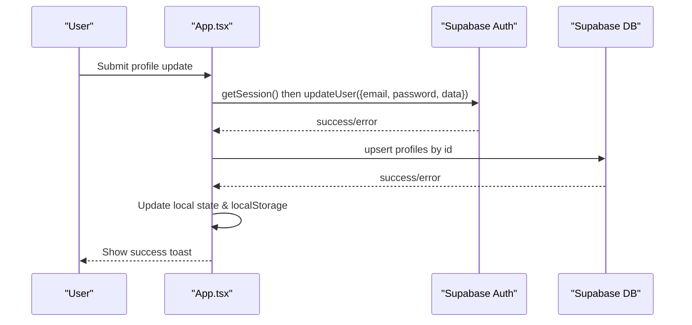
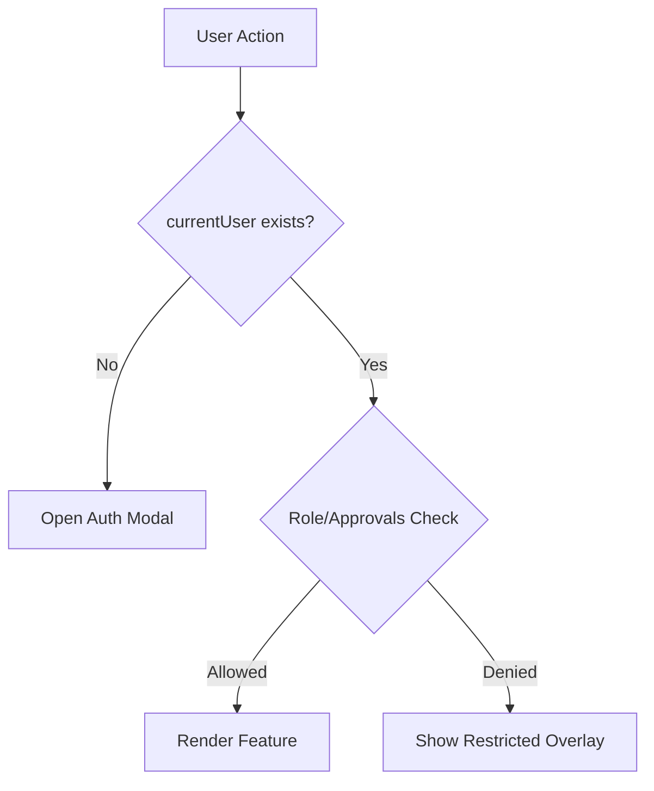
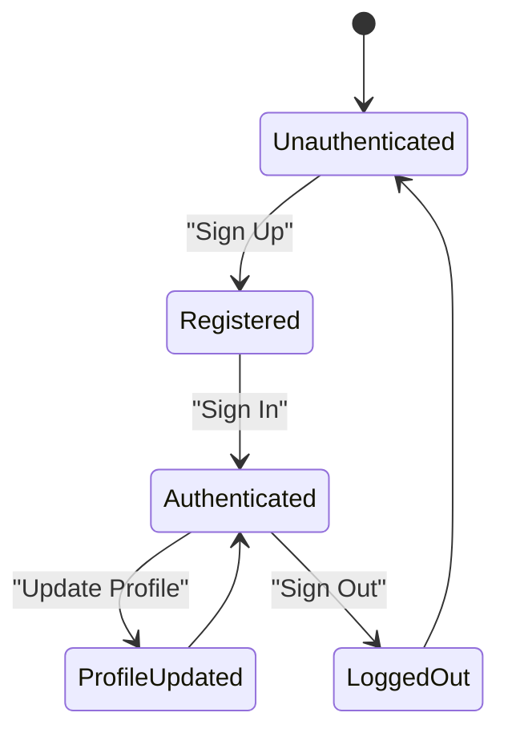
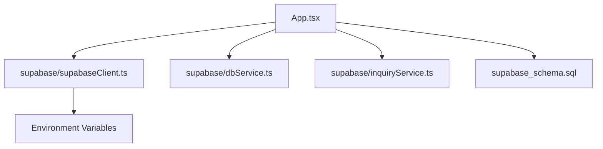

# User Management System

<cite>
**Referenced Files in This Document**
- [App.tsx](file://src/App.tsx)
- [supabaseClient.ts](file://src/supabase/supabaseClient.ts)
- [client.ts](file://src/lib/client.ts)
- [server.ts](file://src/lib/server.ts)
- [dbService.ts](file://src/supabase/dbService.ts)
- [inquiryService.ts](file://src/supabase/inquiryService.ts)
- [supabase_schema.sql](file://supabase_schema.sql)
</cite>

## Table of Contents
1. Introduction
2. Project Structure
3. Core Components
4. Architecture Overview
5. Detailed Component Analysis
6. Dependency Analysis
7. Performance Considerations
8. Troubleshooting Guide
9. Conclusion
10. Appendices

## Introduction
This document explains the user management system implemented in the application, focusing on authentication with Supabase Auth, role-based access control (RBAC), profile management, data validation, and security measures. It also covers session persistence, protected route handling via UI gating, and the full user lifecycle from registration to profile updates and logout. The implementation uses Supabase for both authentication and database operations, with a React frontend managing state and UI flows.

## Project Structure
The user management system spans several key files:
- Authentication client setup and environment configuration
- Supabase client initialization and optional SSR support
- Database service wrappers for consistent error handling
- Inquiry service for support workflows
- Schema definition including profiles and RLS policies
- Main application logic containing auth flows, RBAC checks, and profile management

**Diagram sources**
- [App.tsx](file://src/App.tsx)
- [supabaseClient.ts](file://src/supabase/supabaseClient.ts)
- [client.ts](file://src/lib/client.ts)
- [server.ts](file://src/lib/server.ts)
- [dbService.ts](file://src/supabase/dbService.ts)
- [inquiryService.ts](file://src/supabase/inquiryService.ts)
- [supabase_schema.sql](file://supabase_schema.sql)

**Section sources**
- [App.tsx](file://src/App.tsx)
- [supabaseClient.ts](file://src/supabase/supabaseClient.ts)
- [client.ts](file://src/lib/client.ts)
- [server.ts](file://src/lib/server.ts)
- [dbService.ts](file://src/supabase/dbService.ts)
- [inquiryService.ts](file://src/supabase/inquiryService.ts)
- [supabase_schema.sql](file://supabase_schema.sql)

## Core Components
- Supabase client initialization:
  - Browser client using environment variables for URL and anon key
  - Optional SSR client for server-side request handling
- Database service wrapper:
  - Consistent response shape with typed generics
  - Unified select/insert/update/delete/rpc helpers
- Inquiry service:
  - Fetching and creating inquiries
- Schema and RLS:
  - Profiles table and other tables
  - Open RLS policies for development; should be tightened for production

Key responsibilities:
- Authentication: sign up, sign in, sign out, session retrieval
- Profile management: update metadata and profile fields
- RBAC: role resolution and feature gating
- Data persistence: local storage for current user and Supabase for persistent data

**Section sources**
- [supabaseClient.ts](file://src/supabase/supabaseClient.ts)
- [client.ts](file://src/lib/client.ts)
- [server.ts](file://src/lib/server.ts)
- [dbService.ts](file://src/supabase/dbService.ts)
- [inquiryService.ts](file://src/supabase/inquiryService.ts)
- [supabase_schema.sql](file://supabase_schema.sql)

## Architecture Overview
The user management architecture integrates Supabase Auth and Database with a React frontend that manages state and enforces RBAC at the UI layer.

**Diagram sources**
- [App.tsx](file://src/App.tsx)
- [supabaseClient.ts](file://src/supabase/supabaseClient.ts)
- [supabase_schema.sql](file://supabase_schema.sql)

## Detailed Component Analysis

### Authentication Implementation (Supabase Auth)
- Sign Up:
  - Validates inputs (username, email, phone, password confirmation, minimum length)
  - Calls Supabase Auth signup with user metadata (username, phone, role, etc.)
  - Creates a profile record in the profiles table with computed role and linked entity name
  - Persists user to localStorage and updates UI state
- Sign In:
  - Attempts Supabase Auth login with email/password
  - Falls back to legacy profile lookup if credentials are missing or invalid
  - Loads profile by UUID and sets current user state and localStorage
- Sign Out:
  - Calls Supabase Auth signOut
  - Clears local state and localStorage
  - Resets UI forms and shows info toast

**Diagram sources**
- [App.tsx](file://src/App.tsx)

**Section sources**
- [App.tsx](file://src/App.tsx)

### Role-Based Access Control (RBAC)
- Roles supported: customer, vendor, rider, admin
- Role resolution:
  - Default role based on selection during signup
  - Overrides based on approval records (vendor_approvals, rider_approvals)
  - Vendor linkage detection by username matching store names
- Feature gating:
  - Vendor Hub access determined by role or approvals
  - Rider Transit access determined by role or approvals
  - Admin tab shown only when currentUser.role === 'admin'

**Diagram sources**
- [App.tsx](file://src/App.tsx)
- [supabase_schema.sql](file://supabase_schema.sql)

**Section sources**
- [App.tsx](file://src/App.tsx)
- [supabase_schema.sql](file://supabase_schema.sql)

### User Profile Management
- Update profile:
  - Updates Supabase Auth metadata (email, password, profile fields)
  - Upserts profile record in profiles table
  - Persists updated user to localStorage and refreshes UI
- Fields managed:
  - Username, email, phone, password (optional), profile photo URL, address, delivery point, bio, pickup notes
- Validation:
  - Requires authentication before updates
  - Graceful error handling and user feedback via toasts

**Diagram sources**
- [App.tsx](file://src/App.tsx)

**Section sources**
- [App.tsx](file://src/App.tsx)

### Protected Route Handling (UI Gating)
- Navigation and dashboard tabs are gated by currentUser presence and role
- Examples:
  - Checkout requires currentUser; otherwise opens auth modal
  - Vendor Hub and Rider Transit dashboards require specific roles or approvals
  - Admin tab is conditionally rendered for admin users

**Diagram sources**
- [App.tsx](file://src/App.tsx)

**Section sources**
- [App.tsx](file://src/App.tsx)

### Data Validation and Security Measures
- Input validation:
  - Required fields enforced (username, email/phone, passwords)
  - Minimum password length and confirmation checks
  - Phone number normalization and fallback email generation
- Security:
  - Uses Supabase Auth for credential management
  - LocalStorage used for current user snapshot; consider secure alternatives for sensitive data
  - RLS policies currently open for development; tighten for production

**Section sources**
- [App.tsx](file://src/App.tsx)
- [supabase_schema.sql](file://supabase_schema.sql)

### User Lifecycle
- Registration:
  - Create Supabase Auth user with metadata
  - Insert profile record with role and linked entity name
  - Persist user and show success message
- Login:
  - Authenticate via Supabase Auth or legacy profile lookup
  - Load profile and persist session
- Logout:
  - Clear Supabase session and local state
  - Reset UI and clear localStorage
- Profile updates:
  - Update auth metadata and profile table
  - Persist changes locally and reflect in UI

**Diagram sources**
- [App.tsx](file://src/App.tsx)

**Section sources**
- [App.tsx](file://src/App.tsx)

### Implementing Role-Specific Features and Accessing Auth Data
- Accessing authenticated user data:
  - Read currentUser from component state
  - Use role to conditionally render features
- Role-specific examples:
  - Vendor Hub: upload products, manage catalog, purchase ad banners
  - Rider Transit: claim jobs, confirm pickup, verify OTP handshake
  - Admin Office: approve vendors/riders, release escrow, ban/unban stores, reply to inquiries

**Section sources**
- [App.tsx](file://src/App.tsx)

## Dependency Analysis
The user management system depends on:
- Supabase client for auth and DB operations
- Environment variables for configuration
- LocalStorage for session snapshot
- Schema definitions for data integrity and RLS policies

**Diagram sources**
- [App.tsx](file://src/App.tsx)
- [supabaseClient.ts](file://src/supabase/supabaseClient.ts)
- [dbService.ts](file://src/supabase/dbService.ts)
- [inquiryService.ts](file://src/supabase/inquiryService.ts)
- [supabase_schema.sql](file://supabase_schema.sql)

**Section sources**
- [App.tsx](file://src/App.tsx)
- [supabaseClient.ts](file://src/supabase/supabaseClient.ts)
- [dbService.ts](file://src/supabase/dbService.ts)
- [inquiryService.ts](file://src/supabase/inquiryService.ts)
- [supabase_schema.sql](file://supabase_schema.sql)

## Performance Considerations
- Minimize redundant network calls by caching user state locally
- Use efficient queries and avoid selecting unnecessary columns
- Consider implementing Supabase Auth listeners for real-time session updates
- Optimize UI rendering by memoizing derived data where appropriate

[No sources needed since this section provides general guidance]

## Troubleshooting Guide
Common issues and resolutions:
- Missing environment variables:
  - Ensure VITE_SUPABASE_URL and VITE_SUPABASE_ANON_KEY are set
- RLS policy errors:
  - Verify policies allow intended operations; tighten for production
- Auth failures:
  - Check credentials and network connectivity
  - Review error messages from Supabase Auth responses
- Profile sync issues:
  - Confirm profile upserts succeed and localStorage is updated

**Section sources**
- [supabaseClient.ts](file://src/supabase/supabaseClient.ts)
- [supabase_schema.sql](file://supabase_schema.sql)

## Conclusion
The user management system leverages Supabase Auth and Database to provide robust authentication, role-based access control, and profile management. The React frontend orchestrates user flows, validates inputs, and enforces permissions at the UI layer. For production, ensure RLS policies are tightened, environment variables are securely configured, and sensitive session data is handled securely.

[No sources needed since this section summarizes without analyzing specific files]

## Appendices

### API Definitions for User Operations
- Sign Up:
  - Method: Supabase Auth signUp
  - Payload: email, password, options.data (username, phone, role, etc.)
  - Response: user object or error
- Sign In:
  - Method: Supabase Auth signInWithPassword
  - Payload: email, password
  - Response: session or error
- Sign Out:
  - Method: Supabase Auth signOut
  - Response: void or error
- Update Profile:
  - Method: Supabase Auth updateUser
  - Payload: email, password, data (profile fields)
  - Response: updated user or error
- Profile Upsert:
  - Method: Supabase DB upsert profiles
  - Payload: profile record with id and fields
  - Response: inserted/updated record or error

**Section sources**
- [App.tsx](file://src/App.tsx)
- [supabase_schema.sql](file://supabase_schema.sql)