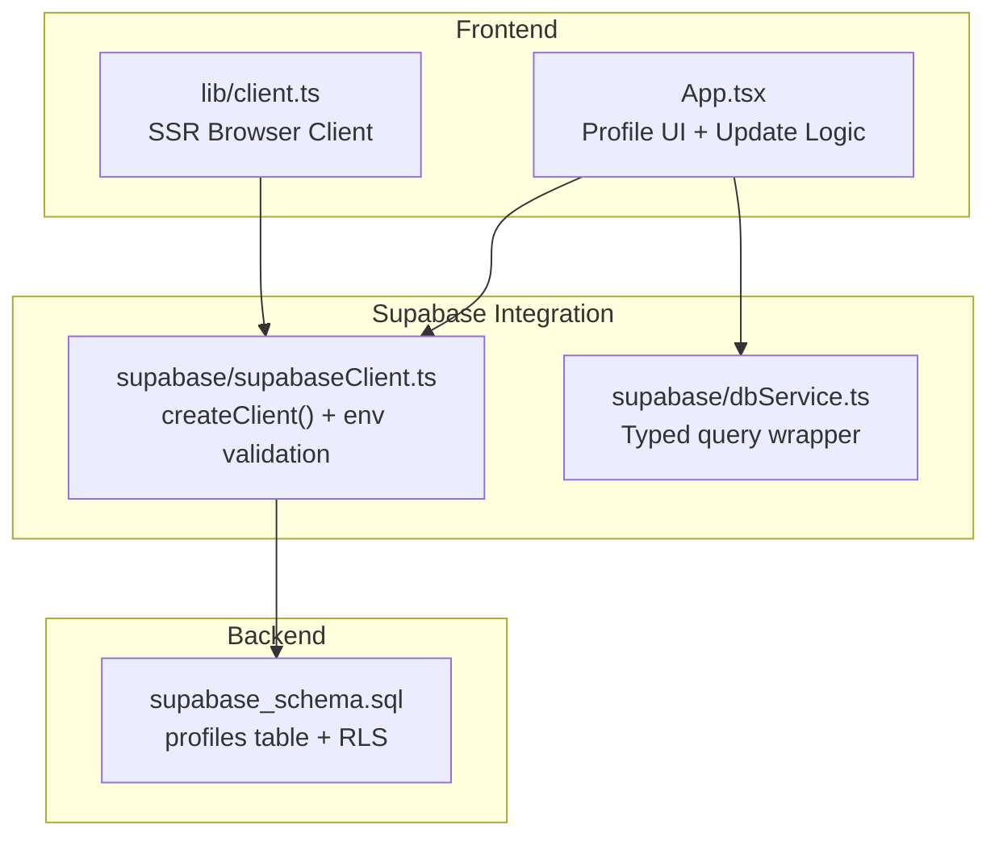
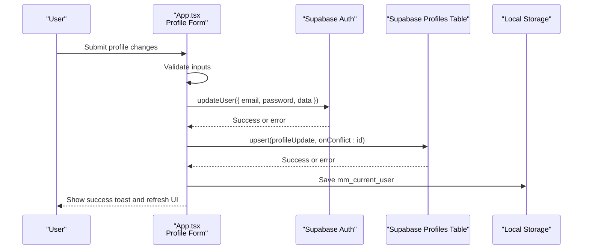
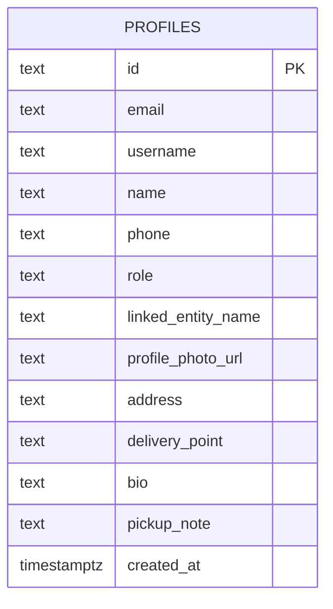
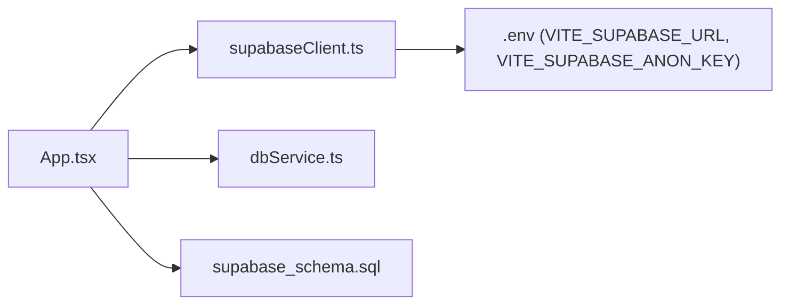
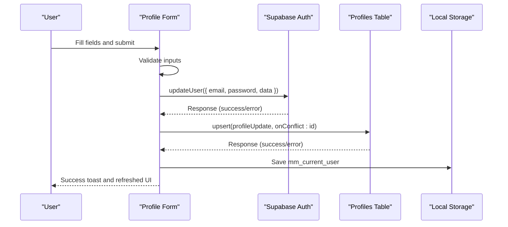

# User Profile Management

<cite>
**Referenced Files in This Document**
- [App.tsx](file://src/App.tsx)
- [supabaseClient.ts](file://src/supabase/supabaseClient.ts)
- [dbService.ts](file://src/supabase/dbService.ts)
- [client.ts](file://src/lib/client.ts)
- [SUPABASE.md](file://SUPABASE.md)
- [supabase_schema.sql](file://supabase_schema.sql)
</cite>

## Table of Contents
1. [Introduction](#introduction)
2. [Project Structure](#project-structure)
3. [Core Components](#core-components)
4. [Architecture Overview](#architecture-overview)
5. [Detailed Component Analysis](#detailed-component-analysis)
6. [Dependency Analysis](#dependency-analysis)
7. [Performance Considerations](#performance-considerations)
8. [Troubleshooting Guide](#troubleshooting-guide)
9. [Conclusion](#conclusion)
10. [Appendices](#appendices)

## Introduction
This document explains the user profile management functionality, including the profile data model, update mechanisms, validation rules, and synchronization with Supabase. It also covers the editing interface, image upload handling (via URL), real-time updates through local state and persistence, and strategies for maintaining consistency across the application.

## Project Structure
The profile feature spans UI logic, Supabase client configuration, database schema, and environment setup:
- UI and business logic are implemented in the main application component.
- Supabase client is configured and exported for use throughout the app.
- A lightweight DB wrapper provides consistent error handling for queries.
- The Supabase schema defines the profiles table and Row Level Security policies.
- Environment variables configure the Supabase connection.

**Diagram sources**
- [App.tsx](file://src/App.tsx)
- [supabaseClient.ts](file://src/supabase/supabaseClient.ts)
- [dbService.ts](file://src/supabase/dbService.ts)
- [client.ts](file://src/lib/client.ts)
- [supabase_schema.sql](file://supabase_schema.sql)

**Section sources**
- [App.tsx](file://src/App.tsx)
- [supabaseClient.ts](file://src/supabase/supabaseClient.ts)
- [dbService.ts](file://src/supabase/dbService.ts)
- [client.ts](file://src/lib/client.ts)
- [supabase_schema.sql](file://supabase_schema.sql)

## Core Components
- Profile Data Model: username, email, phone, role, profile photo URL, address, delivery point, bio, pickup notes.
- Profile Editing Interface: form fields bound to React state; submit triggers update flow.
- Update Mechanism: dual-layer update—Supabase Auth metadata and profiles table upsert.
- Persistence: local storage sync and UI state refresh on success.
- Validation: required fields and password constraints enforced before submission.
- Synchronization: immediate UI updates and optional re-fetch patterns for consistency.

Key responsibilities:
- App.tsx: manages profile state, form binding, validation, and update orchestration.
- supabaseClient.ts: initializes Supabase client and validates environment.
- dbService.ts: wraps Supabase calls with standardized response shape.
- supabase_schema.sql: defines profiles table columns and RLS policies.

**Section sources**
- [App.tsx](file://src/App.tsx)
- [supabaseClient.ts](file://src/supabase/supabaseClient.ts)
- [dbService.ts](file://src/supabase/dbService.ts)
- [supabase_schema.sql](file://supabase_schema.sql)

## Architecture Overview
The profile update flow integrates three layers:
- UI layer collects inputs and validates them.
- Supabase Auth layer updates user metadata (email, password, and profile-related fields).
- Profiles table layer persists structured profile data using an upsert operation.

**Diagram sources**
- [App.tsx](file://src/App.tsx)
- [supabaseClient.ts](file://src/supabase/supabaseClient.ts)
- [supabase_schema.sql](file://supabase_schema.sql)

## Detailed Component Analysis

### Profile Data Model
The profiles table includes the following fields relevant to user profile management:
- id: primary key (user UUID from Supabase Auth)
- username: display name
- email: contact email
- phone: mobile number
- role: account type (customer/vendor/rider/admin)
- linked_entity_name: optional association (e.g., vendor shop name)
- profile_photo_url: image URL for avatar
- address: home/pickup address
- delivery_point: preferred delivery location
- bio: short biography
- pickup_note: additional pickup instructions
- created_at: timestamp

**Diagram sources**
- [supabase_schema.sql](file://supabase_schema.sql)

**Section sources**
- [supabase_schema.sql](file://supabase_schema.sql)

### Profile Editing Interface
- Fields: Full Name, Email Address, Mobile Contact, New Password, Profile Picture URL, Home/Pickup Address, Delivery Point, Profile Bio, Pickup Notes.
- State bindings: each field maps to a React state variable.
- Submission: triggers handleUpdateProfile which performs validation and updates.

Behavior highlights:
- Optional fields: email, password, profile picture URL, bio, pickup notes.
- Required during signup: username and either email or phone; password confirmation and minimum length enforced.
- Role selection available during signup.

**Section sources**
- [App.tsx](file://src/App.tsx)

### Update Mechanisms and Data Validation
Validation rules:
- Signup mode requires valid email and matching passwords with minimum length.
- Login mode supports standard password login and legacy phone-based fallback.
- Profile update requires an authenticated session; otherwise, prompts sign-in.

Update steps:
- Auth metadata update via updateUser with email, password, and profile-related data.
- Profiles table upsert by id to persist structured profile fields.
- On success, update local state and persist to localStorage for consistency.

Error handling:
- Errors from auth and DB operations are caught and surfaced via toast notifications.
- Loading states prevent duplicate submissions.

**Section sources**
- [App.tsx](file://src/App.tsx)

### Synchronization with Supabase Database
- Client initialization: environment variables validated and client created.
- Query wrapper: standardized response shape for data and errors.
- Profiles table operations: insert during signup, upsert during updates.
- RLS policies: open access for development; tighten for production.

Environment guidance:
- Use project URL without /rest/v1 suffix.
- Ensure anon key matches the project.

**Section sources**
- [supabaseClient.ts](file://src/supabase/supabaseClient.ts)
- [dbService.ts](file://src/supabase/dbService.ts)
- [SUPABASE.md](file://SUPABASE.md)
- [supabase_schema.sql](file://supabase_schema.sql)

### Image Upload Handling
Current implementation uses a URL input for profile photos:
- Users paste an image link into the Profile Picture URL field.
- The URL is stored in both Supabase Auth metadata and the profiles table.

Recommendations for future enhancements:
- Integrate Supabase Storage for secure file uploads.
- Implement server-side validation and size/type checks.
- Generate signed URLs for secure image access.

**Section sources**
- [App.tsx](file://src/App.tsx)

### Real-Time Profile Updates
Real-time behavior is achieved through:
- Immediate UI state updates after successful save.
- Local storage persistence to maintain consistency across sessions.
- Optional re-fetching from the database when needed to ensure server-side truth.

For true real-time synchronization across clients, consider:
- Supabase Realtime subscriptions on the profiles table.
- Broadcasting updates to connected clients.

[No sources needed since this section provides general guidance]

### Examples of Updating User Profiles
Typical flows:
- Update basic info: change username, email, phone, and save.
- Update delivery preferences: modify address and delivery point.
- Update personal details: edit bio and pickup notes.
- Change credentials: provide new password alongside other fields.

Consistency practices:
- Always update both Auth metadata and profiles table.
- Persist updated user object to localStorage immediately.
- Provide clear feedback via toast messages.

**Section sources**
- [App.tsx](file://src/App.tsx)

### Maintaining Data Consistency Across the Application
Strategies:
- Centralized state synchronization function to keep form fields aligned with current user.
- Single source of truth: currentUser state reflects latest persisted data.
- Graceful fallbacks: if DB update fails, do not mutate local state until confirmed.

Best practices:
- Avoid partial updates; batch related fields together.
- Validate inputs before sending requests.
- Log non-sensitive debugging info for troubleshooting.

**Section sources**
- [App.tsx](file://src/App.tsx)

### Profile Persistence Strategies and Backup Mechanisms
Persistence:
- Local storage key mm_current_user stores serialized user profile.
- On app load, restore user from local storage to initialize state.

Backup considerations:
- Export/import user profiles periodically for recovery.
- Maintain audit logs for critical changes (e.g., role changes).
- Use Supabase backups and versioned migrations for schema evolution.

[No sources needed since this section provides general guidance]

## Dependency Analysis
The profile feature depends on:
- Supabase client for authentication and database operations.
- Environment variables for connection configuration.
- Profiles table schema for data structure and security policies.

**Diagram sources**
- [App.tsx](file://src/App.tsx)
- [supabaseClient.ts](file://src/supabase/supabaseClient.ts)
- [dbService.ts](file://src/supabase/dbService.ts)
- [supabase_schema.sql](file://supabase_schema.sql)

**Section sources**
- [App.tsx](file://src/App.tsx)
- [supabaseClient.ts](file://src/supabase/supabaseClient.ts)
- [dbService.ts](file://src/supabase/dbService.ts)
- [supabase_schema.sql](file://supabase_schema.sql)

## Performance Considerations
- Minimize network calls by batching profile updates.
- Debounce rapid input changes if implementing live validation.
- Use selective column selection when fetching profiles to reduce payload size.
- Cache frequently accessed profile data locally to avoid repeated queries.

[No sources needed since this section provides general guidance]

## Troubleshooting Guide
Common issues and resolutions:
- Supabase credentials missing: ensure .env contains correct VITE_SUPABASE_URL and VITE_SUPABASE_ANON_KEY.
- Incorrect base URL: do not append /rest/v1 to the project URL.
- Query returns null data: verify row existence and RLS policies.
- Profile update failures: check auth metadata update and profiles table upsert responses.

Debugging tips:
- Use console logs to inspect effective environment values.
- Confirm rows in Supabase Studio after inserts/updates.
- Temporarily relax RLS policies during development, then tighten for production.

**Section sources**
- [SUPABASE.md](file://SUPABASE.md)
- [supabaseClient.ts](file://src/supabase/supabaseClient.ts)

## Conclusion
The user profile management system combines a robust UI, secure Supabase integration, and a well-defined data model. By adhering to validation rules, synchronizing state consistently, and leveraging Supabase features, the application ensures reliable profile updates and persistence. Future enhancements can include secure file uploads and real-time synchronization for improved user experience.

[No sources needed since this section summarizes without analyzing specific files]

## Appendices

### API Workflow Sequence Diagram

**Diagram sources**
- [App.tsx](file://src/App.tsx)
- [supabaseClient.ts](file://src/supabase/supabaseClient.ts)
- [supabase_schema.sql](file://supabase_schema.sql)